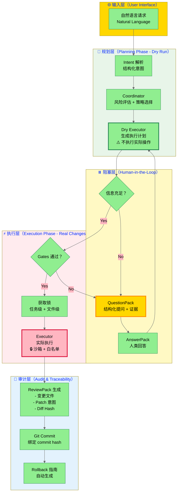
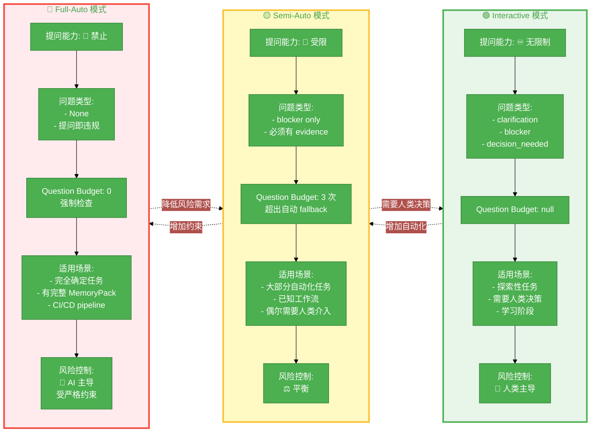
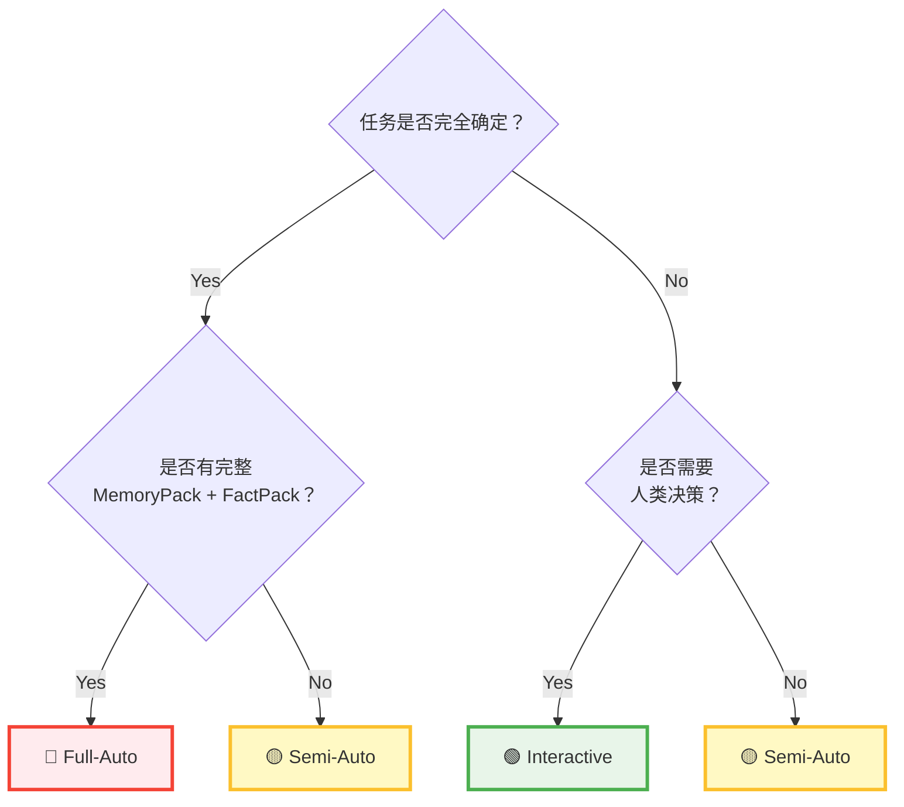

# AgentOS 核心架构图 - 可视化设计规范

## 📊 三张思想级架构图

### 图 1: 执行流程全景图（The Execution Pipeline）

**设计目标**: 展示从自然语言到可审计执行的完整流程

**Mermaid 代码**:



**配色方案**:
- 🟢 绿色系（Planning Phase）: 安全、规划、只读
- 🟡 黄色系（Blocking）: 警告、等待、需要人类介入
- 🔴 红色系（Execution Phase）: 危险、执行、不可逆
- 🔵 蓝色系（Audit）: 可信、记录、追溯

**关键可视化元素**:
1. **分层清晰**: 4 个 subgraph（输入/规划/执行/审计）
2. **阻塞状态突出**: QuestionPack 用黄色高亮
3. **执行分离**: Dry Executor（绿色）vs Executor（红色）对比
4. **决策节点**: 菱形（Check 和 Gate）

---

### 图 2: 三种执行模式对比（Execution Modes Matrix）

**设计目标**: 展示 interactive / semi_auto / full_auto 的权衡

**Mermaid 代码**:



**对比表格版本**（用于 PPT/文档）:

| 维度 | 🟢 Interactive | 🟡 Semi-Auto | 🔴 Full-Auto |
|------|---------------|--------------|--------------|
| **提问能力** | ♾️ 无限制 | 🚧 仅 Blocker | 🚫 禁止（question_budget=0） |
| **问题类型** | clarification<br/>blocker<br/>decision_needed | blocker（必须有 evidence） | None（提问即违规） |
| **Question Budget** | null | 3 次（超出 fallback） | 0（强制） |
| **需要 MemoryPack** | 建议 | 建议 | ✅ 强制 |
| **需要 FactPack** | 建议 | 建议 | ✅ 强制 |
| **适用场景** | - 探索性任务<br/>- 需要人类决策<br/>- 学习阶段 | - 大部分自动化<br/>- 已知工作流<br/>- 偶尔人类介入 | - 完全确定任务<br/>- CI/CD<br/>- 定时任务 |
| **风险控制** | 🙋 人类主导 | ⚖️ 平衡 | 🤖 AI 主导（受约束） |
| **典型用例** | 重构代码库 | 自动化部署 | 生成日报 |
| **失败策略** | 人类介入 | Auto-fallback to interactive | 必须失败（不允许降级） |

**决策树**（用于选择执行模式）:



---

### 图 3: 10 条护城河（The 10 Moats - Machine-Enforced Constraints）

**设计目标**: 展示 AgentOS 的核心约束体系

**Mermaid 代码**（防御层次图）:

```mermaid
%%{init: {'theme':'base', 'themeVariables': { 'primaryColor':'#1976D2', 'primaryTextColor':'#FFF', 'primaryBorderColor':'#0D47A1'}}}%%

graph TB
    subgraph Layer1["🛡️ 第一层：输入完整性（Input Integrity）"]
        M1[Moat 1:<br/>无 MemoryPack 不允许执行]
        M2[Moat 2:<br/>full_auto question_budget = 0]
        M3[Moat 3:<br/>任何命令/路径禁止编造<br/>来源可追溯]
        
        M1 --> M2 --> M3
    end

    subgraph Layer2["📝 第二层：执行记录（Execution Recording）"]
        M4[Moat 4:<br/>每次执行必须写 run_steps<br/>Plan/Apply/Verify 不可缺]
        M5[Moat 5:<br/>每次执行必须有<br/>review_pack.md]
        M6[Moat 6:<br/>每个 patch 必须记录<br/>intent + 文件列表 + diff hash]
        
        M3 --> M4
        M4 --> M5 --> M6
    end

    subgraph Layer3["🔗 第三层：可追溯性（Traceability）"]
        M7[Moat 7:<br/>每次发布必须绑定<br/>commit hash]
        
        M6 --> M7
    end

    subgraph Layer4["🔒 第四层：并发控制（Concurrency Control）"]
        M8[Moat 8:<br/>文件锁冲突必须<br/>WAIT 并 rebase]
        M9[Moat 9:<br/>并发执行必须受<br/>locks 限制]
        
        M7 --> M8
        M8 --> M9
    end

    subgraph Layer5["⏰ 第五层：可复现性（Reproducibility）"]
        M10[Moat 10:<br/>scheduler 触发必须可复现<br/>cron 规则可审计]
        
        M9 --> M10
    end

    style Layer1 fill:#E3F2FD,stroke:#1976D2,stroke-width:3px
    style Layer2 fill:#E8EAF6,stroke:#3F51B5,stroke-width:3px
    style Layer3 fill:#F3E5F5,stroke:#9C27B0,stroke-width:3px
    style Layer4 fill:#FCE4EC,stroke:#E91E63,stroke-width:3px
    style Layer5 fill:#FFF3E0,stroke:#FF9800,stroke-width:3px
    
    style M1 fill:#1976D2,stroke:#0D47A1,stroke-width:2px,color:#FFF
    style M2 fill:#1976D2,stroke:#0D47A1,stroke-width:2px,color:#FFF
    style M3 fill:#1976D2,stroke:#0D47A1,stroke-width:2px,color:#FFF
    style M4 fill:#3F51B5,stroke:#283593,stroke-width:2px,color:#FFF
    style M5 fill:#3F51B5,stroke:#283593,stroke-width:2px,color:#FFF
    style M6 fill:#3F51B5,stroke:#283593,stroke-width:2px,color:#FFF
    style M7 fill:#9C27B0,stroke:#6A1B9A,stroke-width:2px,color:#FFF
    style M8 fill:#E91E63,stroke:#AD1457,stroke-width:2px,color:#FFF
    style M9 fill:#E91E63,stroke:#AD1457,stroke-width:2px,color:#FFF
    style M10 fill:#FF9800,stroke:#E65100,stroke-width:2px,color:#FFF
```



**Checklist 版本**（用于验证）:

```
🛡️ AgentOS v1.0 - 10 条护城河验证清单

━━━━━━━━━━━━━━━━━━━━━━━━━━━━━━━━━━━━
第一层：输入完整性（Input Integrity）
━━━━━━━━━━━━━━━━━━━━━━━━━━━━━━━━━━━━

✅ Moat 1: 无 MemoryPack 不允许执行（哪怕为空）
   ├─ Gate: pre_execution_check()
   ├─ 检查: memory_pack is not None
   └─ 违规: raise ExecutionDenied("MemoryPack required")

✅ Moat 2: full_auto question_budget = 0（提问即违规）
   ├─ Gate: policy_validation()
   ├─ 检查: if mode == "full_auto" then budget == 0
   └─ 违规: raise InvalidPolicy("full_auto requires zero questions")

✅ Moat 3: 任何命令/路径禁止编造（来源可追溯）
   ├─ Gate: provenance_check()
   ├─ 检查: for cmd in commands: provenance.verify(cmd)
   └─ 违规: raise FabricationDetected(cmd)

━━━━━━━━━━━━━━━━━━━━━━━━━━━━━━━━━━━━
第二层：执行记录（Execution Recording）
━━━━━━━━━━━━━━━━━━━━━━━━━━━━━━━━━━━━

✅ Moat 4: 每次执行必须写 run_steps（Plan/Apply/Verify）
   ├─ Gate: run_steps_check()
   ├─ 检查: all(["Plan", "Apply", "Verify"] in run_steps)
   └─ 违规: raise IncompleteRunSteps()

✅ Moat 5: 每次执行必须有 review_pack.md
   ├─ Gate: review_pack_existence()
   ├─ 检查: review_pack.exists(run_id)
   └─ 违规: raise MissingReviewPack(run_id)

✅ Moat 6: 每个 patch 必须记录 intent + 文件列表 + diff hash
   ├─ Gate: patch_integrity()
   ├─ 检查: patch.intent and patch.files and patch.diff_hash
   └─ 违规: raise IncompletePatch(patch_id)

━━━━━━━━━━━━━━━━━━━━━━━━━━━━━━━━━━━━
第三层：可追溯性（Traceability）
━━━━━━━━━━━━━━━━━━━━━━━━━━━━━━━━━━━━

✅ Moat 7: 每次发布必须绑定 commit hash
   ├─ Gate: commit_binding()
   ├─ 检查: all(commit.hash is not None for commit in commits)
   └─ 违规: raise UnboundCommit()

━━━━━━━━━━━━━━━━━━━━━━━━━━━━━━━━━━━━
第四层：并发控制（Concurrency Control）
━━━━━━━━━━━━━━━━━━━━━━━━━━━━━━━━━━━━

✅ Moat 8: 文件锁冲突必须 WAIT 并 rebase
   ├─ Gate: file_lock_conflict_detection()
   ├─ 检查: if file_lock.conflict() then state = WAITING_LOCK
   └─ 违规: raise ConcurrentModification()

✅ Moat 9: 并发执行必须受 locks 限制
   ├─ Gate: task_lock_check()
   ├─ 检查: task_lock.acquired()
   └─ 违规: raise ConcurrentExecutionDenied()

━━━━━━━━━━━━━━━━━━━━━━━━━━━━━━━━━━━━
第五层：可复现性（Reproducibility）
━━━━━━━━━━━━━━━━━━━━━━━━━━━━━━━━━━━━

✅ Moat 10: scheduler 触发必须可复现（cron 规则可审计）
   ├─ Gate: scheduler_determinism()
   ├─ 检查: trigger.is_deterministic() and trigger.logged()
   └─ 违规: raise NonDeterministicTrigger()

━━━━━━━━━━━━━━━━━━━━━━━━━━━━━━━━━━━━

这些不是"建议"，而是机器强制执行的约束。
所有 Gates 在 CI 中自动运行。
```

**雷达图版本**（用于可视化成熟度）:

```
        输入完整性 (3/3)
                 ↑
                 |
                 |
可复现性 ←-------●-------→ 执行记录
  (1/1)          |          (3/3)
                 |
                 |
                 ↓
        并发控制 (2/2)   可追溯性 (1/1)

总分: 10/10 ✅
```

---

## 🎨 配色标准（Design System）

### 主色调

| 颜色 | 十六进制 | 用途 | 情感 |
|------|---------|------|------|
| **Planning Green** | `#90EE90` | 规划阶段、Dry Run | 安全、只读 |
| **Execution Red** | `#FFB6C1` | 执行阶段、实际变更 | 危险、不可逆 |
| **Blocked Yellow** | `#FFD700` | BLOCKED 状态、QuestionPack | 警告、等待 |
| **Audit Blue** | `#87CEEB` | 审计、ReviewPack | 可信、追溯 |

### 辅助色

| 颜色 | 十六进制 | 用途 |
|------|---------|------|
| **Success** | `#4CAF50` | 成功状态 |
| **Warning** | `#FBC02D` | 警告状态 |
| **Error** | `#F44336` | 错误状态 |
| **Info** | `#1976D2` | 信息提示 |

---

## 📐 图表使用指南

### 图 1 使用场景
- ✅ **适合**: GitHub README、技术博客、演讲 PPT
- ✅ **目标**: 让人理解 AgentOS 的端到端流程
- ✅ **重点**: Planning vs Execution 的分离

### 图 2 使用场景
- ✅ **适合**: 用户文档、决策指南、FAQ
- ✅ **目标**: 帮助用户选择合适的执行模式
- ✅ **重点**: 三种模式的权衡

### 图 3 使用场景
- ✅ **适合**: 安全白皮书、合规文档、技术评审
- ✅ **目标**: 展示 AgentOS 的约束体系
- ✅ **重点**: 机器门禁，非人工约定

---

## 🛠️ 生成图片的工具推荐

### Mermaid Live Editor
- **URL**: https://mermaid.live
- **用途**: 在线编辑 + 导出 PNG/SVG
- **优点**: 无需安装，直接粘贴代码

### Mermaid CLI
```bash
# 安装
npm install -g @mermaid-js/mermaid-cli

# 生成图片
mmdc -i diagram.mmd -o diagram.png -b transparent
```

### Draw.io（手动绘制）
- **URL**: https://app.diagrams.net
- **用途**: 精细化设计
- **优点**: 完全可控，适合打印

---

## 📊 高清导出参数

### PNG（适合文档）
- 分辨率: 2400x1800 (2x)
- 背景: 透明
- DPI: 300

### SVG（适合网页）
- 矢量格式
- 支持缩放
- 文件小

### PDF（适合打印）
- A4 横向
- 边距: 20mm
- 字体嵌入

---

**创建时间**: 2026-01-25  
**维护者**: AgentOS Team  
**最后更新**: 2026-01-25

---

## 快速链接

- [白皮书（中文）](WHITEPAPER_V1.md)
- [白皮书（英文完整版）](WHITEPAPER_FULL_EN.md)
- [社交媒体套件](SOCIAL_MEDIA_KIT.md)
- [发布指南](RELEASE_GUIDE.md)
