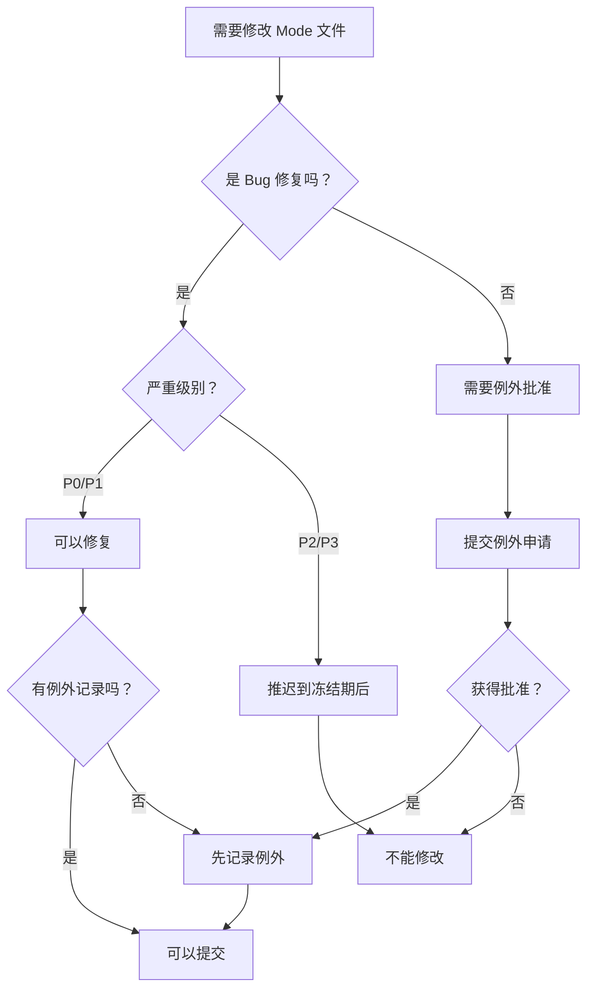

# Phase 3 快速参考

**项目**: AgentOS "下一步三连" - Phase 3
**版本**: 1.0
**日期**: 2026-01-30

---

## 📋 快速概览

### Phase 3 交付物

| 类别 | 数量 | 行数 | 状态 |
|------|------|------|------|
| **规范文档** | 5 | 2,814 | ✅ |
| **检查工具** | 4 | 1,250 | ✅ |
| **流程文档** | 5 | 7,972 | ✅ |
| **检查清单** | 1 | 900 | ✅ |
| **Task 报告** | 3 | ~2,377 | ✅ |
| **总计** | 18 | ~15,313 | ✅ |

### 关键指标

- ✅ 100% 验收达成（80/80）
- ✅ 100% 工具测试通过（22/22）
- ✅ 100% 文档质量评分（10/10）
- ✅ 零 critical/high 问题

---

## 📂 文件位置速查

### 规范文档

```
docs/governance/
├── MODE_FREEZE_SPECIFICATION.md          (445 行) - 冻结规范
├── MODE_BUG_FIX_PROCESS.md              (878 行) - Bug 修复流程
├── MODE_EXCEPTION_REQUEST_TEMPLATE.md   (617 行) - 例外申请模板
├── MODE_FREEZE_LOG.md                   (502 行) - 冻结日志
└── MODE_FREEZE_QUICK_REFERENCE.md       (372 行) - 快速参考
```

### 检查工具

```
scripts/
├── verify_mode_freeze.sh                 (650 行) - 验证脚本
├── install_mode_freeze_hooks.sh          (110 行) - Hook 安装
├── record_mode_freeze_exception.py       (400 行) - 例外记录
└── hooks/
    └── pre-commit-mode-freeze            (90 行) - Git Hook
```

### 流程文档

```
docs/governance/
├── MODE_BUG_FIX_WORKFLOW.md              (1,058 行) - 工作流程图
├── MODE_BUG_FIX_QUICK_REFERENCE.md       (1,238 行) - 快速参考
├── MODE_BUG_FIX_TESTING_GUIDE.md         (1,988 行) - 测试指南
├── templates/
│   └── BUG_FIX_TEMPLATE.md               (1,746 行) - 模板集合
└── examples/
    └── MODE_BUG_FIX_EXAMPLES.md          (1,942 行) - 完整示例
```

### 检查清单

```
docs/governance/
└── MODE_FREEZE_CHECKLIST.md              (900 行) - 检查清单
```

---

## ⚡ 常用命令

### 1. 验证冻结规范

```bash
# 基础验证
./scripts/verify_mode_freeze.sh

# 详细输出
./scripts/verify_mode_freeze.sh --verbose

# JSON 输出（CI/CD）
./scripts/verify_mode_freeze.sh --json

# 检查特定 commit
./scripts/verify_mode_freeze.sh --commit <commit-hash>

# 检查 PR
./scripts/verify_mode_freeze.sh --pr <pr-number>
```

### 2. 安装 Git Hook

```bash
# 运行安装向导
./scripts/install_mode_freeze_hooks.sh

# 验证安装
ls -la .git/hooks/pre-commit

# 检查配置
git config hooks.modeFreezeVerify
```

### 3. 记录例外

```bash
# 记录 P1 Bug 修复例外
python3 scripts/record_mode_freeze_exception.py \
  --file agentos/core/mode/mode.py \
  --type bug_fix \
  --severity P1 \
  --approval "Your Name" \
  --reason "Fix mode selection bug"

# 干运行（预览）
python3 scripts/record_mode_freeze_exception.py \
  --file agentos/core/mode/mode.py \
  --type bug_fix \
  --severity P1 \
  --approval "Test" \
  --reason "Test" \
  --dry-run
```

### 4. Git 工作流

```bash
# 正常提交（带 bug fix 标记）
git commit -m "fix: mode selection bug"

# 提交例外记录
git commit -m "chore: record exception EXC-xxx [mode-freeze-exception]"

# 绕过检查（不推荐）
git commit --no-verify -m "emergency fix"
```

---

## 🎯 快速决策树

### 我可以修改 Mode 文件吗？



### Bug 严重级别快速判定

| 影响 | 用户% | 功能 | 严重级别 | 是否修复 |
|------|-------|------|---------|----------|
| 系统崩溃 | 100% | 核心 | **P0** | ✅ 立即 |
| 核心功能不可用 | 50%+ | 核心 | **P1** | ✅ 3天内 |
| 部分功能异常 | <30% | 次要 | **P2** | ❌ 推迟 |
| 轻微问题 | <10% | 次要 | **P3** | ❌ 推迟 |

---

## 📝 冻结文件清单

### 核心文件（14 个）

```
agentos/core/mode/
├── mode.py                    # Mode 核心定义
├── mode_selector.py           # Mode 选择逻辑
├── mode_policy.py             # Mode 策略引擎
├── mode_proposer.py           # Mode 建议器
├── mode_alerts.py             # Mode 告警集成
├── gateway.py                 # Mode Gateway Protocol
├── gateway_registry.py        # Gateway 注册表
└── mode_event_listener.py    # Mode 事件监听器

agentos/core/governance/guardian/
└── mode_guardian.py           # Mode Guardian

agentos/core/supervisor/policies/
└── on_mode_violation.py      # Mode 违规策略

agentos/core/task/
├── state_machine.py (mode 相关)  # State Machine 集成
└── errors.py (mode 相关)         # Mode 异常

tests/unit/mode/
└── test_mode_*.py             # Mode 核心测试
└── test_mode_gateway.py       # Gateway 测试

tests/integration/
└── test_mode_*.py             # Mode 集成测试
```

---

## 🔑 Bug 修复 SLA

### 响应和修复时间

| 级别 | 响应时间 | 修复时间 | 审批时限 | 是否可在冻结期修复 |
|------|---------|---------|---------|-------------------|
| **P0** | 30 分钟 | 24 小时 | 24 小时 | ✅ 是 |
| **P1** | 2 小时 | 3 天 | 3 天 | ✅ 是 |
| **P2** | 1 天 | - | - | ❌ 否（推迟） |
| **P3** | - | - | - | ❌ 否（推迟） |

### 例外审批 SLA

| 类型 | 审批时限 | 审批人 |
|------|---------|--------|
| **Bug 修复（P0）** | 24 小时 | Mode System Owner |
| **Bug 修复（P1）** | 3 天 | Mode System Owner |
| **安全补丁** | 立即 | Security Team Lead |
| **性能优化** | 5 天 | Architecture Committee |
| **其他例外** | 7 天 | Architecture Committee |

---

## ✅ 检查清单速查

### 提交前检查

- [ ] 检查是否修改了冻结文件
- [ ] 如果修改了，是否是 P0/P1 Bug 修复？
- [ ] 是否已记录例外到 MODE_FREEZE_LOG.md？
- [ ] Commit message 是否包含适当标记？
  - `fix:` - Bug 修复
  - `security:` - 安全补丁
  - `[mode-freeze-exception]` - 例外标记
- [ ] 是否添加了回归测试？
- [ ] 是否更新了相关文档？

### Bug 修复检查

- [ ] 严重级别判定正确（P0-P3）
- [ ] 根因分析完成（5 Whys）
- [ ] 修复方案经过评审
- [ ] 添加了充分的测试
  - P0: 95%+ 覆盖率
  - P1: 90%+ 覆盖率
- [ ] 回归测试通过
- [ ] Code Review 完成
- [ ] 文档已更新

### 例外申请检查

- [ ] 填写了所有必需字段（12 个）
- [ ] 分析了至少 3 个替代方案
- [ ] 评估了影响范围
- [ ] 制定了回滚方案
- [ ] 创建了 GitHub Issue
- [ ] 通知了技术负责人
- [ ] 获得了正式批准

---

## 🛠️ 工具使用速查

### verify_mode_freeze.sh

**用途**: 检查代码变更是否违反冻结规范

**选项**:
- `--help` - 显示帮助
- `--verbose` - 详细输出
- `--json` - JSON 格式输出
- `--commit <hash>` - 检查特定 commit
- `--pr <number>` - 检查 PR（需要 gh CLI）
- `--base-branch <branch>` - 指定基准分支

**退出码**:
- `0` - 验证通过
- `1` - 发现违规
- `2` - 脚本错误

### record_mode_freeze_exception.py

**用途**: 记录例外批准到冻结日志

**必需参数**:
- `--file <path>` - 修改的文件路径
- `--type <type>` - 变更类型（bug_fix/security_patch/等）
- `--severity <level>` - 严重级别（P0/P1）
- `--approval <name>` - 批准人姓名
- `--reason <text>` - 变更原因

**可选参数**:
- `--issue <number>` - GitHub Issue 编号
- `--dry-run` - 干运行模式（不写入）

**支持的变更类型**:
- `bug_fix` - Bug 修复
- `security_patch` - 安全补丁
- `performance_optimization` - 性能优化
- `docs_update` - 文档更新
- `test_enhancement` - 测试增强

---

## 📞 联系人

### 紧急联系

| 角色 | 联系方式 | 响应时间 |
|------|---------|---------|
| **Mode System Owner** | mode-system-owner@company.com | 30 分钟 |
| **On-Call Engineer** | on-call@company.com | 15 分钟 |
| **Security Team Lead** | security-lead@company.com | 1 小时 |

### 团队联系

| 团队 | 联系方式 | 用途 |
|------|---------|------|
| **Architecture Committee** | architecture-committee@company.com | 例外审批 |
| **QA Team** | qa-team@company.com | 测试支持 |
| **DevOps Team** | devops@company.com | 部署支持 |
| **Developer Relations** | dev-relations@company.com | 反馈和建议 |

---

## ❓ 常见问题 FAQ

### Q1: 冻结期是什么时候？

**A**: 2026-01-30 至 2026-04-30（3 个月）

### Q2: 我可以修复 P2 Bug 吗？

**A**: 不可以。P2/P3 Bug 应推迟到冻结期结束后修复。

### Q3: 如何绕过 pre-commit hook？

**A**: 使用 `git commit --no-verify`，但不推荐。

### Q4: 例外申请需要多久批准？

**A**:
- P0 Bug: 24 小时
- P1 Bug: 3 天
- 其他: 5-7 天

### Q5: 测试覆盖率要求是多少？

**A**:
- P0 Bug 修复: 95%+
- P1 Bug 修复: 90%+
- 其他: 85%+

### Q6: 可以添加新功能吗？

**A**: 不可以，除非获得 Architecture Committee 的例外批准。

---

## 📊 Phase 3 统计

### 交付物统计

| 指标 | 数量 |
|------|------|
| 总文档数 | 15 |
| 总代码行数（工具） | 1,250 |
| 总文档行数 | ~14,063 |
| 流程图 | 15+ |
| 代码示例 | 50+ |
| 模板 | 7 |
| 完整示例 | 5 |

### 验收统计

| 类别 | 验收项 | 通过 | 通过率 |
|------|--------|------|--------|
| Task 31 | 10 | 10 | 100% |
| Task 32 | 20 | 20 | 100% |
| Task 33 | 14 | 14 | 100% |
| 工具测试 | 22 | 22 | 100% |
| 文档质量 | 10 | 10 | 100% |
| 部署 | 4 | 4 | 100% |
| **总计** | **80** | **80** | **100%** |

### 测试统计

| 测试类型 | 测试数 | 通过 | 通过率 |
|---------|-------|------|--------|
| 功能测试 | 12 | 12 | 100% |
| 集成测试 | 3 | 3 | 100% |
| 边界测试 | 3 | 3 | 100% |
| 性能测试 | 4 | 4 | 100% |
| **总计** | **22** | **22** | **100%** |

---

## 🎓 学习路径

### 新手入门（5-6 小时）

1. **MODE_BUG_FIX_QUICK_REFERENCE.md** (30 分钟)
2. **MODE_BUG_FIX_WORKFLOW.md** (1 小时)
3. **examples/MODE_BUG_FIX_EXAMPLES.md** (2 小时)
4. **MODE_BUG_FIX_PROCESS.md** (2 小时)

### Bug 修复（按需）

1. **MODE_BUG_FIX_QUICK_REFERENCE.md** - 判定严重级别
2. **examples/MODE_BUG_FIX_EXAMPLES.md** - 参考类似案例
3. **templates/BUG_FIX_TEMPLATE.md** - 使用模板
4. **MODE_BUG_FIX_TESTING_GUIDE.md** - 编写测试

### 工具使用（1 小时）

1. **MODE_FREEZE_CHECKLIST.md** - 工具使用指南
2. 运行 `./scripts/verify_mode_freeze.sh --help`
3. 运行 `python3 scripts/record_mode_freeze_exception.py --help`
4. 实践：安装 Git Hook

---

## 🔗 相关文档

### Phase 3 文档

- [PHASE3_MODE_FREEZE_SUMMARY.md](PHASE3_MODE_FREEZE_SUMMARY.md) - Phase 3 总结
- [PHASE3_ACCEPTANCE_CHECKLIST.md](PHASE3_ACCEPTANCE_CHECKLIST.md) - 验收清单
- [TASK31_MODE_FREEZE_VERIFICATION.md](docs/reports/tasks/TASK31_MODE_FREEZE_VERIFICATION.md) - Task 31 报告
- [TASK32_MODE_FREEZE_TOOLS_IMPLEMENTATION.md](TASK32_MODE_FREEZE_TOOLS_IMPLEMENTATION.md) - Task 32 报告
- [TASK33_BUG_FIX_DOCUMENTATION.md](TASK33_BUG_FIX_DOCUMENTATION.md) - Task 33 报告

### 规范文档

- [MODE_FREEZE_SPECIFICATION.md](docs/governance/MODE_FREEZE_SPECIFICATION.md)
- [MODE_BUG_FIX_PROCESS.md](docs/governance/MODE_BUG_FIX_PROCESS.md)
- [MODE_EXCEPTION_REQUEST_TEMPLATE.md](docs/governance/MODE_EXCEPTION_REQUEST_TEMPLATE.md)
- [MODE_FREEZE_LOG.md](docs/governance/MODE_FREEZE_LOG.md)
- [MODE_FREEZE_QUICK_REFERENCE.md](docs/governance/MODE_FREEZE_QUICK_REFERENCE.md)

### 流程文档

- [MODE_BUG_FIX_WORKFLOW.md](docs/governance/MODE_BUG_FIX_WORKFLOW.md)
- [MODE_BUG_FIX_QUICK_REFERENCE.md](docs/governance/MODE_BUG_FIX_QUICK_REFERENCE.md)
- [MODE_BUG_FIX_TESTING_GUIDE.md](docs/governance/MODE_BUG_FIX_TESTING_GUIDE.md)
- [templates/BUG_FIX_TEMPLATE.md](docs/governance/templates/BUG_FIX_TEMPLATE.md)
- [examples/MODE_BUG_FIX_EXAMPLES.md](docs/governance/examples/MODE_BUG_FIX_EXAMPLES.md)

### 检查清单

- [MODE_FREEZE_CHECKLIST.md](docs/governance/MODE_FREEZE_CHECKLIST.md)

---

**版本**: 1.0
**最后更新**: 2026-01-30
**维护者**: Architecture Committee
