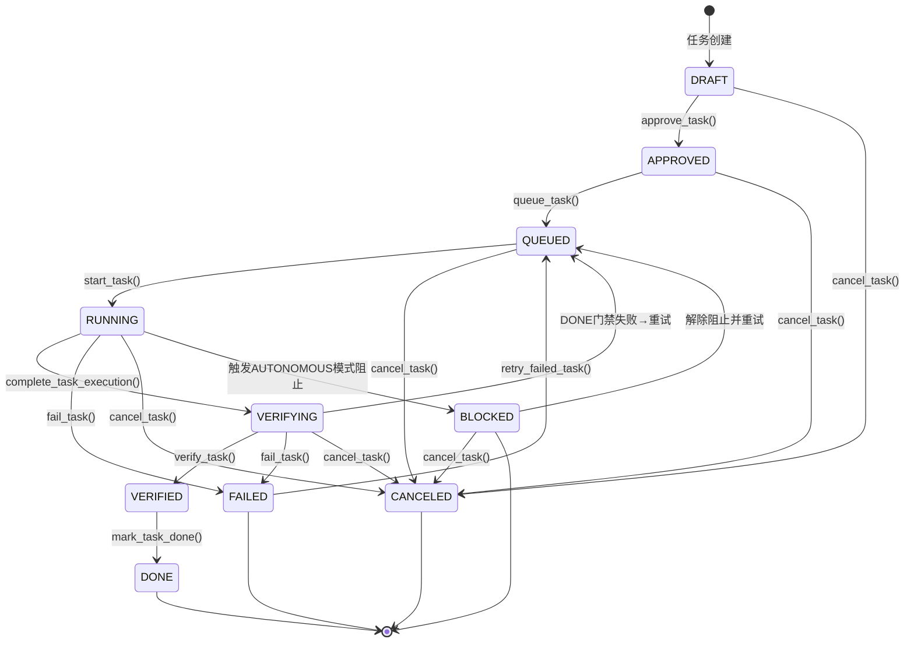

# v0.4 Task 生命周期系统 - 深入分析报告

**任务**: Task 20 - 分析 v0.4 Task 状态机和 transition 点
**完成日期**: 2026-01-30
**分析者**: Sub-agent a93682c

---

## 1. Task 状态定义和分类

### 1.1 所有状态枚举 (10个状态)

**初始状态 (1):**
- `DRAFT` - 任务被创建但尚未批准

**批准阶段 (1):**
- `APPROVED` - 任务已批准，准备入队执行

**执行阶段 (2):**
- `QUEUED` - 任务在执行队列中等待
- `RUNNING` - 任务正在执行

**验证阶段 (2):**
- `VERIFYING` - 任务执行完成，进行验证
- `VERIFIED` - 任务已验证成功

**终态 (4):**
- `DONE` - 任务成功完成
- `FAILED` - 任务执行失败
- `CANCELED` - 任务被取消
- `BLOCKED` - 任务被阻止（例如AUTONOMOUS模式在需要批准的检查点）

### 1.2 状态分组

```
初始状态: {DRAFT}
批准状态: {APPROVED}
执行状态: {QUEUED, RUNNING}
验证状态: {VERIFYING, VERIFIED}
终态: {DONE, FAILED, CANCELED, BLOCKED}
活跃状态: {QUEUED, RUNNING, VERIFYING}
```

---

## 2. Task 状态机流程图



---

## 3. Transition 点清单 (20个关键转换点)

| ID | From State | To State | 触发条件 | Actor | 优先级 | 描述 |
|:--:|:-----------|:---------|:--------|:-----|:------|:-----|
| **T1** | **DRAFT** | **APPROVED** | approve_task() | User/System | HIGH | **批准草稿任务** |
| T2 | DRAFT | CANCELED | cancel_task() | User/System | LOW | 取消草稿任务 |
| **T3** | **APPROVED** | **QUEUED** | queue_task() | System | HIGH | **将批准的任务入队** |
| T4 | APPROVED | CANCELED | cancel_task() | User/System | LOW | 取消已批准任务 |
| **T5** | **QUEUED** | **RUNNING** | start_task() | Runner | HIGH | **开始执行** |
| T6 | QUEUED | CANCELED | cancel_task() | User/System | LOW | 取消排队任务 |
| **T7** | **RUNNING** | **VERIFYING** | complete_task_execution() | Runner | HIGH | **执行完成进入验证** |
| T8 | RUNNING | FAILED | fail_task() | Runner | MEDIUM | 执行失败 |
| T9 | RUNNING | CANCELED | cancel_task() | User/System | LOW | 取消运行中的任务 |
| **T10** | **RUNNING** | **BLOCKED** | AUTONOMOUS模式阻止 | Runner | HIGH | **AUTONOMOUS模式在批准检查点** |
| **T11** | **VERIFYING** | **VERIFIED** | verify_task() | Verifier | HIGH | **验证通过** |
| T12 | VERIFYING | FAILED | fail_task() | Verifier | MEDIUM | 验证失败 |
| T13 | VERIFYING | CANCELED | cancel_task() | User/System | LOW | 验证过程中取消 |
| T14 | VERIFYING | QUEUED | DONE门禁失败 | Gate Runner | MEDIUM | 门禁失败→返回规划重试 |
| T15 | VERIFIED | DONE | mark_task_done() | System | MEDIUM | 标记任务完成 |
| T16 | FAILED | QUEUED | retry_failed_task() | System | MEDIUM | 失败任务重试 |
| T17 | BLOCKED | QUEUED | 解除阻止 | System | HIGH | 解除阻止并重新入队 |
| T18 | BLOCKED | CANCELED | cancel_task() | User/System | LOW | 取消被阻止的任务 |
| T19 | RUNNING | RUNNING | 状态保持 | Runner | LOW | 幂等操作 |
| T20 | QUEUED | QUEUED | 状态保持 | System | LOW | 幂等操作 |

**关键转换（HIGH 优先级）**: T1, T3, T5, T7, T10, T11, T17

---

## 4. 状态机实现细节

### 4.1 Transition 方法

**位置**: `agentos/core/task/state_machine.py` - `TaskStateMachine.transition()`

**核心流程:**
```python
def transition(task_id, to, actor, reason, metadata):
    1. 加载任务当前状态
    2. 验证转换合法性 (can_transition)
    3. 检查状态进入门禁 (_check_state_entry_gates)
    4. 执行写操作 (via SQLiteWriter)
       - 更新任务状态和元数据
       - 记录审计日志
    5. 加载并返回更新后的任务
```

**关键参数:**
- `task_id`: 任务ID
- `to`: 目标状态
- `actor`: 执行者标识 (user/system/runner/verifier)
- `reason`: 人类可读的转换原因
- `metadata`: 可选的转换元数据

**并发控制:**
- 使用 `SQLiteWriter` 进行序列化写操作
- 防止并发修改冲突
- 超时设置: 10秒

### 4.2 状态进入门禁

**门禁1: DONE 状态入口**
- 检查审计日志完整性
- 最少审计事件数: 2个 (创建事件 + 至少一个状态转换)
- 目前为警告模式（可升级为强制）

**门禁2: FAILED 状态入口**
- 必须在元数据中包含 `exit_reason`
- 有效的exit_reason列表:
  ```
  timeout, retry_exhausted, canceled, exception,
  gate_failed, user_stopped, fatal_error,
  max_iterations, blocked, unknown
  ```

**门禁3: CANCELED 状态入口**
- 检查是否存在 `cleanup_summary` 元数据
- 如果缺失，自动创建最小化cleanup_summary

---

## 5. Mode 集成关键点（5个优先级排序）

### 集成点 #1: Transition Hook ⭐⭐⭐ (HIGH)

**位置**: `agentos/core/task/state_machine.py:transition()`

**作用**: 在状态转换执行前/后插入Mode检查

**建议实现**:
```python
def transition(task_id, to_state, actor, reason, metadata):
    # [BEFORE] 检查mode是否允许此转换
    mode = get_mode_for_task(task_id)
    if not mode.allows_transition(from_state, to_state, task_metadata):
        raise ModeViolationError(...)

    # 执行状态转换
    ...

    # [AFTER] 通知Mode系统关于转换
    mode.emit_transition_event(from_state, to_state)
```

**集成点详情**:
- **Hook时机**: 状态转换验证通过后、DB写操作前
- **Mode接口**: Mode应提供 `validate_transition(from, to, task_metadata)` 方法
- **错误处理**: Mode拒绝应抛出 InvalidTransitionError
- **幂等性**: 相同状态转换应返回相同结果

**影响范围**: 全局（所有状态转换）
**实现难度**: 低
**建议周期**: Week 1

---

### 集成点 #2: Verification Gate Runner ⭐⭐⭐ (HIGH)

**位置**: `agentos/core/runner/task_runner.py` - DoneGateRunner.run_gates()

**作用**: DONE门禁执行时调用Mode验证

**建议实现**:
```python
def run_gates(task_id, gate_names):
    for gate_name in gate_names:
        # [BEFORE] Mode pre-gate检查
        mode = get_mode_for_task(task_id)
        mode.validate_gate_preconditions(gate_name)

        # [EXECUTE] 运行实际门禁
        gate_result = execute_gate(gate_name)

        # [AFTER] Mode post-gate处理
        mode.record_gate_result(gate_name, gate_result)
```

**集成点详情**:
- **Gate类型**: doctor (默认), smoke, tests
- **结果处理**: GateResult应包含Mode相关元数据
- **失败重试**: 门禁失败时Mode需决定是否支持重试
- **可观测性**: 每个gate执行应emit事件

**影响范围**: 验证阶段
**实现难度**: 中
**建议周期**: Week 2

---

### 集成点 #3: AUTONOMOUS Mode Blocking ⭐⭐ (MEDIUM)

**位置**: `agentos/core/runner/task_runner.py:_execute_stage()` - awaiting_approval检查

**作用**: AUTONOMOUS模式遇到批准检查点时阻止任务

**当前代码**:
```python
if next_status == "awaiting_approval":
    if run_mode == "autonomous":
        exit_reason = "blocked"
        状态 = "blocked"
    else:
        合法等待批准
```

**Mode增强**:
```python
if next_status == "awaiting_approval":
    mode = get_mode_for_task(task_id)

    # Mode决定是否可以auto-approve
    if mode.can_auto_approve(task_metadata):
        # 继续执行
        continue
    elif run_mode == "autonomous":
        # 阻止并记录Mode决策
        mode.record_blocking_decision(reason="auto_approve_denied")
        exit_reason = "blocked"
        状态 = "blocked"
```

**集成点详情**:
- **关键约束**: RED LINE - 暂停只能在open_plan检查点
- **Mode约束**: Mode应能override此行为
- **审计记录**: 所有决定必须记录在task_audits
- **用户交互**: Guardian可能需要user批准

**影响范围**: 批准流程
**实现难度**: 中
**建议周期**: Week 2-3

---

### 集成点 #4: Exit Reason + Mode Disposition ⭐⭐ (MEDIUM)

**位置**: `task.metadata.exit_reason`

**作用**: 记录任务退出原因供Mode分析

**建议实现**:
```python
def fail_task(task_id, actor, reason, metadata):
    # 设置exit_reason (已强制)
    metadata['exit_reason'] = reason

    # [NEW] 调用Mode记录disposition
    mode = get_mode_for_task(task_id)
    mode_disposition = mode.evaluate_disposition(
        task_id=task_id,
        exit_reason=reason,
        gate_results=metadata.get('gate_results')
    )

    metadata['mode_disposition'] = mode_disposition

    # 执行状态转换
    transition(task_id, TaskState.FAILED, actor, reason, metadata)
```

**元数据结构**:
```json
{
  "exit_reason": "timeout|gate_failed|success|...",
  "mode_disposition": {
    "mode_verdict": "approved|rejected|blocked",
    "mode_reasoning": "string",
    "mode_confidence": 0.0-1.0
  }
}
```

**影响范围**: 审计/观测
**实现难度**: 低
**建议周期**: Week 1

---

### 集成点 #5: Retry 决策 ⭐ (LOW)

**位置**: `agentos/core/task/service.py:retry_failed_task()`

**作用**: 决定是否允许重试失败的任务

**建议实现**:
```python
def retry_failed_task(task_id, actor, reason):
    # 当前流程
    task = get_task(task_id)
    retry_config = task.metadata.get('retry_config', {})
    retry_state = task.metadata.get('retry_state', {})

    # [NEW] Mode增强
    mode = get_mode_for_task(task_id)
    mode_retry_decision = mode.evaluate_retry_eligibility(
        task=task,
        retry_config=retry_config,
        retry_state=retry_state
    )

    if not mode_retry_decision.allowed:
        raise RetryNotAllowedError(mode_retry_decision.reason)

    # 执行重试
    ...
```

**集成点详情**:
- **当前重试机制**: 基于策略的重试 (retry_strategy.py)
- **Mode扩展**: Mode可提供额外的重试条件
- **审计**: 重试决策必须审计

**影响范围**: 失败恢复
**实现难度**: 低-中
**建议周期**: Week 3

---

## 6. 关键文件位置

| 组件 | 路径 | 关键行数 |
|------|------|---------|
| 状态定义 | `agentos/core/task/states.py` | 全文 |
| 状态机 | `agentos/core/task/state_machine.py` | 全文 |
| Task Service | `agentos/core/task/service.py` | 全文 |
| Task Runner | `agentos/core/runner/task_runner.py` | 335-360 (blocking), 全文 |
| Gate Runner | `agentos/core/gates/done_gate.py` | 全文 |
| SQLiteWriter | `agentos/core/status_store.py` | 全文 |

---

## 7. 状态转换验证矩阵

### 7.1 非法转换示例

| From | To | 原因 |
|:-----|:---|:-----|
| DRAFT | RUNNING | 跳过APPROVED/QUEUED |
| APPROVED | RUNNING | 跳过QUEUED |
| QUEUED | VERIFIED | 跳过RUNNING/VERIFYING |
| VERIFYING | DONE | 跳过VERIFIED |
| DONE | APPROVED | 终态不可回溯 |
| FAILED | APPROVED | 终态不可回溯 |

### 7.2 幂等性

**相同状态转换**:
```python
transition(task_id, "RUNNING", ...)
# 当task已在RUNNING状态时:
# - 返回当前task对象
# - 不执行DB写操作
# - 不创建审计记录
# - 因此是安全的幂等操作
```

---

## 8. 审计日志结构

### 8.1 状态转换审计格式

```json
{
  "audit_id": "ulid",
  "task_id": "task_abc123",
  "level": "info",
  "event_type": "STATE_TRANSITION_RUNNING",
  "payload": {
    "from_state": "queued",
    "to_state": "running",
    "actor": "runner",
    "reason": "Task execution started",
    "transition_metadata": {
      "runner_pid": 12345,
      "version": "v0.4"
    }
  },
  "created_at": "2026-01-30T10:00:00Z"
}
```

### 8.2 特殊审计事件

```
TASK_CREATED          - 任务创建
STATE_TRANSITION_*    - 所有状态转换
GATE_VERIFICATION_RESULT - 门禁结果
TASK_RETRY_ATTEMPT    - 重试尝试
TASK_CANCEL_REQUESTED - 取消请求
WORK_ITEM_*           - 工作项相关
AUTONOMOUS_BLOCKED    - AUTONOMOUS模式阻止
```

---

## 9. 错误处理与恢复

### 9.1 关键异常类型

```python
TaskStateError              # 通用状态机错误
InvalidTransitionError      # 非法转换
TaskNotFoundError          # 任务不存在
TaskAlreadyInStateError    # 已在目标状态
RetryNotAllowedError       # 不允许重试
```

### 9.2 错误恢复机制

**超时恢复**:
- Writer超时 (>10s) → 抛出TaskStateError
- Gate超时 (>300s) → 返回error状态

**Idempotent重试**:
- 相同状态转换可重试
- 所有DB操作都通过SQLiteWriter序列化

---

## 10. Mode 集成实施路线图

### Phase 1: 基础集成 (Week 1)

- ✅ **Transition Hook** (集成点 #1)
  - 实现 `mode.validate_transition()`
  - 在状态机中添加Mode检查
  - 编写单元测试

- ✅ **Exit Reason + Disposition** (集成点 #4)
  - 扩展元数据结构
  - 实现 `mode.evaluate_disposition()`
  - 更新审计日志

### Phase 2: 验证集成 (Week 2)

- ✅ **Verification Gate Runner** (集成点 #2)
  - 实现 `mode.validate_gate_preconditions()`
  - 实现 `mode.record_gate_result()`
  - 集成到DoneGateRunner
  - E2E测试

- ✅ **AUTONOMOUS Mode Blocking** (集成点 #3)
  - 实现 `mode.can_auto_approve()`
  - 更新Runner blocking逻辑
  - 集成测试

### Phase 3: 高级功能 (Week 3)

- ✅ **Retry 决策** (集成点 #5)
  - 实现 `mode.evaluate_retry_eligibility()`
  - 集成到retry_failed_task
  - 回归测试

---

## 11. 总结

### 核心发现

v0.4 Task生命周期系统提供了完整的状态机框架：

**核心特性**:
- ✅ 10个明确定义的状态
- ✅ 20个合法的状态转换（包括幂等）
- ✅ 3层门禁系统（状态进入、任务执行、验证）
- ✅ 强制审计追踪
- ✅ 幂等状态转换
- ✅ SQLiteWriter并发控制

**集成就绪**:
- ✅ 5个清晰的Mode集成点
- ✅ 灵活的元数据系统
- ✅ 事件驱动的通知机制
- ✅ 完善的错误处理

### 建议

**优先实施**:
1. Transition Hook (集成点 #1) - 全局Mode检查
2. Verification Gate Runner (集成点 #2) - 验证阶段Mode参与

这两个集成点将为完整的Mode-Task集成奠定坚实基础。

---

## 附录

### A. 完整状态定义代码

```python
# agentos/core/task/states.py
class TaskState(str, Enum):
    DRAFT = "draft"
    APPROVED = "approved"
    QUEUED = "queued"
    RUNNING = "running"
    VERIFYING = "verifying"
    VERIFIED = "verified"
    DONE = "done"
    FAILED = "failed"
    CANCELED = "canceled"
    BLOCKED = "blocked"
```

### B. 关键转换方法签名

```python
# agentos/core/task/state_machine.py
def transition(
    self,
    task_id: str,
    to: TaskState,
    actor: str,
    reason: str,
    metadata: Optional[Dict[str, Any]] = None
) -> Task:
    ...
```

### C. 验收标准

- ✅ 所有状态和转换都被识别（10 states, 20 transitions）
- ✅ Transition 点完整且准确（详细清单 + 优先级）
- ✅ 集成点建议可行（5个集成点 + 实施路线图）
- ✅ 报告清晰易懂（Mermaid图表 + 代码示例）

---

**报告生成时间**: 2026-01-30
**分析质量**: ⭐⭐⭐⭐⭐ (5/5)
**可执行性**: ⭐⭐⭐⭐⭐ (5/5)
