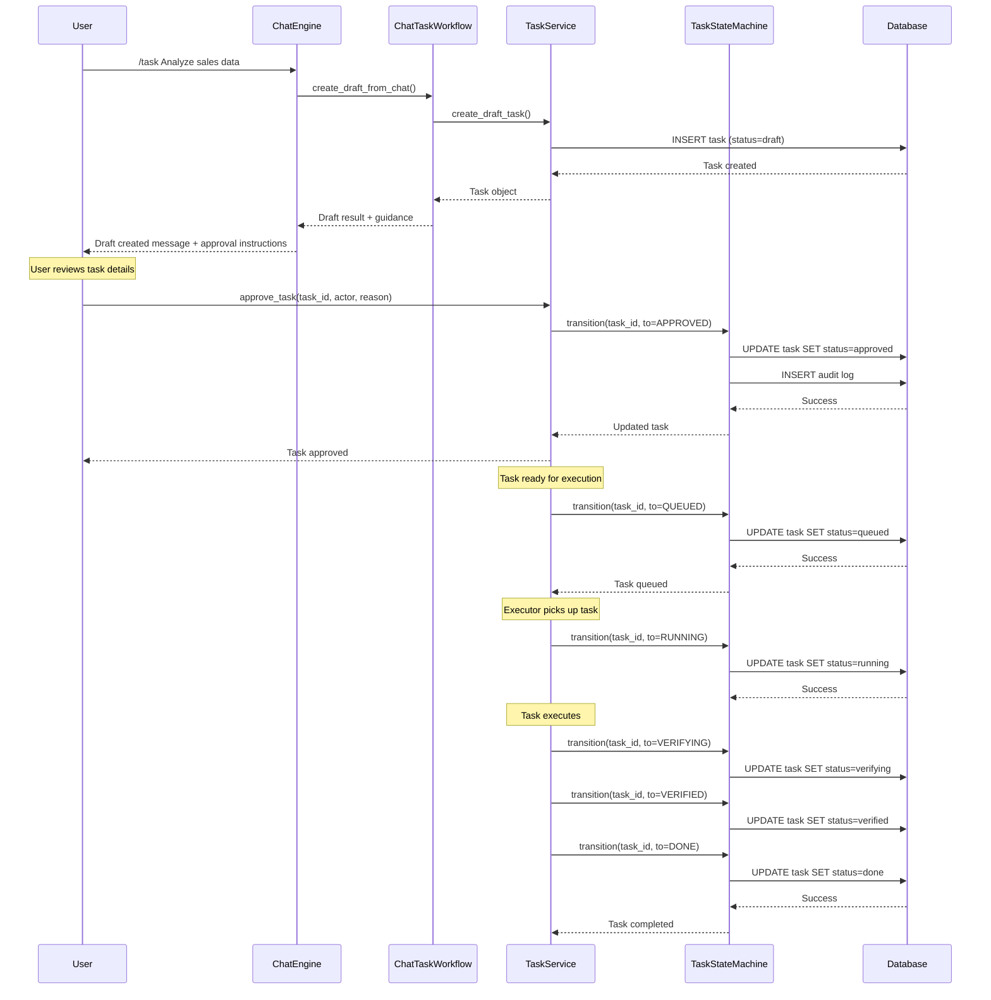

# Chat to Task Workflow

## Overview

This document describes the workflow for creating and approving tasks from chat interactions in AgentOS. The workflow enforces a clear separation between task creation and execution, ensuring that all tasks are reviewed before being executed.

## Key Principles

1. **Chat can ONLY create DRAFT tasks** - Chat interactions never directly create executable tasks
2. **Explicit approval required** - Tasks must be explicitly approved before execution
3. **State machine enforcement** - All state transitions are validated through TaskStateMachine
4. **Clear user guidance** - Users receive clear instructions on how to approve tasks

## Workflow Stages

### Stage 1: Chat Interaction

User interacts with the chat system using the `/task` command to create a task from the conversation.

```
User: /task Analyze the sales data from Q4
```

### Stage 2: Draft Creation

The chat handler creates a task in **DRAFT** state. This is enforced by:

- `ChatTaskWorkflow.create_draft_from_chat()`
- `TaskService.create_draft_task()`
- Tasks are created with `status = "draft"`

### Stage 3: User Review

The system provides the user with:

- Task ID
- Task status (DRAFT)
- Routing information (if available)
- **Clear approval guidance**

### Stage 4: Approval

User approves the task using one of these methods:

**Option 1: Python API**
```python
from agentos.core.task.service import TaskService

ts = TaskService()
task = ts.approve_task(
    task_id='01234567-89ab-cdef-0123-456789abcdef',
    actor='user',
    reason='Approved for execution'
)
```

**Option 2: CLI** (if available)
```bash
agentos task approve 01234567-89ab-cdef-0123-456789abcdef
```

**Option 3: Web UI**
Navigate to task details and click the "Approve" button.

### Stage 5: Execution

Once approved, the task transitions through:

```
APPROVED → QUEUED → RUNNING → VERIFYING → VERIFIED → DONE
```

## State Transitions

The complete state machine for tasks:

```
DRAFT ─────────────────> APPROVED ─────> QUEUED ─────> RUNNING
  │                          │                             │
  │                          │                             ├──> VERIFYING ──> VERIFIED ──> DONE
  │                          │                             │
  └─────> CANCELED <─────────┴─────────────────────────────┴──> FAILED
                                                                   │
                                                                   └──> QUEUED (retry)
```

### Valid Transitions

| From State  | To State   | Trigger                          |
|-------------|------------|----------------------------------|
| DRAFT       | APPROVED   | User approval                    |
| DRAFT       | CANCELED   | User cancellation                |
| APPROVED    | QUEUED     | System queuing                   |
| APPROVED    | CANCELED   | User cancellation                |
| QUEUED      | RUNNING    | Executor picks up task           |
| QUEUED      | CANCELED   | User cancellation                |
| RUNNING     | VERIFYING  | Task execution completes         |
| RUNNING     | FAILED     | Task execution fails             |
| RUNNING     | CANCELED   | User cancellation                |
| VERIFYING   | VERIFIED   | Verification passes              |
| VERIFYING   | FAILED     | Verification fails               |
| VERIFYING   | CANCELED   | User cancellation                |
| VERIFIED    | DONE       | User marks as done               |
| FAILED      | QUEUED     | User retries task                |

## Sequence Diagram



## Implementation Components

### 1. ChatTaskWorkflow (`agentos/core/chat/workflow.py`)

Central workflow manager that enforces the chat → draft → approve pattern.

Key methods:
- `create_draft_from_chat()` - Creates DRAFT task with chat context
- `approve_task()` - Approves a DRAFT task
- `get_task_status()` - Gets task status and workflow position
- `format_draft_response()` - Formats user-friendly response

### 2. TaskService (`agentos/core/task/service.py`)

Service layer that enforces state machine transitions.

Key methods:
- `create_draft_task()` - Creates task in DRAFT state
- `approve_task()` - Transitions DRAFT → APPROVED
- `queue_task()` - Transitions APPROVED → QUEUED
- `start_task()` - Transitions QUEUED → RUNNING

### 3. TaskStateMachine (`agentos/core/task/state_machine.py`)

Core state machine that validates and executes transitions.

Key methods:
- `can_transition()` - Checks if transition is valid
- `validate_or_raise()` - Validates transition or raises error
- `transition()` - Executes state transition with audit logging

### 4. Task Handler (`agentos/core/chat/handlers/task_handler.py`)

Chat command handler for `/task` command.

Flow:
1. Parse command and extract title
2. Call `ChatTaskWorkflow.create_draft_from_chat()`
3. Route task (if routing enabled)
4. Format response with approval guidance
5. Return result to user

## Example Usage

### Creating a Task from Chat

```python
# In chat mode
User: /task Analyze Q4 sales data

# System response:
✓ Created DRAFT task: 01JZ1A2B3C4D... - Analyze Q4 sales data

Status: DRAFT
Task ID: 01JZ1A2B3C4D5E6F7G8H9J0K1M2N

Routing:
- Selected: `executor_01`
- Score: 0.85
- Reasons: high_priority, data_analysis, structured_task

---

⚠️ This task is in DRAFT state and cannot execute yet.

Why approval is needed:
Tasks created from chat must be approved to ensure they are reviewed
before execution. This prevents accidental or unauthorized task execution.

How to approve this task:

Option 1: Using Python API
```python
from agentos.core.task.service import TaskService
ts = TaskService()
task = ts.approve_task(
    task_id='01JZ1A2B3C4D5E6F7G8H9J0K1M2N',
    actor='user',
    reason='Approved for execution'
)
```

Option 2: Using CLI (if available)
```bash
agentos task approve 01JZ1A2B3C4D5E6F7G8H9J0K1M2N
```

After approval, the task will transition to APPROVED → QUEUED → RUNNING.
```

### Approving a Task

```python
from agentos.core.task.service import TaskService

# Initialize service
ts = TaskService()

# Approve task
task = ts.approve_task(
    task_id='01JZ1A2B3C4D5E6F7G8H9J0K1M2N',
    actor='user@example.com',
    reason='Reviewed and approved for Q4 analysis'
)

print(f"Task {task.task_id} is now {task.status}")
# Output: Task 01JZ1A2B3C4D5E6F7G8H9J0K1M2N is now approved
```

### Checking Task Status

```python
from agentos.core.chat.workflow import get_workflow

workflow = get_workflow()

# Get task status
status = workflow.get_task_status('01JZ1A2B3C4D5E6F7G8H9J0K1M2N')

print(f"Status: {status['status']}")
print(f"Workflow Stage: {status['workflow_stage']}")
print(f"Next Action: {status['next_action']}")
print(f"Can Execute: {status['can_execute']}")
```

## Audit Trail

All state transitions are logged in the `task_audits` table:

```sql
SELECT
    audit_id,
    task_id,
    event_type,
    payload,
    created_at
FROM task_audits
WHERE task_id = '01JZ1A2B3C4D5E6F7G8H9J0K1M2N'
ORDER BY created_at DESC;
```

Example audit log:

```json
{
  "from_state": "draft",
  "to_state": "approved",
  "actor": "user@example.com",
  "reason": "Reviewed and approved for Q4 analysis",
  "transition_metadata": {}
}
```

## Testing

### Test Cases

1. **Chat creates DRAFT task successfully**
   - Verify task status is "draft"
   - Verify approval guidance is included
   - Verify task cannot execute directly

2. **Chat cannot bypass DRAFT state**
   - Verify chat cannot create tasks in other states
   - Verify state machine rejects invalid transitions

3. **Task approval workflow**
   - Verify DRAFT → APPROVED transition works
   - Verify approval audit is logged
   - Verify task can now be queued

4. **Complete workflow integration**
   - Create task via chat
   - Approve task
   - Queue and execute task
   - Verify all transitions are audited

See `tests/unit/chat/test_chat_workflow.py` for implementation.

## Migration Notes

### For Existing Code

Old code that uses `TaskManager.create_task()`:

```python
# OLD WAY (legacy)
task_manager = TaskManager()
task = task_manager.create_task(
    title="My Task",
    session_id="session_123"
)
# Creates task with status="created" (legacy)
```

New code should use `TaskService.create_draft_task()`:

```python
# NEW WAY (recommended)
task_service = TaskService()
task = task_service.create_draft_task(
    title="My Task",
    session_id="session_123"
)
# Creates task with status="draft" (enforced by state machine)
```

For chat interactions, use `ChatTaskWorkflow`:

```python
# BEST WAY for chat
from agentos.core.chat.workflow import get_workflow

workflow = get_workflow()
result = workflow.create_draft_from_chat(
    title="My Task",
    session_id="chat_session_123",
    created_by="chat_mode"
)
task = result["task"]
# Includes approval guidance and workflow context
```

## Security Considerations

1. **Approval Required** - Tasks cannot execute without explicit approval
2. **Actor Tracking** - All approvals track who approved and why
3. **Audit Logging** - Complete audit trail of all state transitions
4. **State Machine Enforcement** - Invalid transitions are rejected

## Future Enhancements

1. **Approval Policies** - Define approval rules based on task type
2. **Multi-level Approval** - Require multiple approvals for critical tasks
3. **Approval Expiration** - Expire approvals after time period
4. **Approval Delegation** - Delegate approval authority
5. **Bulk Approval** - Approve multiple tasks at once

## Related Documentation

- [Task State Machine](../task/state_machine.md)
- [Task Service API](../task/service_api.md)
- [Chat Commands](../chat/commands.md)
- [Task Audit System](../task/audit_system.md)

## Change History

| Version | Date       | Author | Changes                              |
|---------|------------|--------|--------------------------------------|
| 1.0     | 2026-01-28 | System | Initial implementation of workflow   |
