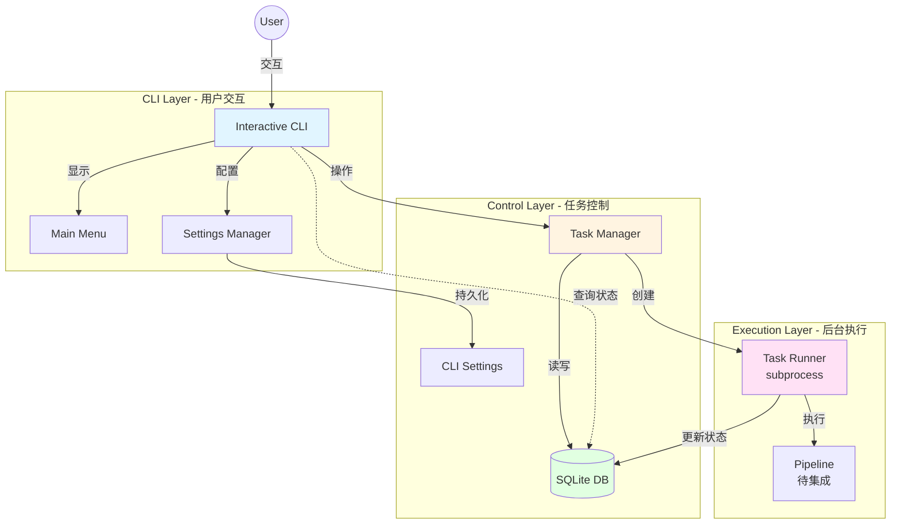
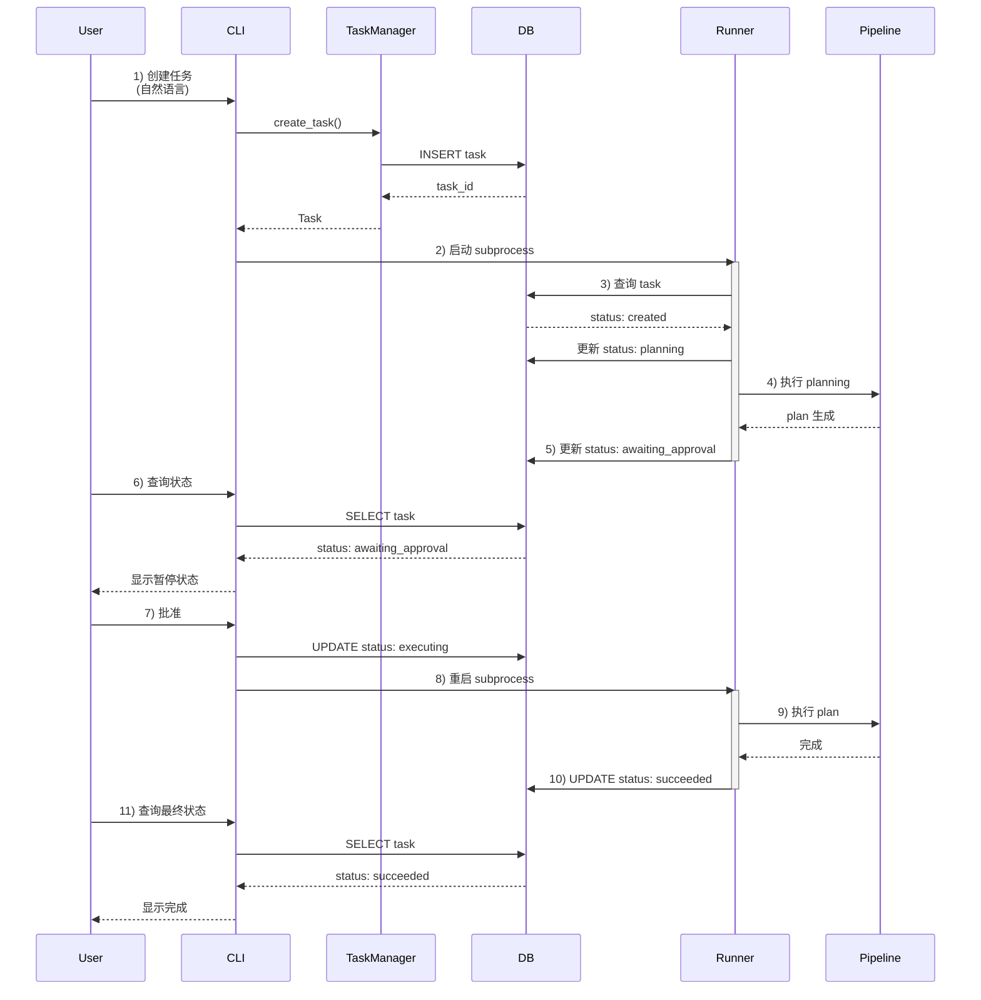
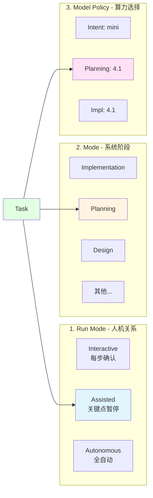
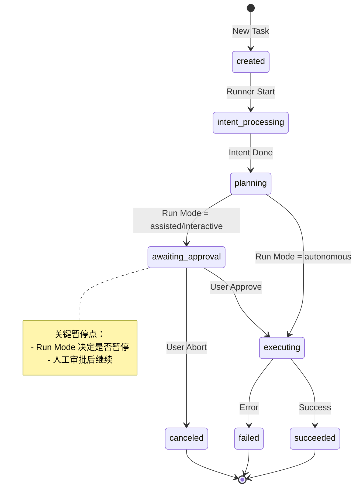
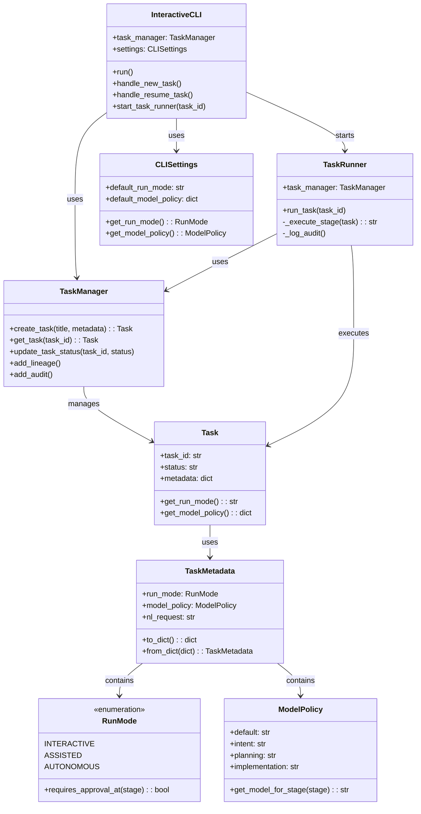
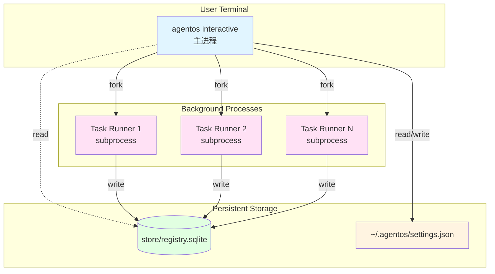
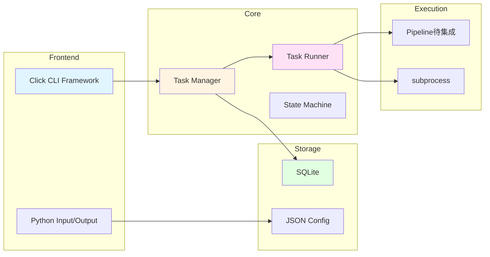
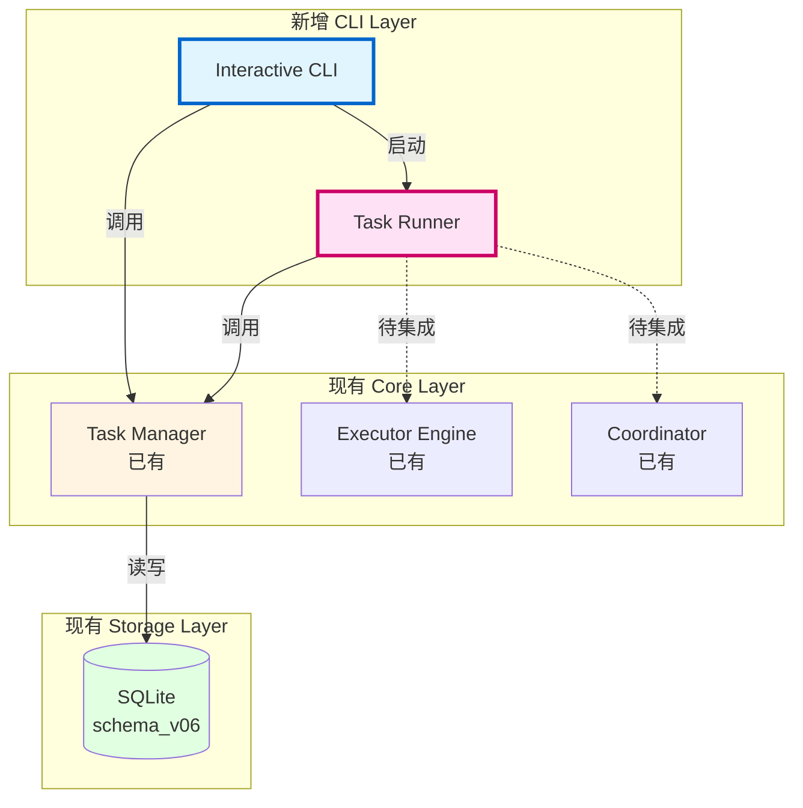

# CLI Task Control Plane - 架构图

## 系统架构概览



## 数据流图



## 三层模型架构



## 状态机转换图



## 文件组织结构

```
agentos/
├── cli/
│   ├── main.py              # 入口，集成交互模式
│   └── interactive.py       # 交互式主循环 [NEW]
│
├── config/
│   ├── __init__.py          # [NEW]
│   └── cli_settings.py      # CLI 配置管理 [NEW]
│
├── core/
│   ├── task/
│   │   ├── models.py        # Task 模型（扩展）
│   │   ├── manager.py       # TaskManager（不变）
│   │   ├── run_mode.py      # RunMode/ModelPolicy [NEW]
│   │   └── __init__.py      # 导出新类型
│   │
│   └── runner/
│       ├── __init__.py      # [NEW]
│       └── task_runner.py   # 后台 Runner [NEW]
│
tests/
└── test_cli_e2e.py          # 端到端测试 [NEW]

docs/
└── cli/
    ├── CLI_TASK_CONTROL_PLANE.md      # 使用文档 [NEW]
    ├── CLI_IMPLEMENTATION_SUMMARY.md  # 实现总结 [NEW]
    └── CLI_ARCHITECTURE.md             # 架构图（本文档）[NEW]
```

## 核心类关系图



## 部署视图



## 技术栈



## 与现有系统集成点



## 设计原则

### 1. 最小侵入 (Minimal Intrusion)
- 不修改现有 TaskManager 核心逻辑
- 不修改现有 Executor/Coordinator
- 纯增量添加新模块

### 2. 渐进式演进 (Progressive Evolution)
- 当前：subprocess 模式（简单可靠）
- 未来：daemon 模式（高性能）
- 接口保持兼容

### 3. 关注点分离 (Separation of Concerns)
- CLI Layer：用户交互
- Control Layer：任务管理
- Execution Layer：实际执行

### 4. 通过数据库通信 (DB as IPC)
- 最简单的进程间通信
- 天然支持持久化
- 易于调试和追溯

## 核心创新点

### 1. Task-Centric 架构
不同于 opencode 的 session-centric，我们以 task 为中心，提供：
- 完整的 task lineage
- 原生 audit 支持
- 任意时刻可恢复

### 2. 三层模型
清晰分离三个概念：
- Run Mode（人机关系）
- Mode（系统阶段）
- Model Policy（算力选择）

### 3. 智能暂停
根据 Run Mode 自动在关键点暂停：
- Interactive：每步都停
- Assisted：planning 停
- Autonomous：不停

### 4. 可治理性
不只是"让 AI 跑"，而是"让人随时能接管"：
- 任务可暂停
- 任务可恢复
- 任务可追溯
- 任务可审计

---

**文档版本**: v1.0.0  
**创建日期**: 2026-01-26  
**维护者**: AgentOS Team
