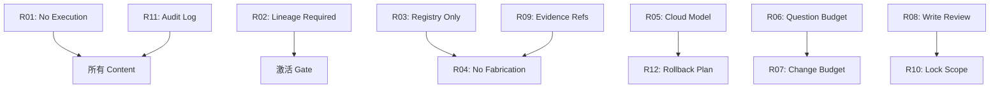

# AgentOS Rules Catalog（规则目录）

本文档提供 AgentOS v0.9 中 12 条 P0 Rules 的完整索引和详细说明。

---

## 📊 统计摘要

- **总数**: 12 条 P0 Rules
- **覆盖范围**: Content Plane 全生命周期（setup → postmortem）
- **严重级别分布**:
  - `block`: 3 条（R01, R02, R06）
  - `error`: 8 条（R03-R05, R07-R08, R10-R12）
  - `warn`: 1 条（R09）

---

## 🗂️ 分类索引

### 类别 1: 执行与安全（Execution & Security）

#### R01: No Execution
- **ID**: `rule_r01_no_execution`
- **Severity**: `block`
- **Scope**: 所有 content types，所有 risk levels，所有 phases
- **核心约束**: Content Plane 禁止任何执行逻辑
- **禁止字段**: `execute`, `run`, `shell`, `bash`, `python`, `powershell`, `subprocess`, `command_line`, `script`, `exec`
- **强制**: `constraints.execution: forbidden`
- **Evidence**: `content_source_yaml`, `schema_validation`

**适用场景**：
- ✅ 所有 content 注册前的 schema 验证
- ✅ Runtime gate 检查
- ✅ Static scan 禁止执行符号

**不适用场景**：
- ❌ Execution Plane（未来 v0.9.1+）

---

### 类别 2: 治理与血缘（Governance & Lineage）

#### R02: Lineage Required
- **ID**: `rule_r02_lineage_required`
- **Severity**: `block`
- **Scope**: workflow, agent, command, policy, rule
- **核心约束**: 激活前必须有完整 lineage
- **必须字段**: `lineage.introduced_in`, `lineage.derived_from`, `lineage.supersedes`
- **Evidence**: `content_metadata`, `lineage_validation`

**适用场景**：
- ✅ ContentActivationGate 检查（v0.5 红线 #3 的 gate 表达）
- ✅ 注册时验证
- ✅ 版本演化追踪

**不适用场景**：
- ❌ memory, fact（它们有自己的存储机制）

---

#### R11: Audit Log Mandatory
- **ID**: `rule_r11_audit_log_mandatory`
- **Severity**: `error`
- **Scope**: rule type（所有规则评估）
- **核心约束**: 规则判定必须写入 run_tape/audit
- **必须操作**: 记录 rule_id, outcome, evidence, timestamp
- **Evidence**: `audit_log_entry`, `run_tape_reference`, `evaluation_metadata`

**适用场景**：
- ✅ 规则引擎执行时（未来）
- ✅ 合规审计
- ✅ 调试和事后分析

---

### 类别 3: 引用与完整性（References & Integrity）

#### R03: Registry Only References
- **ID**: `rule_r03_registry_only_references`
- **Severity**: `error`
- **Scope**: workflow, agent, command（medium/high/critical risk）
- **核心约束**: 引用的 content ID 必须在 ContentRegistry 中
- **禁止**: 编造、幻觉、未注册的 ID
- **Evidence**: `registry_query_result`, `content_reference_list`

**适用场景**：
- ✅ Intent/Plan 构建时
- ✅ Workflow 步骤引用 command/agent
- ✅ 防止 "幻觉引用"

**不适用场景**：
- ❌ 外部系统引用（如 GitHub API）

---

#### R04: No Fabrication Paths Commands
- **ID**: `rule_r04_no_fabrication_paths_commands`
- **Severity**: `error`
- **Scope**: workflow, command（medium/high/critical risk）
- **核心约束**: 路径和命令必须来自 factpack/scan
- **禁止**: 编造文件路径、幻觉命令
- **Evidence**: `factpack`, `project_scan`, `path_validation`

**适用场景**：
- ✅ 文件操作规划
- ✅ 命令执行前验证
- ✅ 防止操作不存在的文件

**不适用场景**：
- ❌ 模板文件路径（占位符）

---

### 类别 4: 风险管理（Risk Management）

#### R05: Risk Escalation Cloud Model Required
- **ID**: `rule_r05_risk_escalation_cloud_model_required`
- **Severity**: `error`
- **Scope**: high/critical risk
- **核心约束**: 高风险决策必须用云端模型
- **禁止**: 本地/边缘模型处理高风险决策
- **Evidence**: `risk_assessment`, `model_configuration`, `inference_metadata`

**适用场景**：
- ✅ 生产环境部署规划
- ✅ 数据库迁移设计
- ✅ 安全敏感操作

**不适用场景**：
- ❌ low/medium risk 任务（可用本地模型）

---

#### R12: Rollback Plan Required High Risk
- **ID**: `rule_r12_rollback_plan_required_high_risk`
- **Severity**: `error`
- **Scope**: workflow, command（high/critical risk）
- **核心约束**: 高风险操作必须有 rollback_plan
- **必须字段**: `rollback_plan` (undo steps, triggers)
- **Evidence**: `risk_assessment`, `rollback_plan`, `rollback_test_result`

**适用场景**：
- ✅ 部署到生产环境
- ✅ 数据库 schema 变更
- ✅ 不可逆操作（如删除）

**不适用场景**：
- ❌ 只读操作（risk_level: low）

---

### 类别 5: 预算与资源（Budget & Resources）

#### R06: Question Budget Full Auto Zero
- **ID**: `rule_r06_question_budget_full_auto_zero`
- **Severity**: `block`
- **Scope**: workflow（full_auto mode）
- **核心约束**: 无人值守模式禁止提问
- **强制**: `question_budget: 0` when `mode: full_auto`
- **Evidence**: `execution_policy`, `mode_configuration`

**适用场景**：
- ✅ CI/CD 自动化流程
- ✅ 定时任务执行
- ✅ 批处理作业

**不适用场景**：
- ❌ semi_auto mode（允许提问）

---

#### R07: Change Budget Required
- **ID**: `rule_r07_change_budget_required`
- **Severity**: `error`
- **Scope**: workflow（medium/high/critical risk）
- **核心约束**: 必须声明变更预算
- **必须字段**: `resource_budget.max_files`, `resource_budget.max_commits`
- **Evidence**: `resource_budget`, `plan_metadata`

**适用场景**：
- ✅ 功能开发规划
- ✅ 重构任务
- ✅ 批量修改

**不适用场景**：
- ❌ 单文件快速修复（low risk）

---

### 类别 6: 审查与证据（Review & Evidence）

#### R08: Write Effect Requires Review State
- **ID**: `rule_r08_write_effect_requires_review_state`
- **Severity**: `error`
- **Scope**: command（write effects）
- **核心约束**: 写操作必须进入 requires_review 状态
- **When**: `effects.kind: write`
- **Then**: `decision: require_review`
- **Evidence**: `command_effects`, `state_transition_log`, `approval_metadata`

**适用场景**：
- ✅ 文件修改
- ✅ 数据库写入
- ✅ 配置变更

**不适用场景**：
- ❌ 只读操作（effects.kind: read）

---

#### R09: Evidence Refs Required for Key Decisions
- **ID**: `rule_r09_evidence_refs_required_for_key_decisions`
- **Severity**: `warn`
- **Scope**: workflow, command（key decisions）
- **核心约束**: 关键决策必须引用 evidence_refs
- **推荐字段**: `evidence_refs` (factpack IDs, scan results)
- **Evidence**: `decision_metadata`, `evidence_references`, `reasoning_trace`

**适用场景**：
- ✅ 架构选型
- ✅ 技术方案设计
- ✅ 重要实现决策

**不适用场景**：
- ❌ 琐碎决策（如变量命名）

---

### 类别 7: 并发与锁（Concurrency & Locking）

#### R10: Lock Scope Required for File Targets
- **ID**: `rule_r10_lock_scope_required_for_file_targets`
- **Severity**: `error`
- **Scope**: command（targets files）
- **核心约束**: 文件操作必须声明 lock_scope
- **必须字段**: `lock_scope` (file paths/patterns, lock mode)
- **Evidence**: `target_file_list`, `lock_scope_declaration`, `conflict_check_result`

**适用场景**：
- ✅ 并发修改文件
- ✅ 多步骤操作同一文件
- ✅ 冲突检测与 WAIT+replan

**不适用场景**：
- ❌ 单次读取操作

---

## 📈 Severity 级别说明

### `block` - 阻塞级别
- **行为**: 立即拒绝，无法通过
- **适用**: 红线约束（如 R01 禁止执行）
- **示例**: R01, R02, R06

### `error` - 错误级别
- **行为**: 默认拒绝，需修正
- **适用**: 必须遵守的规则
- **示例**: R03-R05, R07-R08, R10-R12

### `warn` - 警告级别
- **行为**: 发出警告，可通过但记录
- **适用**: 最佳实践建议
- **示例**: R09

### `info` - 信息级别
- **行为**: 仅记录，不影响流程
- **适用**: 提示信息
- **示例**: （暂无）

---

## 🔗 规则关联图

---

## 🎯 使用建议

### 规划阶段（Setup, Analysis, Design）
- 优先检查: R02, R03, R04, R09
- 确保: Lineage 完整，引用有效，证据充足

### 实施阶段（Implementation, Validation）
- 优先检查: R07, R08, R10
- 确保: 预算声明，写操作审查，锁范围明确

### 发布阶段（Review, Release）
- 优先检查: R05, R12
- 确保: 高风险用云端模型，有回滚计划

### 运维阶段（Operations, Postmortem）
- 优先检查: R11
- 确保: 审计日志完整

---

## 📚 扩展阅读

- **Schema 定义**: `agentos/schemas/content/rule.schema.json`
- **红线 Validator**: `agentos/core/gates/validate_rule_redlines.py`
- **编写指南**: `docs/content/rules/authoring-guide.md`
- **使用说明**: `docs/content/rules/README.md`

---

**版本**: v0.9.0  
**状态**: ✅ Production Ready  
**维护**: AgentOS Team  
**最后更新**: 2026-01-25
