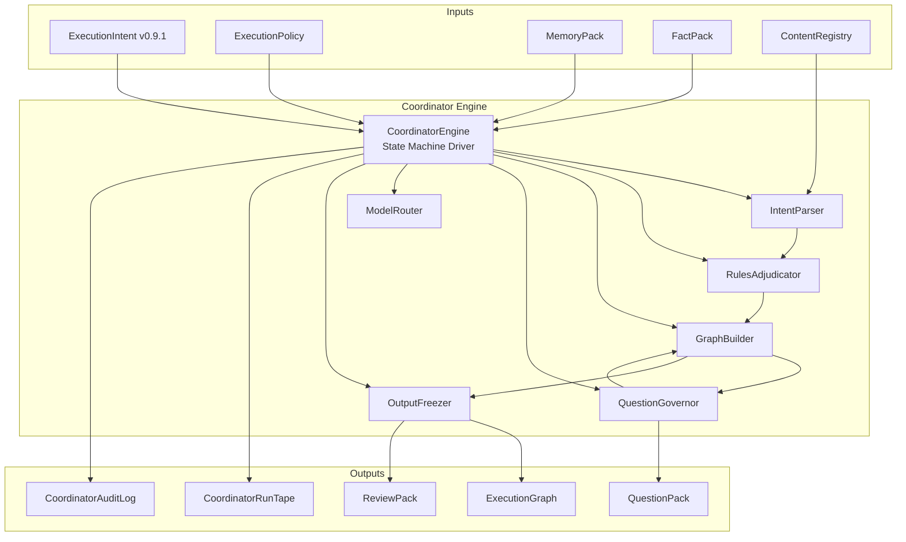
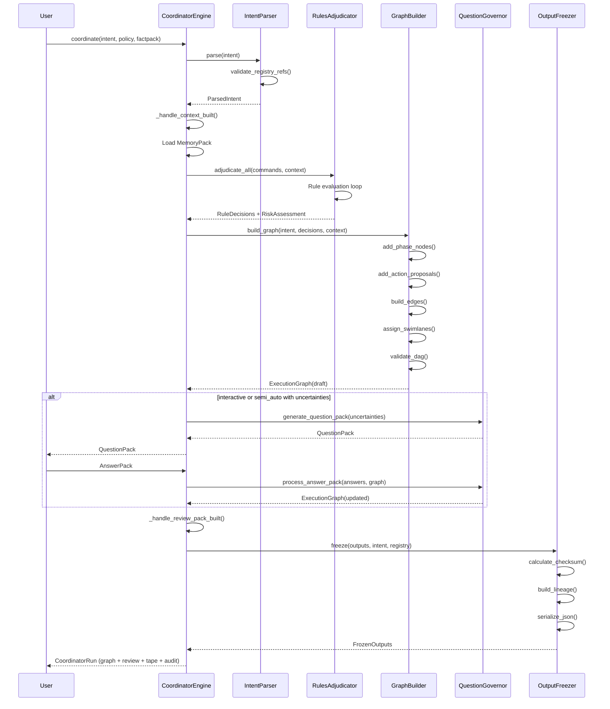
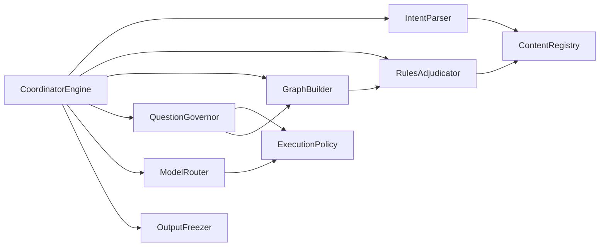

# Coordinator Implementation Architecture (v0.9.2)

**Version**: 0.9.2  
**Status**: Design Specification  
**Date**: 2026-01-25

---

## Overview

This document defines the implementation architecture for the Coordinator Engine. The Coordinator is a **planning engine**, not an execution engine — it transforms ExecutionIntents into auditable, executable plans.

**Core Design Principle**: Separation of planning from execution.

---

## Architecture Diagram



---

## Core Classes

### 1. CoordinatorEngine

**File**: `agentos/core/coordinator/engine.py`

**Purpose**: Main orchestrator and state machine driver

**Key Methods**:

```python
class CoordinatorEngine:
    def __init__(self, registry: ContentRegistry, memory_service: MemoryService):
        self.registry = registry
        self.memory_service = memory_service
        self.current_state = "INIT"
        self.run_tape = []
        
    def coordinate(
        self,
        intent: dict,
        policy: ExecutionPolicy,
        factpack: dict
    ) -> CoordinatorRun:
        """
        Main entry point: Transform Intent into ExecutionGraph and artifacts
        
        Returns:
            CoordinatorRun with all outputs (graph, review, tape, etc.)
        """
        
    def _transition(self, from_state: str, to_state: str, trigger: str) -> bool:
        """
        Execute state transition with guard evaluation
        
        Returns:
            True if transition succeeded, False otherwise
        """
        
    def _evaluate_guards(self, to_state: str, context: dict) -> tuple[bool, list]:
        """
        Evaluate guard conditions for transition
        
        Returns:
            (passed, reasons)
        """
        
    # State handlers (13 total)
    def _handle_received(self, context: dict) -> dict:
        """Handle RECEIVED state"""
        
    def _handle_prechecked(self, context: dict) -> dict:
        """Handle PRECHECKED state - schema validation"""
        
    def _handle_context_built(self, context: dict) -> dict:
        """Handle CONTEXT_BUILT state - memory + factpack"""
        
    def _handle_rules_evaluated(self, context: dict) -> dict:
        """Handle RULES_EVALUATED state - rule adjudication"""
        
    def _handle_graph_drafted(self, context: dict) -> dict:
        """Handle GRAPH_DRAFTED state - graph construction"""
        
    def _handle_questions_emitted(self, context: dict) -> dict:
        """Handle QUESTIONS_EMITTED state - question generation"""
        
    def _handle_awaiting_answers(self, context: dict) -> dict:
        """Handle AWAITING_ANSWERS state - wait for AnswerPack"""
        
    def _handle_graph_finalized(self, context: dict) -> dict:
        """Handle GRAPH_FINALIZED state - integrate answers"""
        
    def _handle_review_pack_built(self, context: dict) -> dict:
        """Handle REVIEW_PACK_BUILT state - build review package"""
        
    def _handle_frozen_outputs(self, context: dict) -> dict:
        """Handle FROZEN_OUTPUTS state - freeze and checksum"""
        
    def _handle_done(self, context: dict) -> dict:
        """Handle DONE state - finalize"""
        
    def _handle_blocked(self, context: dict, reason: str) -> dict:
        """Handle BLOCKED state - constraint violation"""
        
    def _handle_aborted(self, context: dict, reason: str) -> dict:
        """Handle ABORTED state - red line violation"""
```

**Key Responsibilities**:
- Drive state machine through 13 states
- Evaluate guard conditions
- Record state transitions in RunTape
- Coordinate other components
- Handle failures (BLOCKED/ABORTED)

**Red Lines Enforced**:
- No execution symbols in code
- No modification of global state
- All decisions auditable

---

### 2. IntentParser

**File**: `agentos/core/coordinator/intent_parser.py`

**Purpose**: Parse and validate ExecutionIntent

**Key Methods**:

```python
class IntentParser:
    def __init__(self, registry: ContentRegistry):
        self.registry = registry
        
    def parse(self, intent: dict) -> ParsedIntent:
        """
        Parse Intent and extract structured information
        
        Returns:
            ParsedIntent with workflows, agents, commands, constraints
        """
        
    def validate_registry_refs(self, intent: dict) -> tuple[bool, list]:
        """
        Validate all workflow/agent/command/rule references exist in registry
        
        Returns:
            (valid, missing_refs)
        """
        
    def check_version_drift(self, intent: dict) -> tuple[bool, dict]:
        """
        Check if registry versions have drifted since intent creation
        
        Returns:
            (consistent, drift_report)
        """
        
    def extract_workflows(self, intent: dict) -> list[dict]:
        """Extract selected_workflows with phases"""
        
    def extract_agents(self, intent: dict) -> list[dict]:
        """Extract selected_agents with roles"""
        
    def extract_commands(self, intent: dict) -> list[dict]:
        """Extract planned_commands with effects and risk"""
        
    def extract_constraints(self, intent: dict) -> dict:
        """Extract constraints (execution, budgets, lock_scope)"""
```

**Key Responsibilities**:
- Schema validation (v0.9.1 conformance)
- Registry reference resolution
- Version drift detection
- Structured extraction of intent components

---

### 3. RulesAdjudicator

**File**: `agentos/core/coordinator/rules_adjudicator.py`

**Purpose**: Adjudicate rules against planned actions

**Key Methods**:

```python
class RulesAdjudicator:
    def __init__(self, registry: ContentRegistry):
        self.registry = registry
        
    def adjudicate(
        self,
        command: dict,
        rules: list[dict],
        evidence: dict
    ) -> RuleDecision:
        """
        Adjudicate a single command against all applicable rules
        
        Returns:
            RuleDecision (allow/deny/warn/require_review)
        """
        
    def adjudicate_all(
        self,
        commands: list[dict],
        context: dict
    ) -> list[RuleDecision]:
        """
        Adjudicate all planned commands
        
        Returns:
            List of RuleDecisions
        """
        
    def assess_risk(self, decisions: list[RuleDecision]) -> RiskAssessment:
        """
        Aggregate rule decisions into overall risk assessment
        
        Returns:
            RiskAssessment with overall_risk and factors
        """
        
    def build_evidence_chain(
        self,
        decision: RuleDecision,
        context: dict
    ) -> list[str]:
        """
        Build evidence chain for a rule decision
        
        Returns:
            List of evidence_refs
        """
        
    def check_machine_decidable(self, rule: dict) -> bool:
        """
        Verify rule is machine-decidable (structured when/then)
        
        Returns:
            True if decidable
        """
```

**Key Responsibilities**:
- Rule evaluation for each command
- Machine-decidable verdict generation
- Risk assessment aggregation
- Evidence chain construction
- Red line enforcement (rule-based)

---

### 4. GraphBuilder

**File**: `agentos/core/coordinator/graph_builder.py`

**Purpose**: Construct ExecutionGraph from Intent and decisions

**Key Methods**:

```python
class GraphBuilder:
    def __init__(self):
        self.graph = {"nodes": [], "edges": [], "swimlanes": []}
        
    def build_graph(
        self,
        intent: ParsedIntent,
        decisions: list[RuleDecision],
        context: dict
    ) -> ExecutionGraph:
        """
        Build complete ExecutionGraph
        
        Returns:
            ExecutionGraph with nodes, edges, swimlanes
        """
        
    def add_phase_nodes(self, workflows: list[dict]) -> list[str]:
        """
        Add phase nodes from workflows
        
        Returns:
            List of phase node IDs
        """
        
    def add_action_proposals(
        self,
        commands: list[dict],
        decisions: list[RuleDecision]
    ) -> list[str]:
        """
        Add action_proposal nodes with evidence_refs
        
        Returns:
            List of action node IDs
        """
        
    def add_decision_points(self, decisions: list[RuleDecision]) -> list[str]:
        """
        Add decision_point nodes for rule adjudications
        
        Returns:
            List of decision node IDs
        """
        
    def add_question_nodes(self, questions: list[dict]) -> list[str]:
        """
        Add question placeholder nodes (before questions emitted)
        
        Returns:
            List of question node IDs
        """
        
    def add_review_gates(self, requires_review: list[str]) -> list[str]:
        """
        Add review_gate nodes based on requires_review
        
        Returns:
            List of review gate node IDs
        """
        
    def build_edges(
        self,
        phases: list[str],
        actions: list[str],
        dependencies: dict
    ) -> list[dict]:
        """
        Build edges (sequential/parallel/conditional)
        
        Returns:
            List of edge objects
        """
        
    def assign_swimlanes(
        self,
        agents: list[dict],
        nodes: list[dict]
    ) -> list[dict]:
        """
        Assign nodes to agent swimlanes
        
        Returns:
            List of swimlane objects
        """
        
    def validate_dag(self) -> tuple[bool, str]:
        """
        Validate graph is a DAG (no cycles)
        
        Returns:
            (is_dag, error_message)
        """
        
    def topological_sort(self) -> list[str]:
        """
        Perform topological sort on graph
        
        Returns:
            Ordered list of node IDs
        """
```

**Key Responsibilities**:
- Graph construction (nodes, edges, swimlanes)
- DAG validation (no cycles)
- Topo logical ordering
- Evidence attribution for actions
- Dependency resolution

---

### 5. QuestionGovernor

**File**: `agentos/core/coordinator/question_governor.py`

**Purpose**: Govern question emission and answer processing

**Key Methods**:

```python
class QuestionGovernor:
    def __init__(self, policy: ExecutionPolicy):
        self.policy = policy
        self.question_budget = policy.question_budget
        
    def should_ask(
        self,
        uncertainty: dict,
        context: dict
    ) -> bool:
        """
        Decide if a question should be asked
        
        Returns:
            True if allowed by policy and budget
        """
        
    def generate_question_pack(
        self,
        uncertainties: list[dict],
        graph: ExecutionGraph,
        context: dict
    ) -> QuestionPack:
        """
        Generate QuestionPack from uncertainties
        
        Returns:
            QuestionPack with questions and policy constraints
        """
        
    def classify_question(
        self,
        uncertainty: dict,
        context: dict
    ) -> dict:
        """
        Classify question (blocker/clarification/optimization/risk_mitigation)
        
        Returns:
            Question classification with blocking_level
        """
        
    def build_evidence_refs(
        self,
        uncertainty: dict,
        context: dict
    ) -> list[str]:
        """
        Build evidence_refs for question (归因)
        
        Returns:
            List of evidence references
        """
        
    def calculate_impact(
        self,
        question: dict,
        graph: ExecutionGraph
    ) -> dict:
        """
        Calculate impact of question on plan
        
        Returns:
            Impact object (scope, affected_nodes, description)
        """
        
    def define_fallback_strategy(
        self,
        question: dict,
        context: dict
    ) -> str:
        """
        Define fallback strategy if question not answered
        
        Returns:
            Fallback strategy description
        """
        
    def process_answer_pack(
        self,
        answers: AnswerPack,
        graph: ExecutionGraph
    ) -> ExecutionGraph:
        """
        Integrate answers into graph
        
        Returns:
            Updated ExecutionGraph
        """
        
    def check_answer_conflicts(
        self,
        answers: AnswerPack,
        decisions: list[RuleDecision]
    ) -> list[dict]:
        """
        Check if answers conflict with rule decisions
        
        Returns:
            List of conflicts
        """
```

**Key Responsibilities**:
- Question budget enforcement
- Question classification (blocker vs optimization)
- Evidence attribution (归因)
- Impact analysis
- Fallback strategy definition
- Answer integration
- Conflict detection

**Red Line Enforcement**:
- full_auto mode: question_budget = 0 (never enters QUESTIONS_EMITTED)

---

### 6. ModelRouter

**File**: `agentos/core/coordinator/model_router.py`

**Purpose**: Route tasks to appropriate models (local/cloud)

**Key Methods**:

```python
class ModelRouter:
    def __init__(self, policy: ExecutionPolicy):
        self.policy = policy
        self.budget_used = 0.0
        
    def select_model(
        self,
        task_type: str,
        context: dict
    ) -> ModelDecision:
        """
        Select model for a task
        
        Returns:
            ModelDecision with model, reason, cost, data_sensitivity
        """
        
    def check_compliance(
        self,
        model: str,
        data_sensitivity: str
    ) -> tuple[bool, str]:
        """
        Check if model selection complies with policy
        
        Returns:
            (compliant, reason)
        """
        
    def estimate_cost(
        self,
        model: str,
        task_type: str,
        context: dict
    ) -> float:
        """
        Estimate cost for using model
        
        Returns:
            Cost in USD
        """
        
    def check_budget(self, estimated_cost: float) -> bool:
        """
        Check if within budget
        
        Returns:
            True if budget allows
        """
        
    def select_fallback(
        self,
        primary_model: str,
        reason: str
    ) -> str:
        """
        Select fallback model if primary unavailable
        
        Returns:
            Fallback model name
        """
```

**Key Responsibilities**:
- Model selection (local vs cloud)
- Cost estimation
- Budget tracking
- Compliance checking (data sensitivity)
- Fallback strategies

---

### 7. OutputFreezer

**File**: `agentos/core/coordinator/output_freezer.py`

**Purpose**: Freeze outputs with checksums and lineage

**Key Methods**:

```python
class OutputFreezer:
    def __init__(self):
        self.checksums = {}
        
    def freeze(
        self,
        outputs: dict,
        intent: dict,
        registry_versions: dict
    ) -> FrozenOutputs:
        """
        Freeze all outputs with checksums and lineage
        
        Returns:
            FrozenOutputs bundle
        """
        
    def calculate_checksum(self, obj: dict) -> str:
        """
        Calculate SHA-256 checksum for object
        
        Returns:
            64-character hex string
        """
        
    def build_lineage(
        self,
        intent: dict,
        registry_versions: dict
    ) -> dict:
        """
        Build complete lineage chain
        
        Returns:
            Lineage object with derived_from_intent and registry_versions
        """
        
    def serialize_json(self, obj: dict, output_path: Path) -> str:
        """
        Serialize object to JSON with pretty formatting
        
        Returns:
            Checksum of written file
        """
        
    def serialize_markdown(self, obj: dict, output_path: Path) -> None:
        """
        Serialize object to human-readable Markdown
        """
        
    def validate_frozen(self, frozen: FrozenOutputs) -> tuple[bool, list]:
        """
        Validate frozen outputs (checksums, lineage)
        
        Returns:
            (valid, errors)
        """
```

**Key Responsibilities**:
- Checksum generation (SHA-256)
- Lineage tracking (intent → registry → outputs)
- Serialization (JSON + Markdown)
- Output validation
- Artifact freezing

---

## Data Flow



---

## Component Interactions

### Dependency Graph



### Read-Only Dependencies

All components have **read-only** access to:
- ContentRegistry (no modifications)
- MemoryService (read context only)
- FactPack (read evidence only)
- ExecutionPolicy (read constraints only)

**Red Line**: No component can modify global state.

---

## Error Handling Strategy

### BLOCKED Conditions
- Registry content missing
- MemoryPack unavailable (v0.2 red line)
- Budget exceeded
- Graph topology invalid (cycles)
- Rule conflict unresolvable

**Recovery**: User intervention required (fix Intent, update registry, adjust policy)

### ABORTED Conditions
- Execution symbols detected (Gate D violation)
- Non-machine-decidable rules
- Red line violation (I1-I5)
- Policy violation (e.g., high-risk full_auto)

**Recovery**: Critical — requires design fix, not just data fix

---

## Testing Strategy

### Unit Tests
Each class has comprehensive unit tests:
- `test_coordinator_engine.py`
- `test_intent_parser.py`
- `test_rules_adjudicator.py`
- `test_graph_builder.py`
- `test_question_governor.py`
- `test_model_router.py`
- `test_output_freezer.py`

### Integration Tests
- Full state machine flows (RECEIVED → DONE)
- Question loop (AWAITING_ANSWERS ↔ RULES_EVALUATED)
- Failure branches (BLOCKED, ABORTED)

### Snapshot Tests
- Fixed Intent → consistent output structure
- Regression detection

---

## Performance Considerations

### Optimization Targets
- Intent parsing: < 100ms
- Rule adjudication: < 500ms per command
- Graph construction: < 1s for typical graphs (< 50 nodes)
- Question generation: < 200ms

### Scalability Limits
- Max nodes per graph: 200 (schema enforced)
- Max questions per pack: 50 (schema enforced)
- Max files per Intent: 200 (schema enforced)

---

## Security Considerations

### Input Validation
- All inputs schema-validated
- No arbitrary code execution
- No file system access (except output serialization to designated paths)

### Red Line Enforcement
- Static scanning (Gate D)
- Schema validation (`additionalProperties: false`)
- Audit logging (all decisions recorded)

---

## Implementation Order

1. **IntentParser** (foundational)
2. **RulesAdjudicator** (needed for graph building)
3. **GraphBuilder** (core artifact)
4. **CoordinatorEngine** (state machine driver)
5. **QuestionGovernor** (optional flows)
6. **ModelRouter** (decision recording)
7. **OutputFreezer** (finalization)

---

## Future Extensions (Post-v0.9.2)

### Planned Enhancements
- Parallel graph execution planning (optimize for concurrency)
- Cost-based optimization (suggest cheaper equivalent plans)
- Historical learning (use past RunTapes to improve planning)
- Visual graph rendering (Mermaid/DOT generation)

### Not Planned
- Execution engine integration (separate component)
- Real-time monitoring (execution concern)
- Rollback automation (execution concern)

---

**Status**: ✅ Design Complete  
**Next Step**: Implementation (begin with IntentParser)
