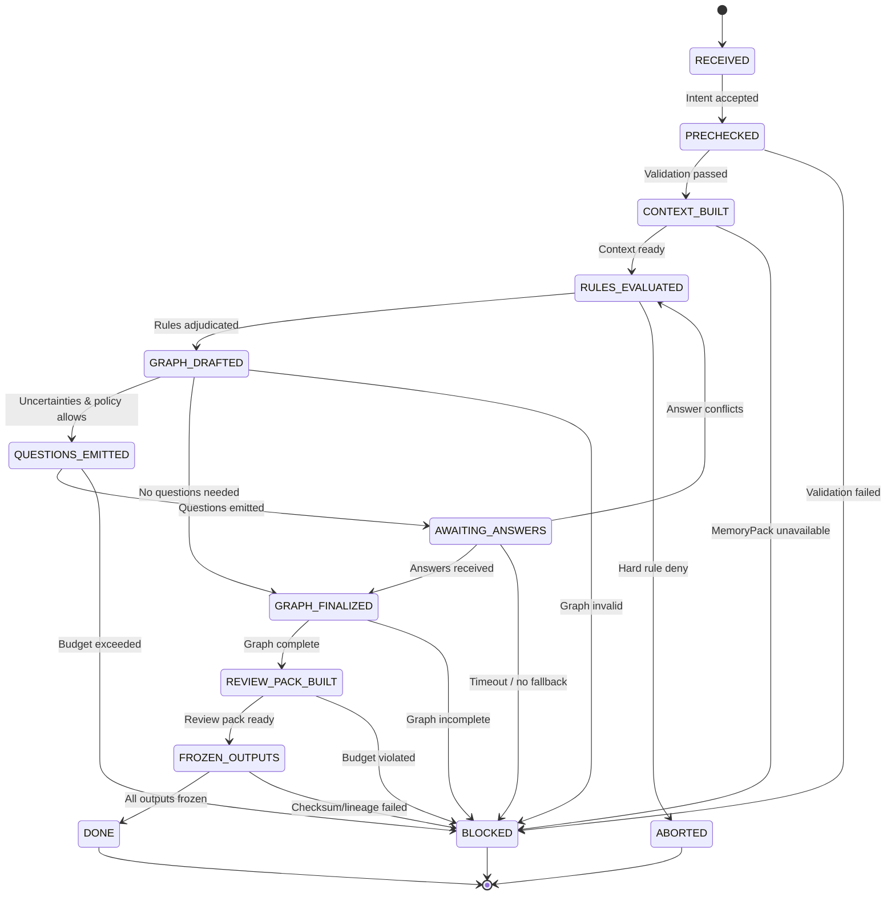

# Coordinator State Machine Specification (v0.9.2)

**Version**: 0.9.2  
**Status**: Design Specification  
**Date**: 2026-01-25

---

## Overview

The Coordinator State Machine defines the complete lifecycle of coordinating an ExecutionIntent into actionable outputs. This state machine is **deterministic, auditable, and non-executing** — it produces plans and decisions, never executes them.

**Core Principle**: The Coordinator is a planning engine, not an execution engine.

---

## State Definitions

### 1. RECEIVED

**Purpose**: Initial state when Intent is received

**Responsibilities**:
- Accept ExecutionIntent input
- Validate Intent format (basic structure check)
- Assign coordinator run_id
- Initialize RunTape

**Inputs**:
- ExecutionIntent (v0.9.1)
- ExecutionPolicy
- Optional: MemoryContext reference
- Optional: FactPack reference

**Outputs**:
- `run_id` assigned
- Initial RunTape entry

**Guards for Next Transition**: None (always transitions to PRECHECKED)

---

### 2. PRECHECKED

**Purpose**: Validate Intent against schema and registry

**Responsibilities**:
- Schema validation (v0.9.1 conformance)
- Checksum verification
- Red line validation (I1-I5)
- Registry reference validation (all workflow/agent/command/rule IDs exist)
- Version drift detection

**Inputs**:
- ExecutionIntent
- ContentRegistry snapshots

**Outputs**:
- `PrecheckReport`: Schema valid, checksum match, red lines passed, registry versions confirmed
- RunTape step #1

**Guards for Next Transition**:
- ✅ Intent schema valid (v0.9.1)
- ✅ Checksum matches
- ✅ All red lines (I1-I5) satisfied
- ✅ All referenced content exists in registry and is active/frozen
- ✅ No version drift detected

**Failure Branch**: If guards fail → **BLOCKED** (with FailurePack)

---

### 3. CONTEXT_BUILT

**Purpose**: Assemble execution context from memory and facts

**Responsibilities**:
- Build MemoryPack (v0.2 requirement: mandatory)
- Load FactPack (project scan evidence)
- Assemble ContextBundle (memory + facts + policy)
- Validate context completeness

**Inputs**:
- MemoryContext queries (scope: project/repo/task/agent)
- FactPack from scanner
- ExecutionPolicy

**Outputs**:
- `ContextBundle`: memory_context + factpack + policy
- RunTape step #2 (evidence references)

**Guards for Next Transition**:
- ✅ MemoryPack constructed (minimum threshold met)
- ✅ FactPack available (project structure + evidence)
- ✅ Policy constraints loaded

**Failure Branch**: If MemoryPack unavailable → **BLOCKED** (v0.2 red line)

---

### 4. RULES_EVALUATED

**Purpose**: Adjudicate all rules against planned actions

**Responsibilities**:
- Load applicable rules from registry
- Evaluate each planned_command against rules
- Generate RuleDecision for each evaluation (allow/deny/warn/require_review)
- Build RiskAssessment (aggregate)
- Record rule evaluation evidence

**Inputs**:
- planned_commands from Intent
- Rules from ContentRegistry
- Evidence from ContextBundle

**Outputs**:
- `RuleDecision[]`: One per planned_command
- `RiskAssessment`: Aggregated risk analysis
- RunTape step #3 (裁决依据)

**Guards for Next Transition**:
- ✅ All rules produce machine-decidable verdicts
- ✅ No unresolvable rule conflicts
- ✅ All deny decisions have documented reasons

**Failure Branch**: 
- If rule denies critical action → **ABORTED** (with reason)
- If rules not machine-decidable → **BLOCKED**

---

### 5. GRAPH_DRAFTED

**Purpose**: Construct ExecutionGraph from Intent and decisions

**Responsibilities**:
- Map workflow phases to graph nodes
- Map planned_commands to action_proposal nodes
- Create decision_point nodes (rule adjudication)
- Build edges (sequential/parallel/conditional)
- Assign swimlanes (agent role mapping)
- Validate graph topology (DAG, no cycles)

**Inputs**:
- selected_workflows (phases)
- selected_agents (roles)
- planned_commands
- RuleDecisions
- ContextBundle

**Outputs**:
- `ExecutionGraph(draft)`: Nodes, edges, swimlanes (may include question placeholders)
- RunTape step #4 (graph construction rationale)

**Guards for Next Transition**:
- ✅ Graph is a DAG (no cycles)
- ✅ All phases mapped to nodes
- ✅ All agents have swimlane assignments
- ✅ All action_proposal nodes have evidence_refs

**Failure Branch**: If graph contains cycles → **BLOCKED**

---

### 6. QUESTIONS_EMITTED (Conditional)

**Purpose**: Emit questions when uncertainties exist and policy allows

**Trigger Conditions** (depends on ExecutionPolicy):
- `interactive`: Allow questions (any type)
- `semi_auto`: Only BLOCKER questions allowed
- `full_auto`: **Never enter this state** (question_budget = 0)

**Responsibilities**:
- Identify uncertainties in graph
- Generate QuestionPack with evidence_refs
- Check question_budget constraints
- Classify questions (blocker/clarification/optimization/risk_mitigation)
- Assign blocking_level (critical/high/medium/low)

**Inputs**:
- ExecutionGraph(draft)
- ExecutionPolicy (question_budget, question_policy)
- Uncertainties detected during graph construction

**Outputs**:
- `QuestionPack`: Structured questions with evidence and impact analysis
- RunTape step #5 (why questions are needed)

**Guards for Next Transition**:
- ✅ question_budget not exceeded
- ✅ All questions have evidence_refs (归因)
- ✅ All questions have default_strategy (fallback if not answered)
- ✅ blocking_level appropriate for policy

**Failure Branch**: 
- If question_budget = 0 but questions needed → use fallback strategy or **BLOCKED**
- If questions lack evidence → **BLOCKED**

**Special Case**: full_auto mode **MUST SKIP** this state entirely (RED LINE)

---

### 7. AWAITING_ANSWERS (Conditional)

**Purpose**: Wait for external AnswerPack

**Responsibilities**:
- Pause coordination
- Wait for AnswerPack input
- Validate AnswerPack structure
- Track timeout (if applicable)

**Inputs**:
- AnswerPack (from external source)

**Outputs**:
- Validated AnswerPack

**Guards for Next Transition**:
- ✅ AnswerPack conforms to schema
- ✅ All critical questions answered
- ✅ Answers do not conflict with rule decisions

**Failure Branch**: 
- If answer conflicts with rules → Re-enter **RULES_EVALUATED** (循环，有上限)
- If timeout → Use default_strategy from questions

**Loop Detection**: Max 3 iterations between AWAITING_ANSWERS ↔ RULES_EVALUATED

---

### 8. GRAPH_FINALIZED

**Purpose**: Finalize ExecutionGraph with answers integrated

**Responsibilities**:
- Integrate AnswerPack into graph (if questions were asked)
- Remove question placeholder nodes
- Update edges based on answers
- Recalculate risk if answers changed decisions
- Validate final graph topology

**Inputs**:
- ExecutionGraph(draft)
- AnswerPack (if applicable)
- Updated RuleDecisions (if re-evaluated)

**Outputs**:
- `ExecutionGraph(final)`: Complete, executable plan
- RunTape step #6 (how answers changed the plan)

**Guards for Next Transition**:
- ✅ Graph is complete (no placeholders)
- ✅ All nodes have required fields
- ✅ Swimlanes cover all nodes

**Failure Branch**: If graph still incomplete → **BLOCKED**

---

### 9. REVIEW_PACK_BUILT

**Purpose**: Build review package for human/automated review

**Responsibilities**:
- Generate ReviewPack (based on existing v1.0.0 schema, enhanced)
- Calculate change impact (estimated files, scope)
- Build rollback guide (if applicable)
- Identify review gates (from Intent.risk.requires_review)
- Estimate execution duration and complexity

**Inputs**:
- ExecutionGraph(final)
- RuleDecisions
- RiskAssessment
- Intent constraints (budgets, requires_review)

**Outputs**:
- `ReviewPack`: Plan summary, risk assessment, change impact, rollback guide
- RunTape step #7

**Guards for Next Transition**:
- ✅ ReviewPack satisfies all requires_review categories
- ✅ Change impact within budget constraints (max_files, max_commits)
- ✅ Risk level justified by evidence

**Failure Branch**: If budgets exceeded → **BLOCKED**

---

### 10. FROZEN_OUTPUTS

**Purpose**: Freeze all outputs with checksums and lineage

**Responsibilities**:
- Generate checksums for all outputs (SHA-256)
- Build lineage chain (intent → registry versions → outputs)
- Serialize outputs (JSON + Markdown)
- Create AuditLog entries
- Prepare frozen artifacts for delivery

**Inputs**:
- ExecutionGraph(final)
- ReviewPack
- QuestionPack + AnswerPack (if used)
- RunTape

**Outputs**:
- Frozen artifacts with checksums
- Complete lineage metadata
- CoordinatorAuditLog entries
- RunTape final entries

**Guards for Next Transition**:
- ✅ All outputs have checksums
- ✅ Lineage complete (traceable back to Intent + registry versions)
- ✅ Outputs satisfy schema validation

**Failure Branch**: If checksums fail or lineage incomplete → **BLOCKED**

---

### 11. DONE

**Purpose**: Terminal success state

**Responsibilities**:
- Mark coordinator run as complete
- Close RunTape
- Generate summary report

**Inputs**: None

**Outputs**:
- `CoordinatorRunSummary`: High-level summary for CLI display

**Next State**: None (terminal)

---

### 12. BLOCKED (Failure State)

**Purpose**: Terminal failure due to constraints

**Trigger Conditions**:
- Registry content missing/inactive
- Rule hard deny
- Policy prohibits operation (e.g., high-risk full_auto)
- Budget constraints exceeded
- MemoryPack unavailable (v0.2 red line)
- Graph topology invalid (cycles)

**Responsibilities**:
- Generate FailurePack (type, message, recovery suggestions)
- Record failure in RunTape
- Log audit entry

**Outputs**:
- `FailurePack(type=constraint_violation | missing_registry | rule_denied | policy_violation)`
- RunTape with failure details

**Next State**: None (terminal)

---

### 13. ABORTED (Failure State)

**Purpose**: Terminal failure due to red line violation

**Trigger Conditions**:
- Execution red line detected (Gate D violation: execute/shell/run symbols)
- Unresolvable rule conflicts
- Non-machine-decidable rules
- Model routing policy violation (e.g., requires cloud but policy forbids)
- Schema violation in generated artifacts

**Responsibilities**:
- Generate FailurePack (type=red_line_violation)
- Record abort reason
- Trigger alert (red line violation is critical)

**Outputs**:
- `FailurePack(type=red_line_violation)`
- RunTape with abort details
- Critical audit log entry

**Next State**: None (terminal)

---

## State Transition Diagram

---

## Guard Conditions Summary

| Transition | Guard Conditions | Failure Action |
|------------|------------------|----------------|
| RECEIVED → PRECHECKED | Always passes | N/A |
| PRECHECKED → CONTEXT_BUILT | Schema valid, checksum match, registry refs exist, red lines pass | → BLOCKED |
| CONTEXT_BUILT → RULES_EVALUATED | MemoryPack available, FactPack available | → BLOCKED |
| RULES_EVALUATED → GRAPH_DRAFTED | All rules decidable, no hard denies | → ABORTED (deny), → BLOCKED (undecidable) |
| GRAPH_DRAFTED → QUESTIONS_EMITTED | Policy allows questions, uncertainties exist | N/A (conditional) |
| GRAPH_DRAFTED → GRAPH_FINALIZED | No uncertainties OR full_auto mode | N/A |
| QUESTIONS_EMITTED → AWAITING_ANSWERS | Budget not exceeded, all questions have evidence | → BLOCKED |
| AWAITING_ANSWERS → GRAPH_FINALIZED | Answers valid, no rule conflicts | Re-eval rules if conflict |
| GRAPH_FINALIZED → REVIEW_PACK_BUILT | Graph complete, no placeholders | → BLOCKED |
| REVIEW_PACK_BUILT → FROZEN_OUTPUTS | Budgets satisfied, review requirements met | → BLOCKED |
| FROZEN_OUTPUTS → DONE | Checksums valid, lineage complete | → BLOCKED |

---

## Loop Detection and Limits

### Permitted Loops
1. **AWAITING_ANSWERS ↔ RULES_EVALUATED**: Max 3 iterations
   - Trigger: Answer conflicts with rules
   - Limit: If 3 iterations exceeded → BLOCKED with conflict details

### Forbidden Loops
- Any other backward transition is **prohibited** to ensure forward progress

---

## Red Line Enforcement in State Machine

### RED LINE #1: No Execution Payload
- **Enforced at**: PRECHECKED (Gate D check)
- **Action**: If `execute` or similar fields detected → ABORTED

### RED LINE #2: full_auto Constraints
- **Enforced at**: QUESTIONS_EMITTED
- **Action**: If `full_auto` mode, this state is **skipped entirely** (question_budget = 0 enforced)

### RED LINE #3: High Risk != full_auto
- **Enforced at**: PRECHECKED
- **Action**: If Intent has `risk.overall = high/critical` AND `interaction.mode = full_auto` → BLOCKED

### RED LINE #4: Evidence Required
- **Enforced at**: GRAPH_DRAFTED
- **Action**: All action_proposal nodes **must** have `evidence_refs` or → BLOCKED

### RED LINE #5: Registry Only
- **Enforced at**: PRECHECKED
- **Action**: All workflow/agent/command/rule references **must** exist in registry or → BLOCKED

---

## Failure Recovery Strategies

### BLOCKED Recovery
User can:
1. Fix Intent and resubmit
2. Update registry content
3. Adjust ExecutionPolicy
4. Provide missing evidence

### ABORTED Recovery
**Red line violations require human intervention**:
1. Review why red line triggered
2. Fix root cause (remove execution symbols, fix policy, etc.)
3. Re-design Intent to satisfy constraints

---

## Audit Requirements

Every state transition **must** generate:
- RunTape entry (from_state, to_state, trigger, guards, outputs)
- AuditLog entry (if significant decision made)
- Timestamp and duration

---

## Testing Requirements

Each state must have:
1. **Unit tests** for state handler logic
2. **Guard tests** for all transition conditions
3. **Failure tests** for BLOCKED and ABORTED branches
4. **Integration tests** for full state machine flows

---

## Implementation Notes

- State machine **must be deterministic**: Same input → Same output
- No side effects: Coordinator only produces outputs, never executes
- All decisions **must be auditable**: RunTape records every decision
- Guard evaluations **must be testable**: No "black box" guards

---

**Status**: ✅ Design Complete  
**Next Steps**: Implement CoordinatorEngine with state handlers
