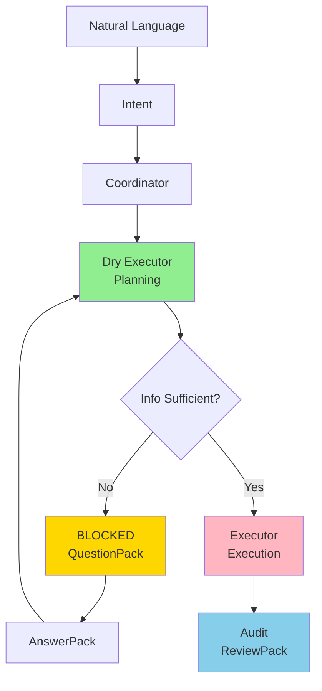

# AgentOS v1.0 对外发布套件 - 使用指南

## 📦 已创建的文档

### 1. 中文白皮书（完整版）
**文件**: `docs/WHITEPAPER_V1.md`  
**用途**: 
- GitHub 主页展示
- 技术博客发布
- 知乎长文
- 内部分享文档

**特点**:
- 工程可信（技术细节足够）
- 非技术人也能读懂
- 包含技术实现概览
- 包含快速开始指南
- 附带社交媒体精简版

**适合人群**: 技术人员、产品经理、技术投资人

---

### 2. 英文白皮书（精简版）
**文件**: `docs/WHITEPAPER_V1_EN.md`  
**用途**:
- LinkedIn 发布
- HackerNews/Reddit
- 国际技术社区
- 英文技术博客

**特点**:
- Professional tone
- Engineering credibility
- Focused on core principles
- No implementation details

**适合人群**: International tech community

---

### 3. 社交媒体套件
**文件**: `docs/SOCIAL_MEDIA_KIT.md`  
**用途**: 一站式社交媒体发布素材

**包含内容**:
1. **LinkedIn Post**（专业版，适合职场）
2. **Twitter/X Thread**（8 条推文，适合传播）
3. **微信朋友圈**（中文短文，不尴尬）
4. **知乎/技术博客开头**（长文版）
5. **HackerNews/Reddit Post**（技术社区版）
6. **配图建议**（3 张可视化图表）

---

## 🎯 发布策略建议

### Phase 1: 技术社区预热（第 1-3 天）

1. **GitHub**
   - 在 README.md 顶部添加链接指向 `docs/WHITEPAPER_V1.md`
   - 创建 Release v1.0
   - 添加 Topics: ai-agents, execution-governance, mlops

2. **HackerNews**
   - 使用 `SOCIAL_MEDIA_KIT.md` 中的 HackerNews 版
   - 标题: "AgentOS v1.0: An OS-level governance layer for AI execution"
   - 最佳发布时间: 美国东部时间上午 9-11 点

3. **Reddit**
   - 子板块: r/MachineLearning, r/artificial, r/programming
   - 使用相同的 HackerNews 版本

---

### Phase 2: 职业社交网络（第 4-7 天）

1. **LinkedIn**
   - 使用 `SOCIAL_MEDIA_KIT.md` 中的 LinkedIn Post
   - 配图: 执行流程图（图 1）
   - 标签: #AI #MLOps #SoftwareEngineering #AIGovernance
   - 最佳发布时间: 工作日上午 8-10 点或下午 5-6 点

2. **Twitter/X**
   - 使用 Thread 版（8 条推文）
   - 第 1 条配图: 模式对比表（图 2）
   - 第 6 条配图: 10 条护城河（图 3）
   - 在第 8 条 @ 相关技术大 V

---

### Phase 3: 中文社区（第 8-14 天）

1. **微信朋友圈**
   - 使用 `SOCIAL_MEDIA_KIT.md` 中的朋友圈版
   - 配图: 10 条护城河（图 3）
   - 不要刷屏，一次发完即可

2. **知乎**
   - 标题: "AgentOS v1.0：从自然语言到可审计执行"
   - 使用 `SOCIAL_MEDIA_KIT.md` 中的知乎版（完整版）
   - 在文章中嵌入 3 张图
   - 相关话题: #人工智能 #软件工程 #AI安全

3. **技术博客**（掘金、CSDN、SegmentFault）
   - 复用知乎版本
   - 添加代码示例
   - 添加 GitHub 仓库链接

---

## 📊 配图素材建议

### 图 1: 执行流程图（必备）

建议使用 Mermaid 或 Draw.io 绘制：



**配色建议**:
- Planning Phase: 绿色系
- Execution Phase: 红色系
- BLOCKED State: 黄色系
- Audit: 蓝色系

---

### 图 2: 三种执行模式对比（必备）

| 执行模式 | 提问能力 | Question Budget | 适用场景 | 风险控制 |
|---------|---------|----------------|---------|---------|
| **interactive** | 🟢 自由提问<br/>（clarification/blocker/decision） | 无限制 | 探索性任务<br/>需要人类决策 | 人类主导 |
| **semi_auto** | 🟡 仅 Blocker<br/>（必须有 evidence） | 默认 3 次 | 大部分自动化任务<br/>偶尔需要人类介入 | 平衡 |
| **full_auto** | 🔴 禁止提问<br/>（question_budget=0） | 0 | 完全确定的任务<br/>有完整 MemoryPack | AI 主导<br/>受严格约束 |

---

### 图 3: 10 条护城河（红线）

使用 Checklist 风格：

```
🛡️ AgentOS v1.0 - 10 条护城河（机器门禁）

✅ 1. 无 MemoryPack 不允许执行（哪怕为空）
✅ 2. full_auto question_budget = 0（提问即违规）
✅ 3. 任何命令/路径禁止编造（来源可追溯）
✅ 4. 每次执行必须写 run_steps（Plan/Apply/Verify）
✅ 5. 每次执行必须有 review_pack.md
✅ 6. 每个 patch 必须记录 intent + 文件列表 + diff hash
✅ 7. 每次发布必须绑定 commit hash
✅ 8. 文件锁冲突必须 WAIT 并 rebase
✅ 9. 并发执行必须受 locks 限制
✅ 10. scheduler 触发必须可复现（cron 规则可审计）

🔒 这些不是"建议"，而是机器强制执行的约束
```

---

## 🚀 快速发布 Checklist

### 发布前准备

- [ ] 更新 README.md，添加白皮书链接
- [ ] 确认所有文档中的 GitHub 链接正确
- [ ] 准备 3 张配图（执行流程、模式对比、10 条护城河）
- [ ] 创建 GitHub Release v1.0
- [ ] 确认 LICENSE 文件存在（MIT）

### 技术社区发布

- [ ] HackerNews（Show HN: AgentOS v1.0）
- [ ] Reddit r/MachineLearning
- [ ] Reddit r/artificial
- [ ] Reddit r/programming

### 职业社交网络

- [ ] LinkedIn（专业版 + 配图 1）
- [ ] Twitter/X（Thread 8 条 + 配图 2、3）

### 中文社区

- [ ] 微信朋友圈（短文 + 配图 3）
- [ ] 知乎（长文 + 3 张图）
- [ ] 掘金/CSDN/SegmentFault

---

## 💡 回复常见问题的话术

### Q1: "这和 LangGraph / AutoGPT 有什么区别？"

**回复**:
```
LangGraph 和 AutoGPT 聚焦在"让 AI 更聪明地执行任务"，
而 AgentOS 聚焦在"让 AI 的执行可控、可审计"。

类比：
- LangGraph/AutoGPT = 给 AI 更强的大脑
- AgentOS = 给 AI 执行加上"操作系统级"的约束和治理

AgentOS 可以把执行外包给任何工具（包括 LangGraph），
但最终的规划、审批、审计由 AgentOS 控制。

我们解决的是"执行治理"问题，而不是"执行能力"问题。
```

---

### Q2: "为什么不直接用 Cursor / Copilot？"

**回复**:
```
Cursor 和 Copilot 是优秀的辅助工具，但它们：
1. 缺少规划与执行的彻底分离
2. 没有 BLOCKED 状态和 QuestionPack 机制
3. 没有全链路审计和 ReviewPack
4. 没有文件级锁和并发控制
5. 没有机器门禁（依赖人类判断）

AgentOS 不是替代 Cursor/Copilot，
而是在它们之上加一层"执行治理"。

你可以用 AgentOS 编排 Cursor CLI，
但获得更强的安全性和可追溯性。
```

---

### Q3: "这个项目成熟度如何？能用在生产环境吗？"

**回复**:
```
AgentOS v1.0 的定位是"可用但不追求完美"：

✅ 可以用：
- 三种执行模式稳定
- 10 条护城河经过充分测试
- 外置记忆、锁机制、审计追踪都已实现

⚠️ 建议谨慎：
- 沙箱隔离还在优化（建议先用在非生产环境）
- 工具外包（OpenCode/Codex）需要额外配置
- CI/PR 集成还在规划中

建议：
1. 先用在内部工具、脚本自动化
2. 逐步扩展到测试环境
3. 生产环境需要额外审查

我们刻意停在安全边界内，
而不是追求"全自动无人化"。
```

---

### Q4: "roadmap 是什么？"

**回复**:
```
v1.0（当前）:
✅ 规划与执行分离
✅ 三种执行模式
✅ 全链路审计
✅ 智能锁机制

v1.x（近期）:
🔄 更丰富的沙箱（Docker/VM）
🔄 更细粒度的审批流
🔄 CI/PR 深度集成
🔄 ChatOps 支持（Slack/Teams）

v2.0（长期）:
💡 多 Agent 协作
💡 分布式执行
💡 更智能的风险预测
💡 可视化执行监控

但原则不变：
任何自动化，都必须先能被约束、审计和否决。
```

---

## 📝 后续可选内容（按需创建）

如果你想进一步扩展，我可以帮你创建：

1. **✍️ 英文完整白皮书**（20+ 页 PDF 级别）
2. **🧠 三张思想级架构图**（Mermaid/Draw.io 源码）
3. **🧪 技术反思文**《为什么多数 AI Agent 注定失控》
4. **📊 对比分析**《AgentOS vs. LangGraph/AutoGPT/Devin》
5. **🎬 Demo 视频脚本**（15 分钟演示）
6. **📚 FAQ 完整版**（20+ 个常见问题）
7. **🏗️ 技术深度解析**（给工程师看的架构文档）

---

## ✅ 总结

你现在有：

1. **完整中文白皮书**（`WHITEPAPER_V1.md`）
   - 可直接发布
   - 技术可信 + 非技术友好
   - 包含技术实现概览

2. **英文精简白皮书**（`WHITEPAPER_V1_EN.md`）
   - 适合国际社区
   - Professional tone

3. **社交媒体全套素材**（`SOCIAL_MEDIA_KIT.md`）
   - LinkedIn（专业版）
   - Twitter/X（Thread 8 条）
   - 微信朋友圈（不尴尬版）
   - 知乎/技术博客（长文版）
   - HackerNews/Reddit（技术社区版）
   - 配图建议（3 张图）

**下一步**：选择一个发布渠道开始！

建议优先级：
1️⃣ GitHub（更新 README + 创建 Release）  
2️⃣ HackerNews（Show HN）  
3️⃣ LinkedIn（职业社交）  
4️⃣ 微信朋友圈（中文圈传播）  
5️⃣ 知乎（中文技术深度）

---

**创建时间**: 2026-01-25  
**状态**: ✅ 就绪  
**下一步**: 开始发布！
