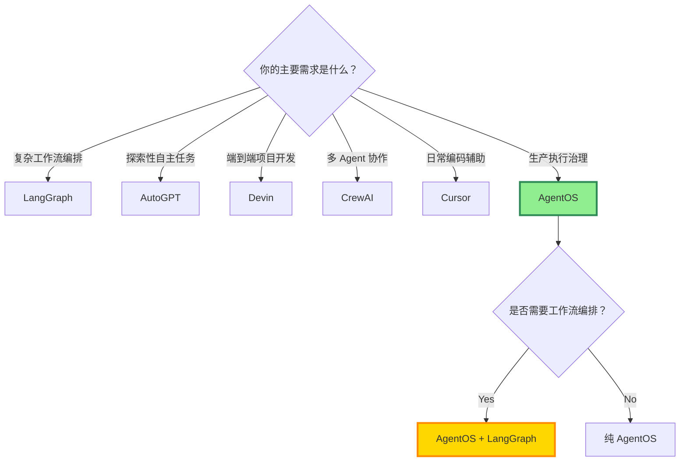

# AgentOS vs. 主流 AI Agent 框架：深度对比

**副标题**: LangGraph / AutoGPT / Devin / CrewAI / Cursor 的架构差异与适用场景

---

**版本**: 1.0  
**日期**: 2026-01-25  
**作者**: AgentOS Team  
**阅读时间**: 20 分钟

---

## 目录

1. [对比概览](#对比概览)
2. [AgentOS vs. LangGraph](#agentos-vs-langgraph)
3. [AgentOS vs. AutoGPT](#agentos-vs-autogpt)
4. [AgentOS vs. Devin](#agentos-vs-devin)
5. [AgentOS vs. CrewAI](#agentos-vs-crewai)
6. [AgentOS vs. Cursor](#agentos-vs-cursor)
7. [选型决策树](#选型决策树)
8. [结论](#结论)

---

## 对比概览

### 一张表看懂所有框架

| 框架 | 定位 | 核心能力 | 适用场景 | 开源 | 成本 |
|------|------|---------|---------|------|------|
| **AgentOS** | 执行治理层 | 规划/执行分离 + 审计 | 生产环境、需要审计 | ✅ | 自托管 |
| **LangGraph** | 工作流编排 | 状态机 + 工具调用 | 复杂工作流 | ✅ | 自托管 |
| **AutoGPT** | 自主任务执行 | 目标分解 + 循环执行 | 探索性任务 | ✅ | 自托管 |
| **Devin** | AI 软件工程师 | 端到端开发 | 完整项目开发 | ❌ | $500/月 |
| **CrewAI** | 多Agent协作 | 角色分工 + 协作 | 团队模拟 | ✅ | 自托管 |
| **Cursor** | AI IDE | 代码补全 + Chat | 日常开发 | ❌ | $20/月 |

---

## AgentOS vs. LangGraph

### LangGraph 简介

LangGraph 是 LangChain 团队开发的状态机工作流框架。

**核心理念**:
- 将 Agent 建模为"状态图"
- 节点 = 操作
- 边 = 状态转换

**典型代码**:
```python
from langgraph.graph import StateGraph

graph = StateGraph()
graph.add_node("analyze", analyze_code)
graph.add_node("generate", generate_patch)
graph.add_edge("analyze", "generate")
```

### 关键差异对比

| 维度 | LangGraph | AgentOS |
|------|-----------|---------|
| **定位** | 工作流编排框架 | 执行治理层 |
| **规划/执行** | 混合（边做边想） | 严格分离（Dry Run → Execute） |
| **BLOCKED 状态** | 无（需手动实现） | 一等状态（QuestionPack） |
| **审计** | 基础日志 | 完整 ReviewPack |
| **锁机制** | 无 | Task + File Lock |
| **Question Budget** | 无 | 支持（3 种模式） |
| **回滚** | 手动 | 自动 rollback_guide |
| **风险评估** | 无 | Coordinator 自动评估 |
| **工具委托** | ✅ | ✅ |

### 架构对比

**LangGraph 架构**:
```
┌─────────┐     ┌─────────┐     ┌─────────┐
│ Node A  │────>│ Node B  │────>│ Node C  │
└─────────┘     └─────────┘     └─────────┘
    ↓ (执行)        ↓ (执行)        ↓ (执行)
   实际操作        实际操作        实际操作
```

**AgentOS 架构**:
```
┌────────────────────────────────┐
│     Planning Phase (Dry)       │
│  ┌──────┐  ┌──────┐  ┌──────┐ │
│  │  分析 │→│ 规划  │→│ 审查  │ │
│  └──────┘  └──────┘  └──────┘ │
└────────────┬───────────────────┘
             │ Gates
             ↓
┌────────────────────────────────┐
│    Execution Phase (Real)      │
│  ┌──────┐  ┌──────┐  ┌──────┐ │
│  │ 执行  │→│ 验证  │→│ 审计  │ │
│  └──────┘  └──────┘  └──────┘ │
└────────────────────────────────┘
```

### 互补关系

**AgentOS 可以把 LangGraph 当作执行工具**:

```python
# AgentOS 负责治理
plan = coordinator.create_plan(intent)

# 委托给 LangGraph 执行
task_pack = {
    "workflow": plan,
    "constraints": execution_policy
}
result = langgraph_executor.execute(task_pack)

# AgentOS 验证结果
review_pack = audit.generate(result)
```

### 使用建议

**选 LangGraph 的场景**:
- ✅ 需要复杂的工作流编排
- ✅ 状态转换逻辑复杂
- ✅ 不需要严格的审计追踪

**选 AgentOS 的场景**:
- ✅ 需要生产级执行治理
- ✅ 需要规划/执行分离
- ✅ 需要完整审计追踪
- ✅ 需要 BLOCKED 状态

**组合使用**:
- AgentOS 作为治理层
- LangGraph 作为执行引擎

---

## AgentOS vs. AutoGPT

### AutoGPT 简介

AutoGPT 是最早的"自主 Agent"项目之一。

**核心理念**:
- 给 AI 一个目标
- AI 自主分解任务
- 循环执行直到完成

**典型流程**:
```
用户: "帮我做市场调研"
AutoGPT:
  1. 搜索行业报告
  2. 下载 PDF
  3. 提取关键数据
  4. 生成报告
  5. 发送邮件
```

### 关键差异对比

| 维度 | AutoGPT | AgentOS |
|------|---------|---------|
| **自主性** | 高（完全自主） | 中（受控自主） |
| **人类介入** | 最小化 | 结构化（QuestionPack） |
| **规划** | 动态（边做边规划） | 静态（先规划后执行） |
| **风险控制** | 有限 | 10 条护城河 |
| **审计** | 日志 | ReviewPack |
| **回滚** | 手动 | 自动 |
| **适用场景** | 探索性任务 | 生产环境 |

### 失控案例对比

**AutoGPT 的典型失控**:
```
目标: "帮我优化网站性能"

AutoGPT 的执行:
1. 分析代码 ✅
2. 发现可以用 CDN ✅
3. 搜索 CDN 服务商 ✅
4. 注册 Cloudflare 账号 ⚠️
5. 修改 DNS 设置 ❌ (未经许可)
6. 网站崩溃 💥
```

**AgentOS 的执行**:
```
目标: "帮我优化网站性能"

AgentOS 的执行:
1. Intent 解析 ✅
2. Dry Run: 生成优化计划 ✅
3. 发现需要修改 DNS → BLOCKED
4. QuestionPack: "是否允许修改 DNS 设置？"
5. 等待人类回答
6. 如果批准 → 执行 + ReviewPack
```

### 哲学差异

| 维度 | AutoGPT | AgentOS |
|------|---------|---------|
| **目标** | 最大化自主性 | 平衡自主性与安全性 |
| **失败策略** | 继续尝试 | BLOCKED 等待人类 |
| **信任模型** | 信任 AI | 验证 AI |

### 使用建议

**选 AutoGPT 的场景**:
- ✅ 探索性任务（不怕失败）
- ✅ 非生产环境
- ✅ 需要最大化自主性

**选 AgentOS 的场景**:
- ✅ 生产环境
- ✅ 需要审计合规
- ✅ 不能容忍失控

---

## AgentOS vs. Devin

### Devin 简介

Devin 是 Cognition AI 开发的"AI 软件工程师"。

**核心能力**:
- 端到端软件开发
- 自己搭建环境
- 自己写代码、测试、调试
- 与人类协作

**Demo 效果**:
- 完成整个 GitHub Issue
- 自己查文档、读代码
- 生成 PR

### 关键差异对比

| 维度 | Devin | AgentOS |
|------|-------|---------|
| **模型** | 专有模型 | 模型无关（OpenAI/Claude 等） |
| **执行环境** | 专有 VM | 可定制（Sandbox/Docker） |
| **透明度** | 闭源 | 开源（MIT） |
| **成本** | $500/月 | 自托管（模型费用另计） |
| **定制性** | 有限 | 完全可控 |
| **审计** | 基础 | 完整 ReviewPack |
| **数据隐私** | 云端 | 本地部署 |

### 架构对比（推测）

**Devin 架构**（基于公开信息）:
```
┌──────────────────────────────┐
│       Proprietary Model      │ (闭源)
└──────────┬───────────────────┘
           ↓
┌──────────────────────────────┐
│       Execution VM           │ (专有沙箱)
│  - Terminal                  │
│  - Browser                   │
│  - Code Editor               │
└──────────┬───────────────────┘
           ↓
      Cloud Infrastructure
```

**AgentOS 架构**:
```
┌──────────────────────────────┐
│    Model-Agnostic Layer      │ (任何 LLM)
└──────────┬───────────────────┘
           ↓
┌──────────────────────────────┐
│      Governance Layer        │ (AgentOS)
│  - Coordinator               │
│  - Dry Executor              │
│  - Gates                     │
└──────────┬───────────────────┘
           ↓
┌──────────────────────────────┐
│      Execution Tools         │ (可定制)
│  - OpenCode / Codex / ...    │
│  - Local / Cloud             │
└──────────────────────────────┘
```

### 使用建议

**选 Devin 的场景**:
- ✅ 需要开箱即用
- ✅ 不需要定制
- ✅ 预算充足（$500/月）
- ✅ 可以接受闭源

**选 AgentOS 的场景**:
- ✅ 需要完全控制
- ✅ 需要定制化
- ✅ 需要本地部署（数据隐私）
- ✅ 需要审计合规
- ✅ 希望开源

**互补关系**:
- 可以用 AgentOS 作为 Devin 的"审计层"
- 把 Devin 当作 AgentOS 的执行工具

---

## AgentOS vs. CrewAI

### CrewAI 简介

CrewAI 是一个多 Agent 协作框架。

**核心理念**:
- 模拟真实团队
- 每个 Agent 有明确角色
- Agents 之间协作完成任务

**典型代码**:
```python
from crewai import Crew, Agent, Task

researcher = Agent(
    role="Researcher",
    goal="Find relevant information"
)

writer = Agent(
    role="Writer",
    goal="Write article"
)

crew = Crew(agents=[researcher, writer])
crew.kickoff(inputs={"topic": "AI safety"})
```

### 关键差异对比

| 维度 | CrewAI | AgentOS |
|------|--------|---------|
| **焦点** | 多 Agent 协作 | 单 Agent 执行治理 |
| **角色系统** | ✅ 核心特性 | 无（可扩展） |
| **执行模式** | 协作式 | 受控式 |
| **审计** | 基础 | 完整 ReviewPack |
| **锁机制** | 无 | Task + File Lock |
| **BLOCKED 状态** | 无 | 一等状态 |

### 互补关系

**AgentOS + CrewAI 组合**:

```python
# CrewAI 负责多 Agent 协作
crew = Crew(agents=[researcher, developer, tester])

# AgentOS 负责执行治理
for agent in crew.agents:
    # 每个 Agent 的执行都经过 AgentOS 治理
    plan = agent.plan_task()
    
    # AgentOS 审查
    if not agentos.approve(plan):
        raise Rejected
    
    # 执行 + 审计
    result = agentos.execute(plan)
    review_pack = agentos.audit(result)
```

### 使用建议

**选 CrewAI 的场景**:
- ✅ 需要多 Agent 协作
- ✅ 任务需要不同角色
- ✅ 不需要严格审计

**选 AgentOS 的场景**:
- ✅ 单 Agent 执行治理
- ✅ 需要规划/执行分离
- ✅ 需要完整审计

**组合使用**:
- CrewAI 编排多个 Agent
- AgentOS 治理每个 Agent 的执行

---

## AgentOS vs. Cursor

### Cursor 简介

Cursor 是一个 AI-native 代码编辑器。

**核心能力**:
- AI 代码补全（类似 Copilot）
- AI Chat（解释代码、生成代码）
- AI Edit（批量修改代码）

**典型使用**:
```
用户在 Cursor 中:
1. Cmd+K: "重构这个函数"
2. AI 生成代码
3. 用户审查 → 接受/拒绝
```

### 关键差异对比

| 维度 | Cursor | AgentOS |
|------|--------|---------|
| **定位** | AI IDE | 执行治理系统 |
| **交互** | 实时补全 + Chat | 结构化任务执行 |
| **范围** | 单文件/多文件编辑 | 跨项目执行 |
| **自主性** | 低（人类主导） | 中（受控自主） |
| **审计** | 无 | 完整 ReviewPack |
| **执行模式** | 辅助 | 自主执行 |

### 互补关系

**Cursor + AgentOS 组合**:

```
Scenario 1: 日常开发（用 Cursor）
- 用户写代码
- Cursor 提供补全和建议
- 人类主导

Scenario 2: 自动化任务（用 AgentOS）
- 用户提交任务
- AgentOS 规划 + 执行
- AI 主导（但受控）
- 可以调用 Cursor CLI 作为执行工具
```

### 使用建议

**选 Cursor 的场景**:
- ✅ 日常编码
- ✅ 需要实时补全
- ✅ 人类主导

**选 AgentOS 的场景**:
- ✅ 自动化任务
- ✅ 需要审计追踪
- ✅ 无人值守执行

**组合使用**:
- 日常开发用 Cursor
- 自动化任务用 AgentOS
- AgentOS 可以调用 Cursor CLI

---

## 选型决策树

### 按需求选择



### 按场景选择

| 场景 | 推荐方案 | 理由 |
|------|---------|------|
| **日常开发** | Cursor | 实时补全，人类主导 |
| **探索性任务** | AutoGPT | 最大化自主性 |
| **复杂工作流** | LangGraph | 状态机编排 |
| **生产自动化** | AgentOS | 执行治理 + 审计 |
| **团队协作模拟** | CrewAI | 角色分工 |
| **完整项目开发** | Devin | 端到端能力 |

### 按预算选择

| 方案 | 成本 | 说明 |
|------|------|------|
| **AgentOS** | 自托管 + 模型费用 | 开源免费 |
| **LangGraph** | 自托管 + 模型费用 | 开源免费 |
| **AutoGPT** | 自托管 + 模型费用 | 开源免费 |
| **CrewAI** | 自托管 + 模型费用 | 开源免费 |
| **Cursor** | $20/月 | 个人版 |
| **Devin** | $500/月 | 专业版 |

---

## 功能矩阵对比

| 功能 | AgentOS | LangGraph | AutoGPT | Devin | CrewAI | Cursor |
|------|---------|-----------|---------|-------|--------|--------|
| **规划/执行分离** | ✅ | ❌ | ❌ | ❓ | ❌ | N/A |
| **BLOCKED 状态** | ✅ | ❌ | ❌ | ❓ | ❌ | N/A |
| **Question Budget** | ✅ | ❌ | ❌ | ❓ | ❌ | N/A |
| **ReviewPack 审计** | ✅ | ❌ | ❌ | 基础 | ❌ | ❌ |
| **Task + File Lock** | ✅ | ❌ | ❌ | ❓ | ❌ | N/A |
| **Rollback Guide** | ✅ | ❌ | ❌ | ❓ | ❌ | ❌ |
| **工作流编排** | 基础 | ✅ | ❌ | ✅ | ❌ | N/A |
| **多 Agent 协作** | ❌ | ❌ | ❌ | ❌ | ✅ | N/A |
| **代码补全** | ❌ | ❌ | ❌ | ❌ | ❌ | ✅ |
| **开源** | ✅ | ✅ | ✅ | ❌ | ✅ | ❌ |

---

## 结论

### 核心差异总结

**AgentOS 的独特价值**:
1. **执行治理层** - 其他框架是"执行引擎"，AgentOS 是"执行治理"
2. **规划/执行分离** - 其他框架"边想边做"，AgentOS 先规划后执行
3. **BLOCKED 状态** - 其他框架瞎猜或失败，AgentOS 结构化提问
4. **10 条护城河** - 机器门禁，而非人工约定

### 适用场景总结

| 你需要... | 选择... |
|----------|---------|
| 生产级执行治理 | AgentOS |
| 复杂工作流编排 | LangGraph |
| 探索性自主任务 | AutoGPT |
| 端到端项目开发 | Devin |
| 多 Agent 协作 | CrewAI |
| 日常编码辅助 | Cursor |

### 组合使用建议

**最佳实践**:
- **AgentOS** 作为治理层
- **LangGraph** 作为工作流引擎
- **Cursor/Codex** 作为执行工具
- **CrewAI** 作为多 Agent 编排（如需要）

**架构示意**:
```
┌─────────────────────────────────────┐
│          AgentOS (治理层)            │
│  - 规划/执行分离                     │
│  - BLOCKED 状态                      │
│  - 审计追踪                          │
└──────────┬──────────────────────────┘
           ↓
    ┌──────┴────────┐
    │               │
┌───┴────┐    ┌────┴────┐
│LangGraph│    │ CrewAI  │ (编排层)
└────┬───┘    └────┬────┘
     └─────────────┘
           ↓
┌──────────────────────────────────────┐
│         Execution Tools              │
│  Cursor CLI / Codex / OpenCode / ... │
└──────────────────────────────────────┘
```

---

## 附录：版本信息

**对比框架版本**:
- AgentOS: v1.0
- LangGraph: v0.2 (2026-01)
- AutoGPT: v0.5 (2025-12)
- Devin: (2026-01)
- CrewAI: v0.4 (2025-11)
- Cursor: (2026-01)

**免责声明**:
- Devin 是闭源产品，部分信息基于公开 Demo 推测
- 各框架快速迭代，信息可能过时
- 建议查阅各框架官方文档获取最新信息

---

## 相关阅读

- [AgentOS v1.0 白皮书](WHITEPAPER_V1.md)
- [为什么多数 AI Agent 注定失控](WHY_AGENTS_FAIL.md)
- [三张思想级架构图](ARCHITECTURE_DIAGRAMS.md)

---

**维护**: AgentOS Team  
**最后更新**: 2026-01-25  
**License**: MIT
