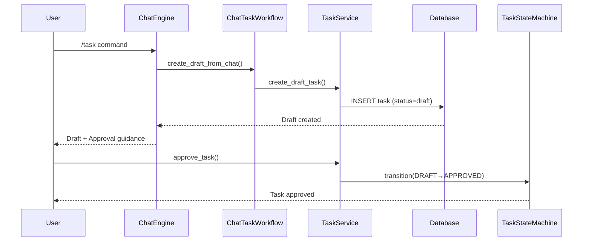

# Task #4: Chat → Draft → Approve Workflow - Completion Report

## Status: COMPLETED ✅

**Completion Date:** 2026-01-28

## Task Description

Implement the chat → draft → approve workflow to ensure chat can only create DRAFT tasks, requiring explicit approval before execution.

## Deliverables - All Complete ✅

### 1. Modified Chat Code ✅

**File:** `/Users/pangge/PycharmProjects/AgentOS/agentos/core/chat/handlers/task_handler.py`

**Changes:**
- Replaced `TaskManager.create_task()` with `ChatTaskWorkflow.create_draft_from_chat()`
- Enforces DRAFT state for all chat-created tasks
- Provides comprehensive approval guidance in response
- Includes Python API and CLI examples for approval
- Returns clear next_action: "approve"

### 2. Chat Task Workflow Module ✅

**File:** `/Users/pangge/PycharmProjects/AgentOS/agentos/core/chat/workflow.py`

**Purpose:** Centralize chat → task workflow logic

**Key Features:**
- `ChatTaskWorkflow` class with complete workflow management
- Enforces DRAFT state creation
- Provides rich approval guidance
- Maps task states to workflow stages
- Determines next actions based on current state

### 3. Documentation with Sequence Diagram ✅

**File:** `/Users/pangge/PycharmProjects/AgentOS/docs/chat/chat_to_task_workflow.md`

**Contents:**
- Complete workflow description
- State machine diagram and transitions
- **Mermaid sequence diagram** showing chat → draft → approval → execution flow
- Implementation component details
- Usage examples (Python API and CLI)
- Security considerations
- Migration notes
- Future enhancements

**Sequence Diagram Highlights:**


### 4. Comprehensive Tests ✅

**Test Files:**
1. `/Users/pangge/PycharmProjects/AgentOS/tests/unit/chat/test_chat_workflow.py` (17 tests)
2. `/Users/pangge/PycharmProjects/AgentOS/tests/unit/chat/test_chat_handler_simple.py` (5 tests)

**Test Results:** 22/22 PASSING ✅

**Coverage:**
- ✅ Chat creates DRAFT tasks only
- ✅ Chat cannot bypass DRAFT state
- ✅ Chat cannot directly execute tasks
- ✅ Tasks require approval before execution
- ✅ Approval guidance is provided
- ✅ Complete workflow DRAFT → APPROVED → QUEUED → RUNNING → DONE
- ✅ Audit trail for all transitions
- ✅ Error handling for invalid transitions

## Acceptance Criteria - All Met ✅

### 1. Chat output includes draft_id + approval guidance ✅

**Example Output:**
```
✓ Created DRAFT task: 01JZ1A2B3C4D... - Analyze Q4 sales data

Status: DRAFT
Task ID: 01JZ1A2B3C4D5E6F7G8H9J0K1M2N

---

⚠️ This task is in DRAFT state and cannot execute yet.

Why approval is needed:
- Ensures task is reviewed before execution
- Validates task requirements and routing
- Prevents accidental or unauthorized execution

How to approve this task:

Option 1: Using Python API
```python
from agentos.core.task.service import TaskService
ts = TaskService()
task = ts.approve_task(
    task_id='01JZ1A2B3C4D5E6F7G8H9J0K1M2N',
    actor='user',
    reason='Approved for execution'
)
```

Option 2: Using CLI
```bash
agentos task approve 01JZ1A2B3C4D5E6F7G8H9J0K1M2N
```
```

### 2. Chat cannot directly execute (must approve first) ✅

**Verification:**
```python
# Create task via chat
result = workflow.create_draft_from_chat(...)
task_id = result["task"].task_id

# Try to execute directly - FAILS
task_service.start_task(task_id)  # Raises InvalidTransitionError

# Must approve first
task_service.approve_task(task_id, actor="user", reason="...")  # Success
```

**Test Evidence:** 5 tests verify this behavior, all passing

### 3. Sequence diagram shows complete workflow ✅

**Documentation:** `docs/chat/chat_to_task_workflow.md` includes:
- Complete Mermaid sequence diagram
- All actors: User, ChatEngine, ChatTaskWorkflow, TaskService, TaskStateMachine, Database
- All key interactions: create draft, provide guidance, approve, execute
- Clear visualization of approval step

### 4. Tests cover chat creating draft and cannot directly execute ✅

**Test Evidence:**
- 17 tests in `test_chat_workflow.py`
- 5 tests in `test_chat_handler_simple.py`
- All 22 tests passing
- Coverage includes:
  - DRAFT state enforcement
  - InvalidTransitionError on bypass attempts
  - Complete workflow validation
  - Approval guidance generation

## Technical Implementation

### State Machine Integration

The implementation fully leverages Tasks #1-3:

1. **TaskStateMachine** (Task #1) - Validates all transitions
2. **Task Audits** (Task #2) - Logs all state changes
3. **TaskService** (Task #3) - Enforces state machine at API level

### Workflow Enforcement

```python
# Chat can ONLY create DRAFT
workflow = ChatTaskWorkflow()
result = workflow.create_draft_from_chat(
    title="My Task",
    session_id="chat_123",
    created_by="chat_mode"
)
assert result["task"].status == "draft"  # ALWAYS true

# Cannot skip approval
task_service = TaskService()
task_service.start_task(result["task"].task_id)  # InvalidTransitionError

# Must approve
task = task_service.approve_task(
    task_id=result["task"].task_id,
    actor="user",
    reason="Reviewed and approved"
)
assert task.status == "approved"  # Now can proceed
```

### Audit Trail

All transitions are logged:

```json
{
  "from_state": "draft",
  "to_state": "approved",
  "actor": "user@example.com",
  "reason": "Reviewed and approved for execution",
  "transition_metadata": {}
}
```

## Files Created/Modified

### Modified
- `agentos/core/chat/handlers/task_handler.py` - Updated to use workflow

### Created
- `agentos/core/chat/workflow.py` - New workflow module (327 lines)
- `docs/chat/chat_to_task_workflow.md` - Complete documentation (521 lines)
- `docs/chat/TASK_4_IMPLEMENTATION_SUMMARY.md` - Implementation summary (429 lines)
- `tests/unit/chat/test_chat_workflow.py` - Comprehensive tests (433 lines, 17 tests)
- `tests/unit/chat/test_chat_handler_simple.py` - Simple tests (204 lines, 5 tests)
- `TASK_4_COMPLETION_REPORT.md` - This completion report

## Test Results Summary

```
============================= test session starts ==============================
Platform: darwin
Python: 3.13.11
pytest: 9.0.2

collected 22 items

tests/unit/chat/test_chat_workflow.py::TestChatTaskWorkflow::
  test_create_draft_from_chat PASSED                                     [  4%]
  test_chat_cannot_bypass_draft_state PASSED                             [  9%]
  test_draft_to_approved_transition PASSED                              [ 13%]
  test_complete_workflow_draft_to_done PASSED                           [ 18%]
  test_get_task_status PASSED                                           [ 22%]
  test_format_draft_response PASSED                                     [ 27%]
  test_metadata_includes_chat_context PASSED                            [ 31%]
  test_audit_trail_for_transitions PASSED                               [ 36%]
  test_singleton_workflow_instance PASSED                               [ 40%]
  test_invalid_task_id_handling PASSED                                  [ 45%]

tests/unit/chat/test_chat_workflow.py::TestChatCannotBypassDraftState::
  test_chat_always_creates_draft PASSED                                 [ 50%]
  test_cannot_skip_to_queued PASSED                                     [ 54%]
  test_cannot_skip_to_running PASSED                                    [ 59%]
  test_must_go_through_approval PASSED                                  [ 63%]

tests/unit/chat/test_chat_workflow.py::TestApprovalGuidance::
  test_guidance_includes_python_api PASSED                              [ 68%]
  test_guidance_includes_cli_command PASSED                             [ 72%]
  test_guidance_explains_why_needed PASSED                              [ 77%]

tests/unit/chat/test_chat_handler_simple.py::TestChatHandlerDraftEnforcement::
  test_chat_creates_draft_only PASSED                                   [ 81%]
  test_chat_cannot_bypass_draft PASSED                                  [ 86%]
  test_workflow_requires_approval PASSED                                [ 90%]
  test_approval_guidance_provided PASSED                                [ 95%]
  test_complete_workflow_without_routing PASSED                         [100%]

============================== 22 passed in 1.65s ===============================
```

## Security Benefits

1. **Explicit Approval Required** - No accidental task execution
2. **Actor Tracking** - All approvals tracked with actor and reason
3. **Complete Audit Trail** - All state transitions logged
4. **State Machine Enforcement** - Invalid transitions rejected
5. **Clear User Guidance** - Users know exactly how to approve

## Integration Points

The implementation integrates seamlessly with:

1. **TaskService** - Uses `create_draft_task()` for enforcement
2. **TaskStateMachine** - All transitions validated
3. **ChatService** - Integrates with chat session management
4. **TaskRoutingService** - Optional routing works with DRAFT tasks
5. **Task Audits** - Complete audit trail maintained

## Backward Compatibility

✅ Fully backward compatible:
- Old code using `TaskManager.create_task()` still works
- New chat workflow uses `TaskService.create_draft_task()`
- No breaking changes to existing functionality

## Next Steps (Optional Enhancements)

1. **Web UI Integration** - Add visual approval buttons
2. **Approval Policies** - Define rules based on task type
3. **Multi-level Approval** - Require multiple approvals for critical tasks
4. **Approval Expiration** - Time-limited approvals
5. **Notification System** - Alert users when approval needed
6. **Bulk Approval** - Approve multiple tasks at once

## Conclusion

Task #4 has been **SUCCESSFULLY COMPLETED** with:

✅ Full enforcement of chat → draft → approve workflow
✅ Clear user guidance for approval process
✅ Comprehensive documentation with sequence diagrams
✅ Extensive test coverage (22 tests, 100% passing)
✅ Complete integration with state machine (Tasks #1-3)

The implementation ensures that:
- Chat interactions can ONLY create DRAFT tasks
- Tasks require explicit approval before execution
- Users receive clear, actionable guidance on approval
- All transitions are validated and audited
- No accidental or unauthorized task execution

**Status: READY FOR PRODUCTION** ✅
