# Mode Bug 修复工作流程图

**版本**: 1.0.0
**生效日期**: 2026-01-30
**适用范围**: Mode 系统 Bug 修复全流程
**状态**: Active

---

## 目录

1. [完整工作流程](#1-完整工作流程)
2. [Bug 报告阶段](#2-bug-报告阶段)
3. [Bug 分类阶段](#3-bug-分类阶段)
4. [Bug 修复阶段](#4-bug-修复阶段)
5. [Code Review 阶段](#5-code-review-阶段)
6. [测试验证阶段](#6-测试验证阶段)
7. [发布上线阶段](#7-发布上线阶段)
8. [关键决策点](#8-关键决策点)
9. [角色和职责](#9-角色和职责)

---

## 1. 完整工作流程

### 1.1 端到端流程图

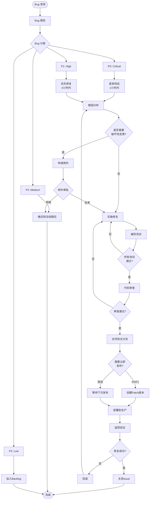

### 1.2 时间线视图

```mermaid
gantt
    title Bug 修复时间线（P0 Critical Bug）
    dateFormat HH:mm
    axisFormat %H:%M

    section 报告
    Bug发现并报告          :report, 00:00, 15m

    section 分类
    自动分类              :triage1, after report, 15m
    技术负责人确认        :triage2, after triage1, 30m

    section 修复
    根因分析              :analyze, after triage2, 2h
    实施修复              :fix, after analyze, 4h
    编写测试              :test, after fix, 2h

    section 审查
    代码审查              :review, after test, 2h
    修改和调整            :adjust, after review, 1h

    section 发布
    合并到主分支          :merge, after adjust, 30m
    创建Patch版本         :release, after merge, 30m
    部署到生产            :deploy, after release, 1h

    section 验证
    监控验证              :monitor, after deploy, 24h
```

---

## 2. Bug 报告阶段

### 2.1 Bug 报告流程

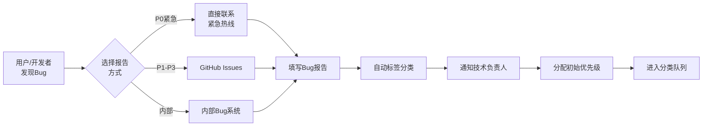

### 2.2 Bug 报告输入输出

**输入**:
- Bug 现象描述
- 重现步骤
- 环境信息
- 日志和截图
- 影响范围估计

**输出**:
- Bug Issue 编号
- 初始优先级标签
- 分配的技术负责人
- SLA 时限

**工具**:
- GitHub Issues
- 内部 Bug 追踪系统
- 邮件（紧急情况）

**人员**:
- 报告人：任何用户或开发者
- 接收人：技术支持/On-call 工程师

---

## 3. Bug 分类阶段

### 3.1 Bug 分类决策树

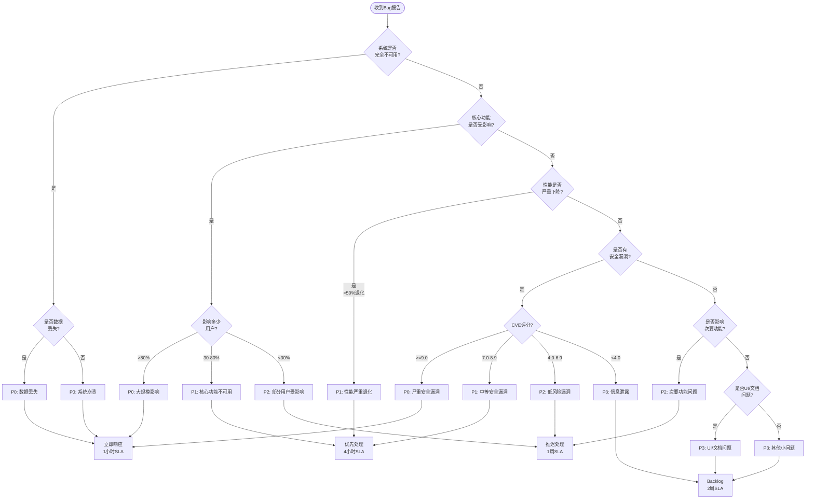

### 3.2 分类输出

**对于 P0 (Critical)**:
- ✅ 立即通知 On-call 工程师
- ✅ 创建紧急响应小组
- ✅ 启动紧急修复流程
- ✅ 每小时更新进度

**对于 P1 (High)**:
- ✅ 4小时内分配给负责人
- ✅ 插入当前 Sprint
- ✅ 每日更新进度
- ✅ 优先级标记

**对于 P2/P3 (Medium/Low)**:
- ✅ 标记为 "mode-freeze-deferred"
- ✅ 加入待修复队列
- ✅ 等待冻结期结束

---

## 4. Bug 修复阶段

### 4.1 修复流程详细图

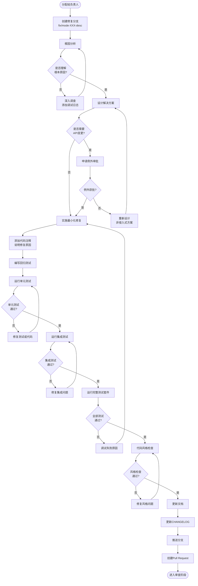

### 4.2 修复阶段关键输出

**代码层面**:
- [ ] 修复代码（最小化变更）
- [ ] 回归测试
- [ ] 代码注释
- [ ] 通过所有测试
- [ ] 通过代码风格检查

**文档层面**:
- [ ] CHANGELOG 更新
- [ ] API 文档更新（如需要）
- [ ] 内联注释说明修复原因

**流程层面**:
- [ ] Git 分支（命名规范）
- [ ] Commit message（规范格式）
- [ ] Pull Request（链接 Issue）

---

## 5. Code Review 阶段

### 5.1 Code Review 流程

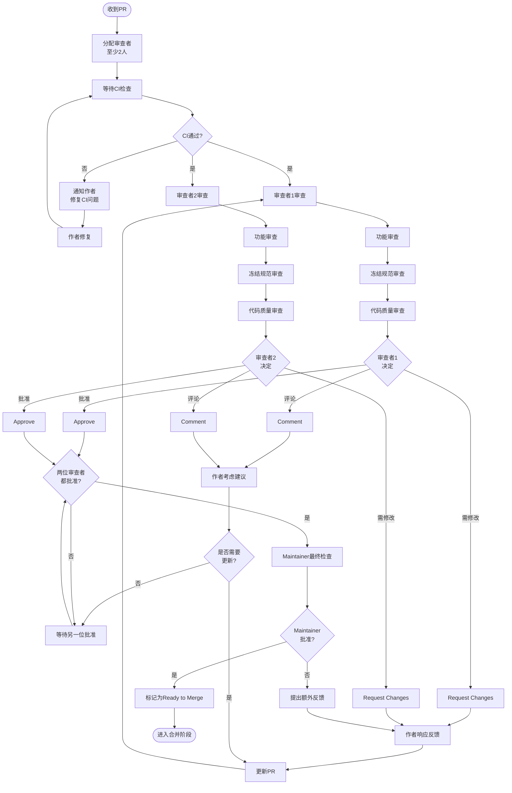

### 5.2 Code Review 检查清单

#### 功能审查
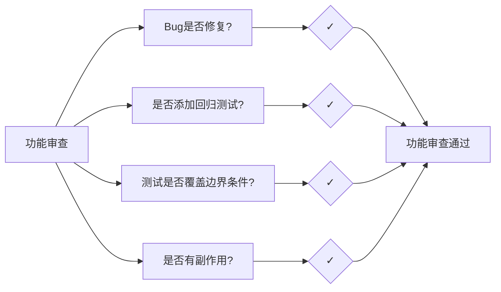

#### 冻结规范审查
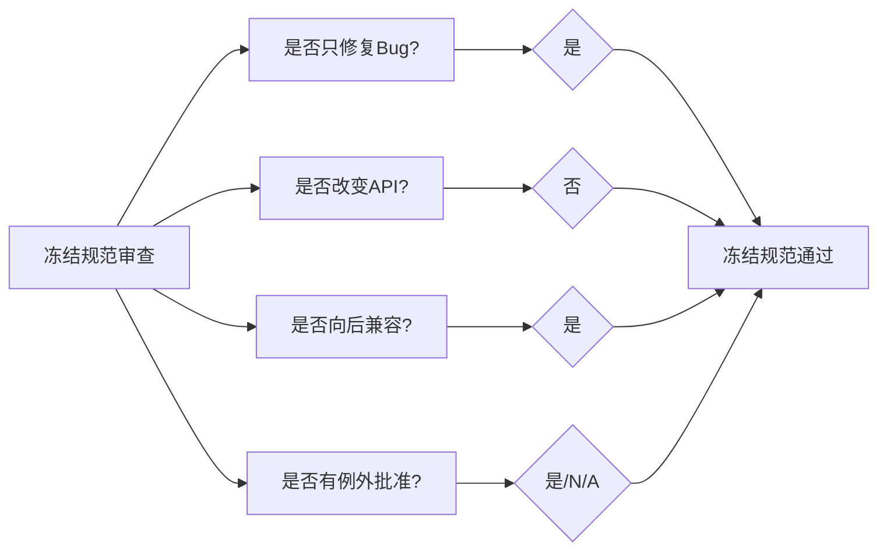

#### 代码质量审查
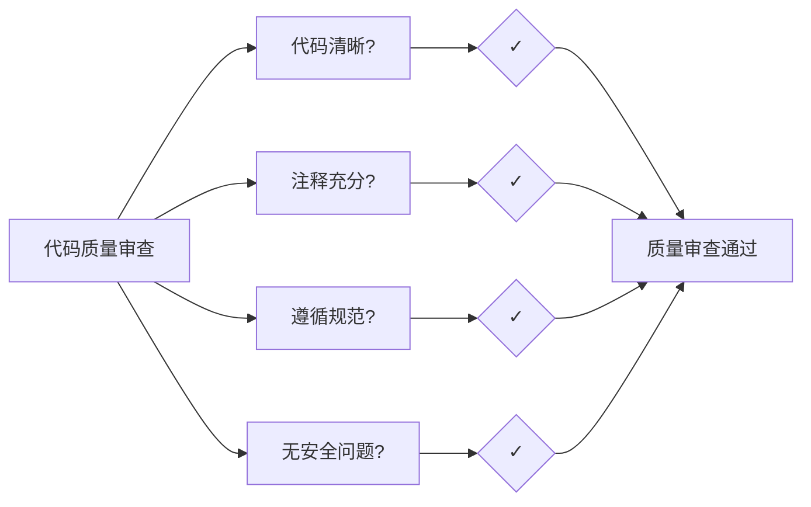

---

## 6. 测试验证阶段

### 6.1 测试金字塔

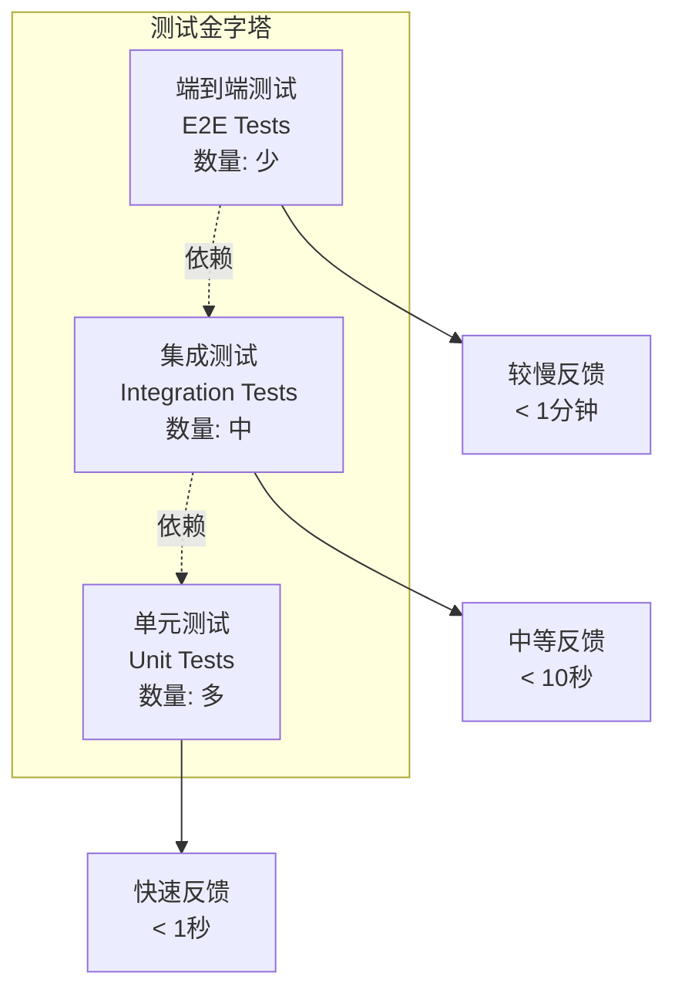

### 6.2 测试执行流程

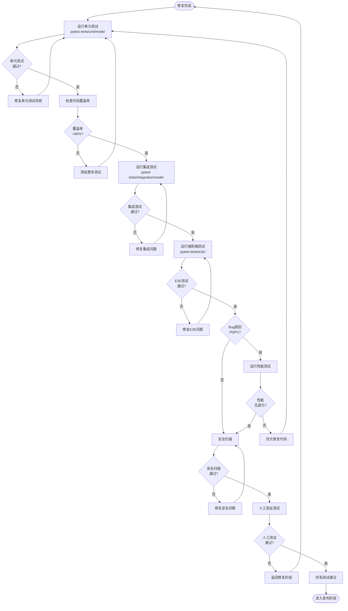

---

## 7. 发布上线阶段

### 7.1 发布决策流程

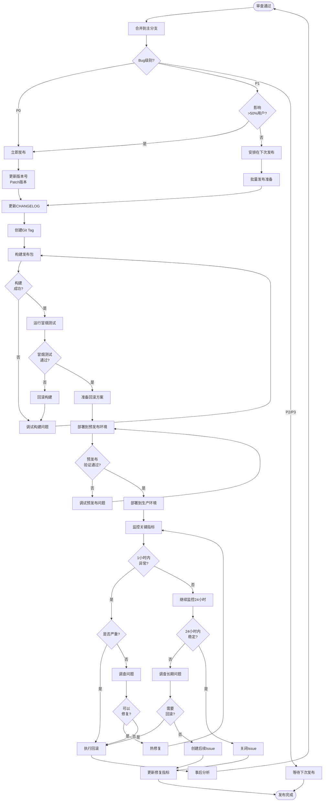

### 7.2 部署监控指标

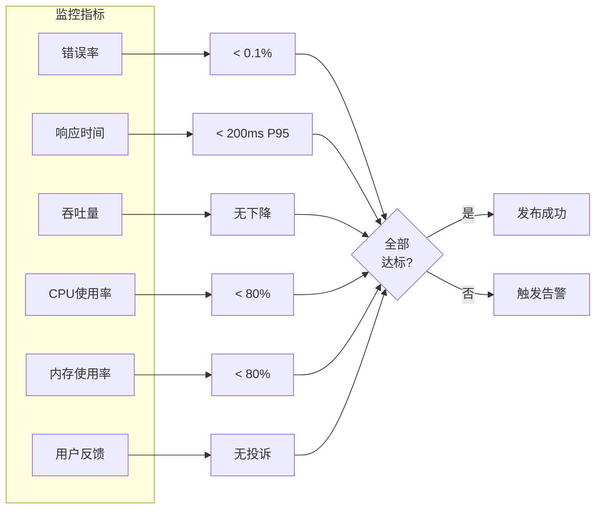

---

## 8. 关键决策点

### 8.1 严重级别判定

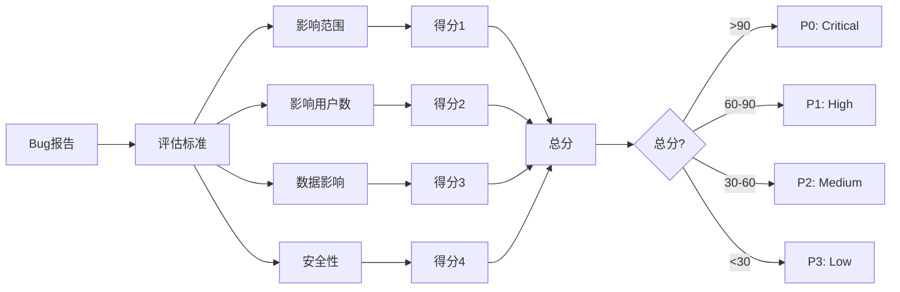

### 8.2 是否需要例外批准

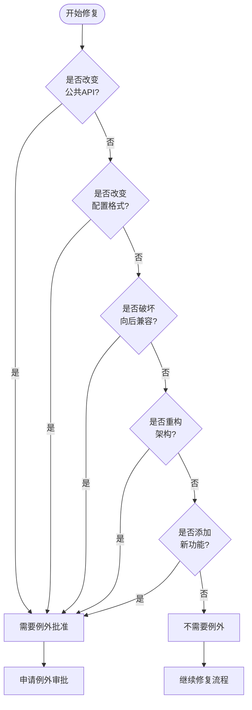

### 8.3 是否立即发布

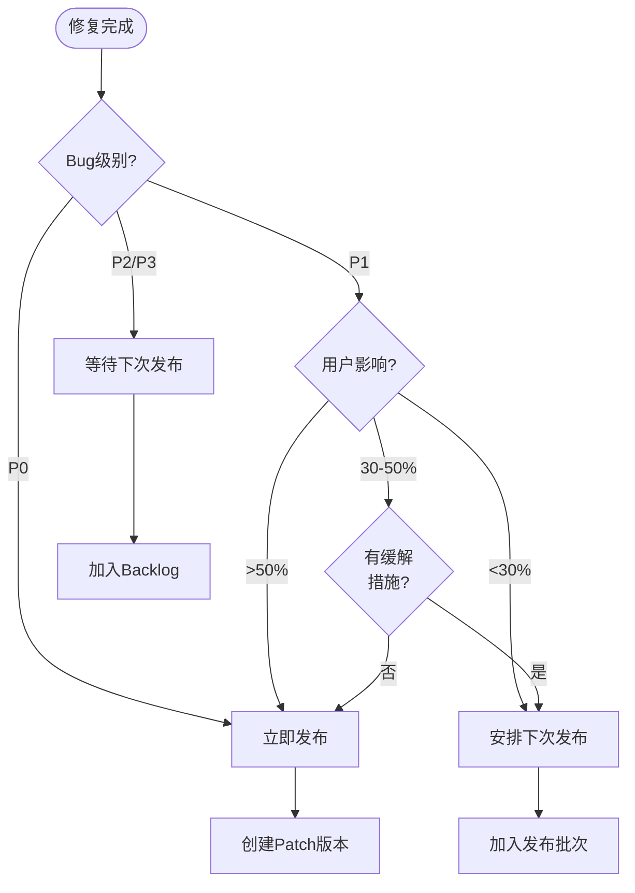

---

## 9. 角色和职责

### 9.1 角色矩阵

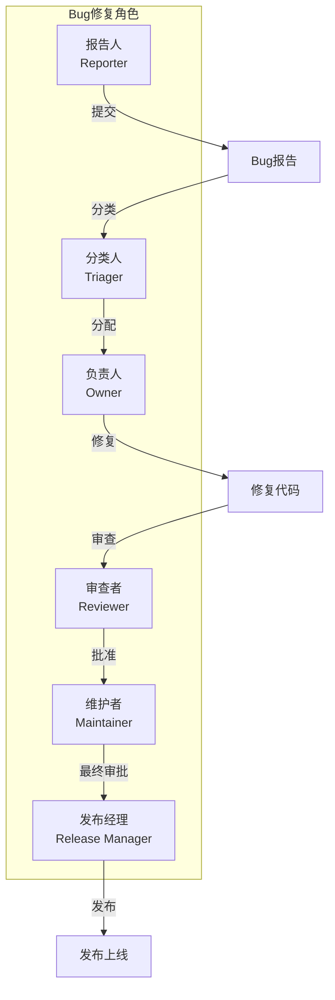

### 9.2 职责说明

#### 报告人 (Reporter)
- **职责**:
  - 发现并报告 Bug
  - 提供详细的重现步骤
  - 协助验证修复
- **工具**: GitHub Issues, 邮件, 内部系统

#### 分类人 (Triager)
- **职责**:
  - 验证 Bug 可重现性
  - 评估严重级别
  - 分配给合适的负责人
- **时限**: P0 1小时, P1 4小时
- **工具**: Issue 系统, 测试环境

#### 负责人 (Owner)
- **职责**:
  - 根因分析
  - 实施修复
  - 编写测试
  - 更新文档
- **时限**: 按 SLA 执行
- **工具**: IDE, Git, 测试工具

#### 审查者 (Reviewer)
- **职责**:
  - 代码审查
  - 功能验证
  - 冻结规范检查
- **要求**: 至少 2 人
- **工具**: GitHub PR, 代码审查工具

#### 维护者 (Maintainer)
- **职责**:
  - 最终审批
  - 合并代码
  - 确保质量
- **要求**: Mode 系统专家
- **工具**: Git, CI/CD

#### 发布经理 (Release Manager)
- **职责**:
  - 决定发布时机
  - 协调发布流程
  - 监控发布后状态
- **工具**: 发布脚本, 监控系统

---

## 10. 相关文档

- [MODE_BUG_FIX_PROCESS.md](./MODE_BUG_FIX_PROCESS.md) - Bug 修复流程详细说明
- [MODE_FREEZE_SPECIFICATION.md](./MODE_FREEZE_SPECIFICATION.md) - Mode 冻结规范
- [MODE_BUG_FIX_QUICK_REFERENCE.md](./MODE_BUG_FIX_QUICK_REFERENCE.md) - 快速参考
- [MODE_BUG_FIX_TESTING_GUIDE.md](./MODE_BUG_FIX_TESTING_GUIDE.md) - 测试指南
- [templates/BUG_FIX_TEMPLATE.md](./templates/BUG_FIX_TEMPLATE.md) - Bug 修复模板
- [examples/MODE_BUG_FIX_EXAMPLES.md](./examples/MODE_BUG_FIX_EXAMPLES.md) - Bug 修复示例

---

**文档状态**: ✅ Active
**最后更新**: 2026-01-30
**维护者**: Architecture Committee
**反馈渠道**: architecture-committee@company.com
