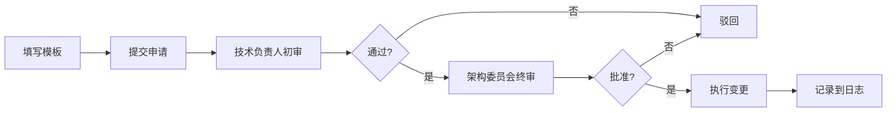

# Mode 系统功能冻结 - 快速参考

**版本**: 1.0.0
**生效日期**: 2026-01-30
**状态**: Active

---

## 📚 核心文档导航

| 文档 | 用途 | 受众 |
|------|------|------|
| [MODE_FREEZE_SPECIFICATION.md](./MODE_FREEZE_SPECIFICATION.md) | 冻结规范总览 | 所有开发者 |
| [MODE_BUG_FIX_PROCESS.md](./MODE_BUG_FIX_PROCESS.md) | Bug 修复流程 | 开发者、测试 |
| [MODE_EXCEPTION_REQUEST_TEMPLATE.md](./MODE_EXCEPTION_REQUEST_TEMPLATE.md) | 例外申请模板 | 需要提交例外的开发者 |
| [MODE_FREEZE_LOG.md](./MODE_FREEZE_LOG.md) | 冻结执行日志 | 所有人（查阅） |

---

## ⚡ 快速查询

### 我可以做什么？

✅ **允许的变更**:
- Bug 修复（不改变 API）
- 性能优化（不改变行为）
- 安全补丁
- 文档更新
- 测试增强

❌ **禁止的变更**:
- 新功能添加
- API 变更（新增/删除/修改接口）
- 架构重构
- 配置文件格式变更
- 破坏性变更

### 哪些模块被冻结？

#### 核心代码
```
agentos/core/mode/
├── mode_policy.py        # 策略引擎
├── mode_alerts.py        # 告警系统
├── mode.py               # 核心定义
├── mode_proposer.py      # 提议器
├── mode_selector.py      # 选择器
└── pipeline_runner.py    # 流水线运行器
```

#### API 和前端
```
agentos/webui/api/mode_monitoring.py              # 监控 API
agentos/webui/static/js/views/ModeMonitorView.js  # 监控视图
```

#### 配置文件
```
configs/mode/
├── default_policy.json
├── dev_policy.json
├── strict_policy.json
└── alert_config.json
```

### 冻结期限

| 里程碑 | 日期 | 说明 |
|--------|------|------|
| 冻结开始 | 2026-01-30 | ✅ 已生效 |
| 第一次评审 | 2026-02-28 | 1 个月后 |
| 第二次评审 | 2026-03-31 | 2 个月后 |
| 预计解冻 | 2026-04-30 | 最早解冻日期 |

---

## 🐛 Bug 修复快速指南

### 1. 报告 Bug

```bash
# 在 GitHub 创建 Issue
标签: bug, mode-system, P0/P1/P2/P3
模板: 使用 Bug Report 模板
```

**Bug 严重级别**:
- **P0 (Critical)**: 系统崩溃、数据丢失、严重安全漏洞
  - SLA: 24 小时修复
- **P1 (High)**: 核心功能不可用、性能严重下降
  - SLA: 3 天修复
- **P2 (Medium)**: 功能部分不可用、明显错误
  - SLA: 2 周修复
- **P3 (Low)**: 小问题、UI 瑕疵、文档错误
  - SLA: 下个版本修复

### 2. 修复流程

```bash
# 1. 创建修复分支
git checkout -b fix/mode-{issue-number}-{description}

# 2. 最小化修复代码
# 只修改必要的代码，不重构

# 3. 添加回归测试
# 确保 Bug 不会再次出现

# 4. 运行所有测试
pytest tests/unit/mode/ -v
pytest tests/integration/mode/ -v

# 5. 提交 PR（至少 2 人审查）
gh pr create --title "fix(mode): ..." --body "Fixes #123"

# 6. 合并并发布 patch 版本（P0/P1）
```

### 3. 代码审查检查清单

- [ ] 是否修复了报告的 Bug？
- [ ] 是否添加了回归测试？
- [ ] 是否通过所有现有测试？
- [ ] 是否符合冻结规范？（不改变 API）
- [ ] 是否向后兼容？
- [ ] 是否最小化变更？

---

## 🚨 例外申请快速指南

### 何时需要申请例外？

当你需要进行以下变更时：
- 功能增强
- API 变更
- 配置格式变更
- 架构重构

### 申请条件

必须满足**所有**条件：
- ✅ 问题严重级别为 P0 或 P1
- ✅ 无其他解决方案
- ✅ 影响范围评估完整

### 申请流程



**时限**:
- **P0**: 24 小时内完成审批
- **P1**: 3 天内完成审批

### 申请步骤

```bash
# 1. 复制模板
cp docs/governance/MODE_EXCEPTION_REQUEST_TEMPLATE.md \
   exception-requests/EXC-2026-001-my-request.md

# 2. 填写所有必填字段
# - 问题描述
# - 变更请求
# - 替代方案
# - 风险评估
# - 测试计划

# 3. 提交 GitHub Issue
# 标签: mode-freeze-exception
# 附加: 填写好的模板

# 4. 通知审批人
# @mode-system-owner @architecture-committee
```

---

## 📊 监控和报告

### 系统稳定性指标

| 指标 | 目标 | 当前 | 状态 |
|------|------|------|------|
| 错误率 | < 0.1% | 0.0% | ✅ |
| 平均响应时间 | < 100ms | 95ms | ✅ |
| P0/P1 Bug 数 | 0 | 0 | ✅ |
| 用户满意度 | > 80% | N/A | - |

### 月度评审

- **频率**: 每月第一周
- **评审内容**:
  - 冻结执行情况
  - 例外申请统计
  - 系统稳定性指标
  - 用户反馈
- **输出**: 月度报告

---

## 📞 联系方式

### 日常咨询

- **技术负责人**: mode-system-owner@company.com
- **GitHub Issues**: 标签 `mode-system`

### 例外申请

- **架构委员会**: architecture-committee@company.com
- **GitHub Issues**: 标签 `mode-freeze-exception`

### 紧急情况（P0）

- **紧急热线**: mode-emergency@company.com
- **电话**: [紧急联系电话]

---

## 🔧 常用命令

### 测试命令

```bash
# 运行 Mode 系统所有测试
pytest tests/unit/mode/ -v
pytest tests/integration/mode/ -v

# 运行特定测试
pytest tests/unit/mode/test_mode_policy.py -v

# 检查代码质量
flake8 agentos/core/mode/
mypy agentos/core/mode/

# 检查测试覆盖率
pytest tests/unit/mode/ --cov=agentos/core/mode --cov-report=html
```

### Git 命令

```bash
# 创建 Bug 修复分支
git checkout -b fix/mode-{issue-number}-{description}

# 运行测试后提交
git add .
git commit -m "fix(mode): fix {description} (#issue-number)"

# 创建 PR
gh pr create \
  --title "fix(mode): {description}" \
  --body "Fixes #{issue-number}" \
  --label "bug,mode-system"
```

---

## 📖 学习资源

### Mode 系统文档

- [Mode 系统概述](../../agentos/core/mode/README.md)
- [Mode 策略详解](../../agentos/core/mode/README_POLICY.md)

### 开发规范

- [代码风格指南](../dev/CODE_STYLE.md)
- [Git 提交规范](../dev/GIT_COMMIT_CONVENTION.md)
- [测试指南](../testing/TESTING_GUIDE.md)

### API 文档

- [Mode API Reference](../api/MODE_API_REFERENCE.md)
- [Mode 监控 API](../api/MODE_MONITORING_API.md)

---

## ❓ FAQ

### Q1: 我可以优化 Mode 系统的性能吗？

**A**: 可以，但必须满足：
- 不改变功能行为
- 不改变 API
- 有性能基准测试证明改进
- 通过所有现有测试

### Q2: 我发现了一个 P3 级别的 Bug，应该怎么办？

**A**:
1. 在 GitHub 创建 Issue（标签：`bug`, `mode-system`, `P3`）
2. 等待冻结期结束后修复
3. 如果紧急，可以申请例外（但通常不会被批准）

### Q3: 如何判断是 Bug 还是功能请求？

**A**:
- **Bug**: 现有功能不按设计工作 → 可以修复
- **功能请求**: 要求新功能 → 冻结期不受理

### Q4: 如果我的变更非常小，还需要审批吗？

**A**:
- 如果符合"允许的变更类型"，不需要例外审批
- 但仍需要正常的代码审查（至少 2 人）
- 文档更新可以直接提交 PR

### Q5: 冻结期会延长吗？

**A**:
- 最短冻结期：2-3 个月
- 如果系统不稳定，可能延长
- 架构委员会会在月度评审中决定

### Q6: 我可以重构 Mode 内部实现吗？

**A**:
- 如果是 Bug 修复的一部分：可以最小化重构
- 如果是独立的重构：不允许，等冻结期结束
- 如果是性能优化：可以，但不改变行为

---

## 🎯 关键原则

> 记住这些原则，可以避免 90% 的问题

1. **最小化变更** - 只修改必要的代码
2. **向后兼容** - 不破坏现有用户代码
3. **充分测试** - 每个变更都有测试
4. **清晰文档** - 记录原因和方案
5. **敬畏冻结** - 冻结是为了稳定性，不是障碍

---

## 📅 重要日期

| 日期 | 事件 |
|------|------|
| 2026-01-30 | ✅ 冻结开始 |
| 2026-02-28 | 📅 第一次月度评审 |
| 2026-03-31 | 📅 第二次月度评审 |
| 2026-04-30 | 📅 预计最早解冻日期 |

---

**文档状态**: ✅ Active
**最后更新**: 2026-01-30
**维护者**: Architecture Committee

---

## 💡 提示

- 📌 将此页面加入书签，快速查询
- 🔔 关注 GitHub Issues 标签 `mode-system`
- 📧 订阅 mode-announce@company.com 邮件列表
- 💬 加入 Slack #mode-system 频道
