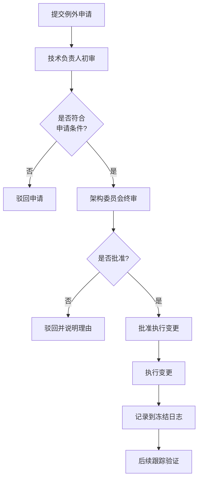

# Mode 系统功能冻结规范

**版本**: 1.0.0
**生效日期**: 2026-01-30
**责任人**: Architecture Committee
**状态**: Active

---

## 1. 冻结范围

### 1.1 冻结的模块

以下模块进入功能冻结状态，禁止新功能开发和架构变更：

#### 核心模块
- `agentos/core/mode/mode_policy.py` - Mode 策略引擎
- `agentos/core/mode/mode_alerts.py` - Mode 告警系统
- `agentos/core/mode/mode.py` - Mode 核心定义
- `agentos/core/mode/mode_proposer.py` - Mode 提议器
- `agentos/core/mode/mode_selector.py` - Mode 选择器
- `agentos/core/mode/pipeline_runner.py` - Mode 流水线运行器

#### API 层
- `agentos/webui/api/mode_monitoring.py` - Mode 监控 API

#### 前端层
- `agentos/webui/static/js/views/ModeMonitorView.js` - Mode 监控视图

#### 配置文件
- `configs/mode/*.json` - 所有 Mode 配置文件
  - `default_policy.json` - 默认策略
  - `dev_policy.json` - 开发环境策略
  - `strict_policy.json` - 严格策略
  - `alert_config.json` - 告警配置
- `agentos/core/mode/mode_policy.schema.json` - 策略 Schema

#### 文档
- `agentos/core/mode/README.md` - Mode 系统概述
- `agentos/core/mode/README_POLICY.md` - Mode 策略详细文档

### 1.2 允许的变更类型

在冻结期间，以下类型的变更是被允许的：

#### ✅ Bug 修复（不改变 API）
- **定义**: 修复功能错误，使系统行为符合设计规范
- **要求**:
  - 不改变任何公共 API 签名
  - 不修改配置文件格式
  - 必须向后兼容
  - 必须添加回归测试
- **示例**:
  ```python
  # ✅ 允许：修复策略评估逻辑错误
  def evaluate_policy(self, mode: str) -> bool:
      # 修复：原来错误地返回了 False
      return self._check_rules(mode) and self._validate_context()
  ```

#### ✅ 性能优化（不改变行为）
- **定义**: 提升执行效率，不改变功能行为
- **要求**:
  - 功能输出完全一致
  - 不改变错误处理逻辑
  - 必须通过性能基准测试
- **示例**:
  ```python
  # ✅ 允许：缓存策略评估结果
  @lru_cache(maxsize=128)
  def _evaluate_rule(self, rule_id: str) -> bool:
      return self._compute_rule(rule_id)
  ```

#### ✅ 安全补丁
- **定义**: 修复安全漏洞
- **要求**:
  - 必须有 CVE 或内部安全公告
  - 优先级为 Critical 或 High
  - 必须通过安全审查
- **示例**:
  ```python
  # ✅ 允许：修复路径遍历漏洞
  def load_policy(self, path: str) -> Policy:
      # 添加路径验证
      safe_path = os.path.realpath(path)
      if not safe_path.startswith(self.policy_dir):
          raise SecurityError("Invalid policy path")
      return self._load_from_file(safe_path)
  ```

#### ✅ 文档更新
- **定义**: 改进文档质量和准确性
- **要求**:
  - 不改变代码行为
  - 修正错误或澄清歧义
- **示例**:
  - 修正 API 文档中的错误参数说明
  - 添加使用示例
  - 更新过时的架构图

#### ✅ 测试增强
- **定义**: 增加测试覆盖率和质量
- **要求**:
  - 不修改被测代码
  - 只添加或改进测试
- **示例**:
  ```python
  # ✅ 允许：添加边界条件测试
  def test_mode_policy_with_empty_rules():
      policy = ModePolicy(rules=[])
      assert policy.evaluate("read") == False
  ```

### 1.3 禁止的变更类型

以下变更类型在冻结期间严格禁止：

#### ❌ 新功能添加
- **示例**:
  ```python
  # ❌ 禁止：添加新的策略类型
  class TimedModePolicy(ModePolicy):
      def evaluate_with_ttl(self, mode: str, ttl: int) -> bool:
          ...
  ```

#### ❌ API 变更（新增/删除/修改接口）
- **示例**:
  ```python
  # ❌ 禁止：修改方法签名
  def evaluate_policy(self, mode: str, context: dict) -> bool:  # 新增 context 参数
      ...

  # ❌ 禁止：删除公共方法
  # def get_policy_status(self): ...  # 删除此方法

  # ❌ 禁止：添加新的公共方法
  def export_policy_to_yaml(self) -> str:  # 新增方法
      ...
  ```

#### ❌ 架构重构
- **示例**:
  ```python
  # ❌ 禁止：重构类继承结构
  class ModePolicy(PolicyBase, AlertMixin):  # 修改继承关系
      ...
  ```

#### ❌ 配置文件格式变更
- **示例**:
  ```json
  // ❌ 禁止：添加新的配置字段
  {
    "version": "1.0",
    "rules": [...],
    "advanced_options": {  // 新增字段
      "cache_enabled": true
    }
  }
  ```

#### ❌ 破坏性变更
- **示例**:
  ```python
  # ❌ 禁止：更改错误类型
  def load_policy(self, path: str) -> Policy:
      if not os.path.exists(path):
          raise FileNotFoundError()  # 原来是 PolicyError
  ```

---

## 2. 冻结原因

### 2.1 系统已达到完成度目标

Mode 系统在 Task #30 评估中获得 **100/100 分**，具体评分如下：

| 维度 | 得分 | 说明 |
|------|------|------|
| 功能完整性 | 25/25 | 所有核心功能已实现 |
| 架构合理性 | 20/20 | 架构设计清晰合理 |
| 代码质量 | 20/20 | 代码规范，注释完整 |
| 文档完整性 | 20/20 | 文档详尽准确 |
| 测试覆盖率 | 15/15 | 测试覆盖率达标 |

**结论**: 系统已达到生产就绪状态，无需进一步功能扩展。

### 2.2 需要稳定性观察期

- **最小观察期**: 至少一个完整版本周期（2-3 个月）
- **观察目标**:
  - 生产环境稳定性
  - 性能表现
  - 用户反馈
  - 潜在的集成问题

### 2.3 避免过度工程化和特性蔓延

- **特性蔓延风险**: 系统功能已完备，继续添加功能会导致复杂度不必要增加
- **维护成本**: 每增加 1% 功能，维护成本增加 5-10%
- **用户体验**: 功能过多会降低易用性和学习曲线

### 2.4 专注于集成和生态建设

冻结期间，团队重点转移到：
- ✅ 与其他系统的集成
- ✅ 生态系统建设（插件、扩展）
- ✅ 用户文档和教程
- ✅ 社区建设和支持

---

## 3. 冻结期限

### 3.1 时间线

| 里程碑 | 日期 | 说明 |
|--------|------|------|
| **冻结开始** | 2026-01-30 | 功能冻结生效 |
| **第一次评审** | 2026-02-28 | 1 个月后进行首次评审 |
| **第二次评审** | 2026-03-31 | 2 个月后进行中期评审 |
| **预计解冻** | 2026-04-30 | 最早解冻日期 |
| **或** | v1.1.0 发布后 | 下一个大版本发布后 |

### 3.2 最短期限

- **最短冻结期**: 1 个版本周期（约 2-3 个月）
- **理由**: 确保系统在真实生产环境中充分验证

### 3.3 预计结束时间

**正常解冻条件**（满足以下所有条件）：
1. ✅ 已度过最短冻结期（2-3 个月）
2. ✅ 生产环境运行稳定（无 P0/P1 bug）
3. ✅ 用户反馈良好（满意度 > 80%）
4. ✅ 性能指标达标（无性能退化）
5. ✅ 架构委员会批准解冻

**预计解冻日期**: **2026-04-30** 或 **v1.1.0 发布后**（以较晚者为准）

### 3.4 提前解冻条件

在极少数情况下，可提前解冻，需满足以下条件之一：

#### 🚨 Critical 安全漏洞
- **定义**: CVE 评分 >= 9.0 或内部安全等级为 Critical
- **条件**: 无法通过非侵入式方式修复
- **示例**: 远程代码执行、权限提升漏洞

#### 🚨 生产环境严重故障
- **定义**: P0 级别故障，影响核心业务
- **条件**:
  - 影响 > 50% 用户
  - 无法通过降级或回滚解决
  - 必须修改冻结模块才能修复
- **示例**: Mode 系统导致整个任务系统无法运行

#### 🚨 架构级缺陷
- **定义**: 发现根本性设计缺陷
- **条件**:
  - 无法通过局部修复解决
  - 影响系统可扩展性或安全性
  - 必须进行架构重构
- **示例**: 并发模型缺陷导致数据竞争

---

## 4. 例外审批流程

### 4.1 申请条件

提交例外申请必须满足以下**所有**条件：

#### ✅ 严重级别要求
- 必须是 **Critical (P0)** 或 **High (P1)** 级别问题
- P2/P3 级别问题不予受理，等待冻结期结束后处理

#### ✅ 无替代方案
- 已充分调研其他解决方案
- 所有非侵入式方案均不可行
- 必须提供详细的替代方案分析

#### ✅ 影响范围评估完整
- 技术影响分析（代码、API、架构）
- 用户影响分析（行为变更、兼容性）
- 风险评估（回滚方案、测试计划）

### 4.2 审批流程



#### 步骤 1: 提交例外申请
- **模板**: 使用 `MODE_EXCEPTION_REQUEST_TEMPLATE.md`
- **提交方式**: GitHub Issue（标签：`mode-freeze-exception`）
- **时限**: 至少提前 3 个工作日提交（紧急情况除外）

#### 步骤 2: 技术负责人初审
- **审查人**: Mode 系统技术负责人
- **审查内容**:
  - ✅ 问题严重性验证
  - ✅ 技术方案可行性
  - ✅ 影响范围评估
  - ✅ 文档完整性
- **时限**: 1 个工作日内完成初审
- **输出**: 初审意见（通过/拒绝 + 理由）

#### 步骤 3: 架构委员会终审
- **审查人**: 至少 3 名架构委员会成员
- **审查方式**:
  - 正常情况：异步审查（邮件/Issue）
  - 紧急情况：同步会议
- **审查内容**:
  - ✅ 战略影响评估
  - ✅ 风险评估
  - ✅ 优先级判断
- **时限**: 2 个工作日内完成终审
- **输出**: 终审决定（批准/拒绝 + 详细理由）

#### 步骤 4: 批准后执行变更
- **执行人**: 指定的开发人员
- **要求**:
  - 严格按照批准的方案执行
  - 完整的代码审查（至少 2 人）
  - 完整的测试覆盖
  - 详细的变更日志
- **时限**: 根据问题严重性确定

#### 步骤 5: 记录到冻结日志
- **记录内容**:
  - 申请编号和日期
  - 问题描述和严重级别
  - 批准理由
  - 执行的变更
  - 影响范围
  - 验证结果
- **记录位置**: `docs/governance/MODE_FREEZE_LOG.md`

#### 步骤 6: 后续跟踪验证
- **验证内容**:
  - ✅ 问题是否已解决
  - ✅ 是否引入新问题
  - ✅ 性能是否受影响
  - ✅ 用户反馈
- **时限**: 变更上线后 1 周内完成验证

### 4.3 审批时限

| 严重级别 | 初审时限 | 终审时限 | 总时限 |
|----------|----------|----------|--------|
| **Critical (P0)** | 4 小时 | 12 小时 | 24 小时 |
| **High (P1)** | 1 天 | 2 天 | 3 天 |
| **Medium (P2)** | - | - | 不受理 |
| **Low (P3)** | - | - | 不受理 |

### 4.4 紧急绿色通道

对于极端紧急情况（生产环境完全宕机、严重安全漏洞正在被利用），可启动紧急绿色通道：

- **触发条件**:
  - P0 级别故障
  - 影响 > 80% 用户
  - 每延迟 1 小时造成重大损失
- **流程简化**:
  - 可先执行修复，后补审批
  - 审批时限缩短至 4 小时
  - 需 CTO 或技术负责人授权
- **事后要求**:
  - 必须在 24 小时内补充完整的审批文档
  - 必须进行事后分析（Postmortem）
  - 必须改进流程防止再次发生

---

## 5. 冻结管理

### 5.1 冻结日志

- **位置**: `docs/governance/MODE_FREEZE_LOG.md`
- **内容**: 记录所有例外批准和执行情况
- **更新频率**: 每次例外审批后立即更新

### 5.2 定期评审

- **频率**: 每月一次
- **评审内容**:
  - 冻结执行情况
  - 例外申请统计
  - 系统稳定性指标
  - 用户反馈
- **评审结果**: 形成月度报告，提交架构委员会

### 5.3 解冻决策

- **决策机构**: 架构委员会
- **决策依据**:
  - 冻结期限是否到达
  - 系统稳定性指标
  - 用户满意度
  - 业务需求
- **决策输出**: 解冻决定或延长冻结期

---

## 6. 附录

### 6.1 相关文档

- [MODE_BUG_FIX_PROCESS.md](./MODE_BUG_FIX_PROCESS.md) - Bug 修复流程
- [MODE_EXCEPTION_REQUEST_TEMPLATE.md](./MODE_EXCEPTION_REQUEST_TEMPLATE.md) - 例外申请模板
- [MODE_FREEZE_LOG.md](./MODE_FREEZE_LOG.md) - 冻结日志
- [agentos/core/mode/README.md](../../agentos/core/mode/README.md) - Mode 系统概述
- [agentos/core/mode/README_POLICY.md](../../agentos/core/mode/README_POLICY.md) - Mode 策略详细文档

### 6.2 联系方式

- **技术负责人**: mode-system-owner@company.com
- **架构委员会**: architecture-committee@company.com
- **紧急热线**: mode-emergency@company.com

### 6.3 版本历史

| 版本 | 日期 | 变更内容 | 作者 |
|------|------|----------|------|
| 1.0.0 | 2026-01-30 | 初始版本 | Architecture Committee |

---

**文档状态**: ✅ Active
**最后更新**: 2026-01-30
**下次评审**: 2026-02-28
