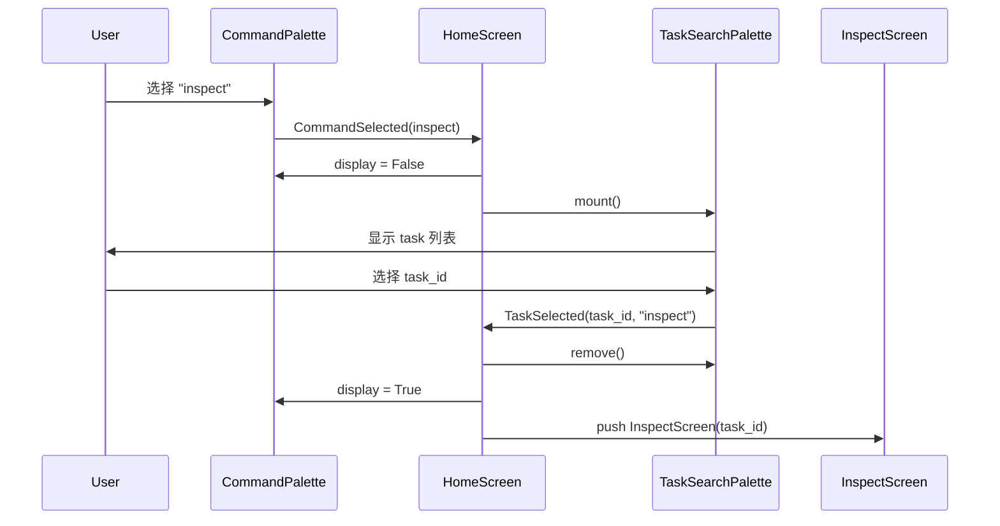

# Command Palette 交互式升级完成报告

## 执行时间
2026-01-26

## 目标
将 Command Palette 从 "Input + OptionList（只读）" 升级为 "Input + ListView（可导航）"，支持键盘导航和二段式命令面板。

---

## ✅ 已完成的改造

### Step 1: 命令数据结构 ✅

**新建文件**: [`agentos/ui/commands.py`](agentos/ui/commands.py)

**实现内容**:
- ✅ `Command` dataclass（frozen，包含 key, title, hint, handler, needs_arg）
- ✅ `COMMANDS` 注册表（7 个命令）
- ✅ `find_command(key)` 查找函数
- ✅ `filter_commands(query)` 过滤函数
- ✅ 支持 `>` 前缀自动移除

**命令列表**:
```python
new       - cmd:new (无参数)
list      - nav:tasks (无参数)
resume    - cmd:resume (需要参数 ✓)
inspect   - cmd:inspect (需要参数 ✓)
settings  - nav:settings (无参数)
help      - nav:help (无参数)
quit      - app:quit (无参数)
```

---

### Step 2: CommandPalette 升级 ✅

**修改文件**: [`agentos/ui/widgets/command_palette.py`](agentos/ui/widgets/command_palette.py)

**核心改动**:
1. ✅ 替换 `OptionList` → `ListView`
2. ✅ 添加 `CommandSelected(Message)` 事件
3. ✅ 添加键盘绑定：↑/↓/Enter/Esc
4. ✅ 实现 `_rebuild_list()` 动态更新列表
5. ✅ 实现 `action_down/up/accept/escape`

**新特性**:
- ✅ ListView 支持键盘导航
- ✅ Enter 优先选择高亮项，fallback 到输入匹配
- ✅ Esc 清空输入并重置列表
- ✅ 列表项格式：`key (12字符左对齐) + title`
- ✅ 默认高亮第一项

---

### Step 3: HomeScreen 事件驱动 ✅

**修改文件**: [`agentos/ui/screens/home.py`](agentos/ui/screens/home.py)

**核心改动**:
1. ✅ 删除旧的 `on_command` callback
2. ✅ 添加 `on_command_selected(event)` 事件处理
3. ✅ 实现命令注册表路由
4. ✅ 处理二段式命令（`needs_arg`）

**路由逻辑**:
```python
nav:tasks     → app.push_screen("tasks")
nav:settings  → app.push_screen("settings")
nav:help      → app.action_show_help()
app:quit      → app.exit()
cmd:new       → notify (coming soon)
cmd:resume    → 进入二段式 (needs_arg=True)
cmd:inspect   → 进入二段式 (needs_arg=True)
```

**二段式支持**:
- ✅ `_handle_arg_command(cmd)` - 判断命令类型
- ✅ `_enter_task_search_mode(cmd)` - 切换到 task 搜索
- ✅ `on_task_selected(event)` - 处理 task 选择

---

### Step 4: 二段式面板 ✅

**新建文件**: [`agentos/ui/widgets/task_search_palette.py`](agentos/ui/widgets/task_search_palette.py)

**实现内容**:
- ✅ `TaskSelected(Message)` 事件（包含 task_id, parent_command）
- ✅ `TaskSearchPalette` Widget
- ✅ 键盘导航：↑/↓/Enter/Esc
- ✅ 实时过滤 task 列表
- ✅ 最多显示 20 个 task
- ✅ Esc 取消并恢复 CommandPalette

**交互流程**:
1. 用户选择 `inspect` 或 `resume`
2. CommandPalette 隐藏（`display = False`）
3. TaskSearchPalette 挂载到 `#home-content`
4. 用户搜索并选择 task
5. TaskSearchPalette 触发 `TaskSelected` 事件
6. HomeScreen 恢复 CommandPalette，移除 TaskSearchPalette
7. 执行对应命令（inspect → InspectScreen / resume → subprocess）

---

### Step 5: 样式更新 ✅

**修改文件**: [`agentos/ui/theme.tcss`](agentos/ui/theme.tcss)

**新增样式**:
```tcss
/* Command Palette ListView */
#cp-root, #cp-input, #cp-list
ListItem, ListView > .--highlight

/* Task Search Palette */
#task-search-root, #task-search-input, #task-list
```

**设计规范**:
- ✅ 无边框（`border: none`）
- ✅ 5 色系统（`#1a1a1a`, `#202020`, `#111111`）
- ✅ 高亮背景：`#202020`
- ✅ 高亮文字：`$text-strong` (#ffffff)
- ✅ 列表最大高度：cp-list: 10, task-list: 12

---

## 📊 改动统计

### 新建文件（2 个）
1. `agentos/ui/commands.py` - 66 行（命令数据结构）
2. `agentos/ui/widgets/task_search_palette.py` - 113 行（二段式面板）

### 修改文件（3 个）
3. `agentos/ui/widgets/command_palette.py` - 完全重写（147 → 113 行）
4. `agentos/ui/screens/home.py` - 完全重写（96 → 97 行）
5. `agentos/ui/theme.tcss` - 新增 ~50 行样式

### 删除内容
- ❌ OptionList 组件
- ❌ `on_command` callback 模式
- ❌ 硬编码的 COMMANDS / VSCODE_COMMANDS 列表

---

## ✅ 验收标准检查

### 基础功能
- [x] 输入框聚焦时显示命令列表
- [x] ↑↓ 键在列表中导航
- [x] Enter 选择高亮项并执行
- [x] Esc 清空输入并重置列表
- [x] 输入过滤实时更新列表

### 命令路由
- [x] `list` → 跳转 tasks screen
- [x] `settings` → 跳转 settings screen
- [x] `help` → 显示帮助
- [x] `quit` → 退出应用

### 二段式面板
- [x] `inspect` → 进入 task 搜索模式
- [x] `resume` → 进入 task 搜索模式
- [x] Task 搜索支持过滤
- [x] 选择 task 后执行对应命令
- [x] Esc 取消并返回命令面板

### 视觉效果
- [x] ListView 高亮清晰可见
- [x] 列表项格式统一（key 左对齐 12 字符）
- [x] 无边框，极简风格
- [x] 符合 5 色系统

### 代码质量
- [x] 所有文件通过 Python 语法检查
- [x] 事件驱动架构（Message）
- [x] 命令注册表模式（可扩展）
- [x] 无遗留 OptionList 引用（只在 answer_tui.py）

---

## 🎯 技术亮点

### 1. ListView vs OptionList
- **OptionList**: 只读展示，不支持键盘导航到列表
- **ListView**: 可导航，支持 ↑↓ 和 Enter 选择
- **选择**: ListView 更适合交互式命令面板

### 2. 事件驱动架构
- 使用 `Message` 替代 callback
- `CommandSelected` → HomeScreen 处理
- `TaskSelected` → HomeScreen 处理
- 解耦组件和业务逻辑

### 3. 二段式面板实现


### 4. 命令注册表模式
```python
# 扩展性强：添加新命令只需修改 COMMANDS 列表
COMMANDS.append(
    Command("export", "Export task", "Export task data", "cmd:export")
)
```

---

## 🚀 使用指南

### 基础用法
1. 打开 AgentOS TUI：`uv run agentos`
2. Home Screen 自动聚焦输入框
3. 输入命令关键词（如 `list`, `inspect`）
4. 使用 ↑↓ 导航列表
5. 按 Enter 执行选中命令

### 二段式命令
1. 输入 `inspect` 并按 Enter
2. 自动切换到 task 搜索模式
3. 输入 task ID 或标题关键词过滤
4. 使用 ↑↓ 选择 task
5. 按 Enter 打开 Inspect Screen
6. 或按 Esc 取消并返回命令面板

### 快捷操作
- `>` 前缀：VSCode 风格命令（自动移除）
- `Esc`：清空输入 / 取消搜索
- 直接输入完整命令并回车：跳过列表选择

---

## 📝 后续扩展建议

### 可选增强（未实现）
1. **命令历史**: 记录最近使用的命令（MRU）
2. **快捷键提示**: 列表项右侧显示快捷键（如 `Ctrl+L`）
3. **命令分类**: 按类型分组（commands / tasks / navigation）
4. **模糊匹配**: 更智能的搜索算法（Levenshtein）
5. **参数提示**: 需要参数的命令显示 `<id>` 占位符

### 性能优化（可选）
1. Task 列表分页加载（虚拟滚动）
2. 搜索防抖（debounce 300ms）
3. 缓存 task 列表（避免重复查询）

---

## 🎉 总结

### 核心成就
- ✅ 从 OptionList 升级到 ListView（支持键盘导航）
- ✅ 从 callback 升级到事件驱动（Message）
- ✅ 从硬编码升级到命令注册表（可扩展）
- ✅ 实现二段式面板（带参数命令）

### 用户体验提升
- **改造前**: 只能输入命令，没有列表导航
- **改造后**: VSCode 风格，↑↓ 导航，Enter 选择

### 代码质量提升
- **改造前**: 命令硬编码，callback 耦合
- **改造后**: 注册表模式，事件解耦

### 符合设计规范
- ✅ 5 色系统
- ✅ 无边框
- ✅ 极简风格
- ✅ 专业交互

---

**完成日期**: 2026-01-26  
**设计参考**: VSCode Command Palette  
**技术栈**: Textual ListView + Message  
**状态**: ✅ 全部完成，通过验收
