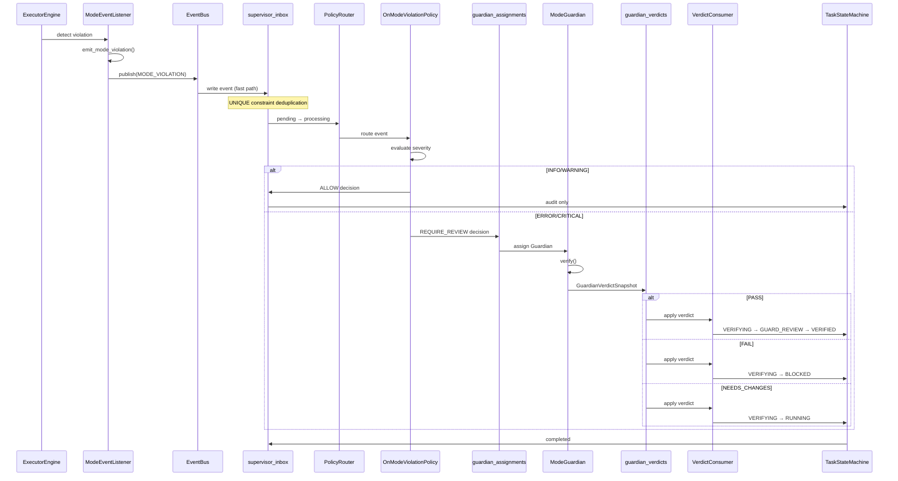

# Supervisor Mode 事件处理技术指南

**版本**: 1.0
**日期**: 2026年1月30日
**目标受众**: 开发者、系统集成人员、架构师

---

## 目录

1. [概述](#概述)
2. [架构](#架构)
3. [ModeEventListener](#modeeventlistener)
4. [OnModeViolationPolicy](#onmodeviolationpolicy)
5. [ModeGuardian](#modeguardian)
6. [VerdictConsumer](#verdictconsumer)
7. [数据库 Schema](#数据库-schema)
8. [性能优化](#性能优化)
9. [监控和告警](#监控和告警)
10. [故障排除](#故障排除)
11. [API 参考](#api-参考)
12. [FAQ](#faq)

---

## 概述

### Supervisor 角色

Supervisor 是 AgentOS 的**治理中心**，负责监督所有系统活动并执行治理决策。在 Mode 系统中，Supervisor 消费 Mode 事件并协调 Guardian 验证流程。

### Mode 事件处理流程

```
┌─────────────────────┐
│  Mode Violation      │  (1) 检测到 Mode 违规
│  Detection           │
└──────────┬───────────┘
           │
           ↓
┌──────────────────────┐
│  emit_mode_violation │  (2) 发出 Mode 事件
└──────────┬───────────┘
           │
           ↓
┌──────────────────────┐
│  EventBus            │  (3) 快速传播
└──────────┬───────────┘
           │
           ↓
┌──────────────────────┐
│  supervisor_inbox    │  (4) 事件入队（去重）
└──────────┬───────────┘
           │
           ↓
┌──────────────────────┐
│  PolicyRouter        │  (5) 路由到策略
└──────────┬───────────┘
           │
           ↓
┌──────────────────────┐
│  OnModeViolation     │  (6) 评估严重性
│  Policy              │
└──────────┬───────────┘
           │
      ┌────┴────┐
      │         │
INFO/WARNING  ERROR/CRITICAL
      │         │
      ↓         ↓
  Audit Only  Guardian Assignment
      │         │
      │         ↓
      │    ┌──────────────────────┐
      │    │  ModeGuardian        │  (7) 验证 Mode 约束
      │    └──────────┬───────────┘
      │               │
      │               ↓
      │    ┌──────────────────────┐
      │    │  GuardianVerdict     │  (8) 生成 Verdict
      │    └──────────┬───────────┘
      │               │
      │               ↓
      │    ┌──────────────────────┐
      │    │  VerdictConsumer     │  (9) 更新任务状态
      │    └──────────────────────┘
      │
      └───────────────┐
                      ↓
              ┌──────────────────┐
              │  Audit Log        │
              └──────────────────┘
```

### 治理机制

**三层治理模型**:

1. **预防层（Prevention）**: Mode Gateway 在状态转换前检查
2. **检测层（Detection）**: Mode 系统检测违规并发出告警
3. **响应层（Response）**: Supervisor + Guardian 验证和执行决策

Phase 2 主要实现**响应层**。

---

## 架构

### 系统架构

```
┌─────────────────────────────────────────────────────────────────┐
│                    Supervisor Mode Integration                   │
├─────────────────────────────────────────────────────────────────┤
│                                                                  │
│  ┌────────────────────────────────────────────────────────┐    │
│  │  Event Sources (事件源)                                 │    │
│  │  - ExecutorEngine                                        │    │
│  │  - TaskRunner                                            │    │
│  │  - Mode System                                           │    │
│  └────────────────┬───────────────────────────────────────┘    │
│                   │                                             │
│                   ↓                                             │
│  ┌────────────────────────────────────────────────────────┐    │
│  │  Event Generation Layer (事件生成层)                    │    │
│  │  ┌──────────────────────────────────────────────────┐  │    │
│  │  │  ModeEventListener                                │  │    │
│  │  │  - emit_mode_violation()                         │  │    │
│  │  │  - Dual recording (alert + event)               │  │    │
│  │  │  - Event structuring                            │  │    │
│  │  └──────────────────────────────────────────────────┘  │    │
│  └────────────────┬───────────────────────────────────────┘    │
│                   │                                             │
│            ┌──────┴──────┐                                      │
│            │             │                                      │
│      EventBus        Polling                                    │
│    (Fast Path)    (Slow Path)                                   │
│         │             │                                         │
│         └──────┬──────┘                                         │
│                ↓                                                │
│  ┌────────────────────────────────────────────────────────┐    │
│  │  Event Ingestion Layer (事件摄入层)                     │    │
│  │  ┌──────────────────────────────────────────────────┐  │    │
│  │  │  supervisor_inbox                                 │  │    │
│  │  │  - Deduplication (UNIQUE event_id)               │  │    │
│  │  │  - Status tracking                               │  │    │
│  │  │  - Error handling                                │  │    │
│  │  └──────────────────────────────────────────────────┘  │    │
│  └────────────────┬───────────────────────────────────────┘    │
│                   ↓                                             │
│  ┌────────────────────────────────────────────────────────┐    │
│  │  Event Processing Layer (事件处理层)                    │    │
│  │  ┌──────────────────────────────────────────────────┐  │    │
│  │  │  PolicyRouter                                     │  │    │
│  │  │  - Route by event_type                           │  │    │
│  │  │  - Match policies                                │  │    │
│  │  └──────────────────────────────────────────────────┘  │    │
│  │                   ↓                                      │    │
│  │  ┌──────────────────────────────────────────────────┐  │    │
│  │  │  OnModeViolationPolicy                            │  │    │
│  │  │  - Severity-based routing                        │  │    │
│  │  │  - Decision creation                             │  │    │
│  │  └──────────────────────────────────────────────────┘  │    │
│  └────────────────┬───────────────────────────────────────┘    │
│                   │                                             │
│            ┌──────┴──────┐                                      │
│            │             │                                      │
│     Audit Only    Guardian Assignment                           │
│            │             │                                      │
│            ↓             ↓                                      │
│  ┌───────────────┐  ┌──────────────────────────────────────┐  │
│  │ AuditAdapter  │  │  Guardian Layer (治理验证层)          │  │
│  └───────────────┘  │  ┌────────────────────────────────┐  │  │
│                     │  │  guardian_assignments          │  │  │
│                     │  │  - Assignment records          │  │  │
│                     │  └────────────────────────────────┘  │  │
│                     │                ↓                      │  │
│                     │  ┌────────────────────────────────┐  │  │
│                     │  │  ModeGuardian                   │  │  │
│                     │  │  - Mode policy check            │  │  │
│                     │  │  - False positive detection     │  │  │
│                     │  │  - Evidence collection          │  │  │
│                     │  └────────────────────────────────┘  │  │
│                     │                ↓                      │  │
│                     │  ┌────────────────────────────────┐  │  │
│                     │  │  GuardianVerdictSnapshot        │  │  │
│                     │  │  - Immutable verdict            │  │  │
│                     │  │  - Evidence & recommendations   │  │  │
│                     │  └────────────────────────────────┘  │  │
│                     │                ↓                      │  │
│                     │  ┌────────────────────────────────┐  │  │
│                     │  │  guardian_verdicts              │  │  │
│                     │  │  - Verdict persistence          │  │  │
│                     │  └────────────────────────────────┘  │  │
│                     └──────────────┬───────────────────────┘  │
│                                    ↓                           │
│  ┌────────────────────────────────────────────────────────┐    │
│  │  Verdict Execution Layer (决策执行层)                   │    │
│  │  ┌──────────────────────────────────────────────────┐  │    │
│  │  │  VerdictConsumer                                  │  │    │
│  │  │  - PASS → VERIFIED                               │  │    │
│  │  │  - FAIL → BLOCKED                                │  │    │
│  │  │  - NEEDS_CHANGES → RUNNING                       │  │    │
│  │  └──────────────────────────────────────────────────┘  │    │
│  └────────────────┬───────────────────────────────────────┘    │
│                   ↓                                             │
│  ┌────────────────────────────────────────────────────────┐    │
│  │  Task State Machine (任务状态机)                        │    │
│  │  - State transitions                                    │    │
│  │  - Constraint enforcement                               │    │
│  └────────────────────────────────────────────────────────┘    │
│                                                                  │
└─────────────────────────────────────────────────────────────────┘
```

### 事件流



### 组件交互

```
Event Emission:
  emit_mode_violation() → ModeEventListener → EventBus

Event Ingestion:
  EventBus → SupervisorEvent → supervisor_inbox
  Polling → supervisor_inbox (补偿机制)

Event Processing:
  supervisor_inbox → PolicyRouter → OnModeViolationPolicy

Decision Routing:
  INFO/WARNING → AuditAdapter → task_audits
  ERROR/CRITICAL → GuardianOrchestrator → guardian_assignments

Guardian Verification:
  guardian_assignments → ModeGuardian.verify() → GuardianVerdictSnapshot

Verdict Execution:
  guardian_verdicts → VerdictConsumer → TaskStateMachine
```

---

## ModeEventListener

### 功能

ModeEventListener 负责将 Mode 违规告警转换为标准化的 EventBus 事件，实现双重记录机制。

**核心职责**:
1. 接收 Mode 违规告警
2. 生成标准化 MODE_VIOLATION 事件
3. 发布到 EventBus（快路径）
4. 记录到 ModeAlertAggregator（审计）
5. 提取任务 ID 和上下文

### API

#### emit_mode_violation()

**函数签名**:
```python
def emit_mode_violation(
    mode_id: str,
    operation: str,
    message: str,
    context: Optional[Dict[str, Any]] = None,
    severity: Optional[AlertSeverity] = None,
    task_id: Optional[str] = None,
) -> None:
    """
    发出 Mode 违规事件到 EventBus 和 ModeAlertAggregator

    Args:
        mode_id: Mode 标识符 (如 "design", "implementation")
        operation: 操作名称 (如 "apply_diff", "commit")
        message: 人类可读的违规消息
        context: 额外上下文字典 (可选)
        severity: AlertSeverity 枚举 (默认: ERROR)
        task_id: 任务标识符 (可选，可从 context 提取)

    Returns:
        None

    Raises:
        无异常抛出（错误会被日志记录）
    """
```

**参数详解**:

- **mode_id** (str, 必需):
  - Mode 标识符
  - 例: "design", "planning", "implementation", "chat", "autonomous"
  - 必须是有效的 Mode ID

- **operation** (str, 必需):
  - 尝试的操作名称
  - 例: "apply_diff", "commit", "push", "execute_code"
  - 用于 Guardian 验证

- **message** (str, 必需):
  - 人类可读的违规描述
  - 例: "Design mode cannot apply diffs"
  - 会出现在日志和审计记录中

- **context** (Dict[str, Any], 可选):
  - 额外的上下文信息
  - 可包含: task_id, audit_context, diff_content, 等
  - 会传递给 Guardian

- **severity** (AlertSeverity, 可选):
  - 违规严重性级别
  - 默认: AlertSeverity.ERROR
  - 可选值:
    - `AlertSeverity.INFO`: 信息性事件
    - `AlertSeverity.WARNING`: 警告
    - `AlertSeverity.ERROR`: 错误（需要 Guardian）
    - `AlertSeverity.CRITICAL`: 严重错误（立即阻止）

- **task_id** (str, 可选):
  - 任务标识符
  - 如果未提供，会尝试从 context 中提取
  - 提取顺序: context["task_id"] → context.get("audit_context", {}).get("task_id")

**使用示例**:

```python
from agentos.core.mode.mode_event_listener import emit_mode_violation
from agentos.core.mode.mode_alerts import AlertSeverity

# 示例 1: 基本用法
emit_mode_violation(
    mode_id="design",
    operation="apply_diff",
    message="Design mode cannot apply diffs",
    severity=AlertSeverity.ERROR
)

# 示例 2: 带任务 ID
emit_mode_violation(
    mode_id="design",
    operation="commit",
    message="Design mode cannot commit changes",
    task_id="task_abc123",
    severity=AlertSeverity.ERROR
)

# 示例 3: 带完整上下文
emit_mode_violation(
    mode_id="planning",
    operation="execute_code",
    message="Planning mode should not execute code",
    context={
        "task_id": "task_xyz789",
        "audit_context": "executor_engine",
        "code_snippet": "print('hello')",
        "line_number": 42
    },
    severity=AlertSeverity.WARNING
)

# 示例 4: 严重违规
emit_mode_violation(
    mode_id="autonomous",
    operation="system_call",
    message="Autonomous mode attempted unauthorized system call",
    context={
        "task_id": "task_def456",
        "syscall": "fork()",
        "security_context": "high_risk"
    },
    severity=AlertSeverity.CRITICAL
)
```

#### ModeEventListener 类

```python
class ModeEventListener:
    """Mode 事件监听器"""

    def __init__(self):
        """初始化监听器"""
        self._alert_aggregator = get_aggregator()
        self._stats = {
            "emitted": 0,
            "by_severity": {},
            "by_mode": {}
        }

    def on_mode_violation(
        self,
        mode_id: str,
        operation: str,
        message: str,
        context: Optional[Dict[str, Any]] = None,
        severity: Optional[AlertSeverity] = None,
        task_id: Optional[str] = None,
    ) -> None:
        """处理 Mode 违规事件"""
        # 实现同 emit_mode_violation()
        pass

    def get_stats(self) -> Dict[str, Any]:
        """获取统计信息"""
        return self._stats.copy()
```

**全局单例**:
```python
# 获取全局 ModeEventListener 实例
from agentos.core.mode.mode_event_listener import get_mode_event_listener

listener = get_mode_event_listener()
listener.on_mode_violation(...)
```

### 事件 Schema

**EventBus 事件结构**:

```json
{
  "type": "mode.violation",
  "ts": "2026-01-30T10:00:00.123456Z",
  "source": "core",
  "entity": {
    "kind": "task",
    "id": "task_abc123"
  },
  "payload": {
    "mode_id": "design",
    "operation": "apply_diff",
    "severity": "error",
    "message": "Design mode cannot apply diffs",
    "context": {
      "audit_context": "executor_engine",
      "diff_content": "...",
      "line_count": 42
    }
  }
}
```

**字段说明**:

- **type** (str): 事件类型，固定为 "mode.violation"
- **ts** (str): ISO 8601 时间戳，UTC 时区
- **source** (str): 事件源，固定为 "core"
- **entity** (object): 实体信息
  - **kind** (str): 实体类型，固定为 "task"
  - **id** (str): 任务 ID
- **payload** (object): 事件负载
  - **mode_id** (str): Mode 标识符
  - **operation** (str): 操作名称
  - **severity** (str): 严重性级别（"info", "warning", "error", "critical"）
  - **message** (str): 违规消息
  - **context** (object): 额外上下文

**supervisor_inbox 存储结构**:

```sql
CREATE TABLE supervisor_inbox (
    event_id TEXT PRIMARY KEY,
    task_id TEXT,
    event_type TEXT NOT NULL,  -- "mode.violation"
    payload TEXT NOT NULL,      -- JSON
    status TEXT DEFAULT 'pending',
    retry_count INTEGER DEFAULT 0,
    created_at TEXT DEFAULT (datetime('now')),
    processed_at TEXT,
    error_message TEXT,
    UNIQUE(event_id)  -- 去重
);
```

### 使用示例

#### 示例 1: ExecutorEngine 集成

```python
# agentos/core/executor/executor_engine.py

from agentos.core.mode.mode_event_listener import emit_mode_violation
from agentos.core.mode.mode_alerts import AlertSeverity

class ExecutorEngine:
    def apply_diff(self, task_id: str, diff: str):
        """应用 diff 到任务"""
        # 检查 Mode
        mode_id = self.get_task_mode(task_id)

        # 检查 Mode 是否允许 apply_diff
        if not check_mode_permission(mode_id, "apply_diff"):
            # 发出 Mode 违规事件
            emit_mode_violation(
                mode_id=mode_id,
                operation="apply_diff",
                message=f"Mode '{mode_id}' attempted to apply diff (forbidden)",
                context={
                    "task_id": task_id,
                    "audit_context": "executor_engine",
                    "diff_lines": len(diff.splitlines())
                },
                severity=AlertSeverity.ERROR,
                task_id=task_id
            )
            raise ModeViolationError(f"Mode {mode_id} does not allow apply_diff")

        # 正常执行
        self._do_apply_diff(task_id, diff)
```

#### 示例 2: 自定义 Mode 检查

```python
from agentos.core.mode.mode_event_listener import emit_mode_violation
from agentos.core.mode.mode_alerts import AlertSeverity

def check_mode_constraint(task_id: str, operation: str):
    """检查 Mode 约束"""
    mode = get_task_mode(task_id)

    if not mode.allows(operation):
        emit_mode_violation(
            mode_id=mode.mode_id,
            operation=operation,
            message=f"Operation '{operation}' not allowed in mode '{mode.mode_id}'",
            context={
                "task_id": task_id,
                "allowed_operations": mode.get_allowed_operations()
            },
            severity=AlertSeverity.ERROR,
            task_id=task_id
        )
        return False
    return True
```

#### 示例 3: 信息性事件

```python
# 记录 Mode 切换
emit_mode_violation(
    mode_id="design",
    operation="mode_switch",
    message="Task entering design mode",
    context={
        "task_id": task_id,
        "previous_mode": "planning",
        "reason": "user_requested"
    },
    severity=AlertSeverity.INFO,
    task_id=task_id
)
```

### 统计信息

```python
from agentos.core.mode.mode_event_listener import get_mode_event_listener

listener = get_mode_event_listener()
stats = listener.get_stats()

print(stats)
# {
#     "emitted": 42,
#     "by_severity": {
#         "info": 10,
#         "warning": 5,
#         "error": 25,
#         "critical": 2
#     },
#     "by_mode": {
#         "design": 15,
#         "planning": 8,
#         "implementation": 2,
#         "autonomous": 17
#     }
# }
```

---

## OnModeViolationPolicy

### 决策逻辑

OnModeViolationPolicy 根据事件严重性决定治理策略。

**决策流程**:

```
MODE_VIOLATION Event
        ↓
Extract severity from payload
        ↓
    ┌───────┴──────────┐
    │                  │
INFO/WARNING     ERROR/CRITICAL
    │                  │
    ↓                  ↓
┌──────────┐    ┌────────────────┐
│  ALLOW    │    │ REQUIRE_REVIEW │
│ (Audit)   │    │  (Guardian)    │
└──────────┘    └────────────────┘
```

**严重性映射**:

| Severity | Decision Type | Guardian Assignment | Task Impact |
|----------|---------------|---------------------|-------------|
| INFO | ALLOW | ❌ No | 无影响，继续执行 |
| WARNING | ALLOW | ❌ No | 无影响，继续执行 |
| ERROR | REQUIRE_REVIEW | ✅ Yes | 暂停，等待 Guardian 验证 |
| CRITICAL | REQUIRE_REVIEW | ✅ Yes | 立即暂停，Guardian 验证 |

### 实现详情

```python
# agentos/core/supervisor/policies/on_mode_violation.py

from agentos.core.supervisor.policies.base import Policy
from agentos.core.supervisor.models import Decision, DecisionType, Action, ActionType

class OnModeViolationPolicy(Policy):
    """Mode 违规事件处理策略"""

    def matches(self, event: SupervisorEvent) -> bool:
        """检查策略是否匹配事件"""
        return event.event_type == "mode.violation"

    def evaluate(
        self,
        event: SupervisorEvent,
        cursor
    ) -> Optional[Decision]:
        """评估事件并返回决策"""
        payload = event.payload

        # 提取信息
        mode_id = payload.get("mode_id")
        operation = payload.get("operation")
        severity = payload.get("severity", "error").lower()
        message = payload.get("message", "")
        context = payload.get("context", {})

        # 根据严重性决策
        if severity in ["info", "warning"]:
            # 审计但不阻止
            return Decision(
                decision_type=DecisionType.ALLOW,
                reason=f"Mode violation at {severity.upper()} level - audit only",
                actions=[
                    Action(
                        action_type=ActionType.WRITE_AUDIT,
                        target=event.task_id,
                        params={
                            "event_type": "MODE_VIOLATION_AUDIT",
                            "mode_id": mode_id,
                            "operation": operation,
                            "severity": severity,
                            "message": message
                        }
                    )
                ]
            )

        elif severity in ["error", "critical"]:
            # 分配 Guardian 验证
            return Decision(
                decision_type=DecisionType.REQUIRE_REVIEW,
                reason=f"Mode '{mode_id}' violated constraint: {operation}",
                actions=[
                    Action(
                        action_type=ActionType.MARK_VERIFYING,
                        target=event.task_id,
                        params={
                            "guardian_code": "mode_guardian",
                            "guardian_type": "ModeGuardian",
                            "guardian_context": {
                                "mode_id": mode_id,
                                "operation": operation,
                                "violation_context": context,
                                "event_id": event.event_id,
                            },
                            "reason": f"Mode '{mode_id}' violated constraint: {operation}",
                        }
                    ),
                    Action(
                        action_type=ActionType.WRITE_AUDIT,
                        target=event.task_id,
                        params={
                            "event_type": "MODE_VIOLATION_GUARDIAN_ASSIGNED",
                            "mode_id": mode_id,
                            "operation": operation,
                            "severity": severity,
                            "guardian": "mode_guardian"
                        }
                    )
                ]
            )

        else:
            # 未知严重性，默认审计
            logger.warning(f"Unknown severity '{severity}', defaulting to audit")
            return Decision(
                decision_type=DecisionType.ALLOW,
                reason=f"Unknown severity '{severity}' - audit only",
                actions=[
                    Action(
                        action_type=ActionType.WRITE_AUDIT,
                        target=event.task_id,
                        params={
                            "event_type": "MODE_VIOLATION_UNKNOWN_SEVERITY",
                            "severity": severity,
                            "message": message
                        }
                    )
                ]
            )
```

### 配置

**Policy 注册**:

```python
# agentos/core/supervisor/router.py

def register_mode_policies(router: PolicyRouter, db_path: str):
    """注册 Mode 相关策略"""
    router.register(
        event_type="mode.violation",
        policy=OnModeViolationPolicy(db_path)
    )
```

**使用**:

```python
from agentos.core.supervisor.router import PolicyRouter, register_mode_policies

# 创建 router
router = PolicyRouter()

# 注册 Mode 策略
register_mode_policies(router, db_path)

# 处理事件
event = SupervisorEvent(event_type="mode.violation", ...)
policies = router.route(event)

for policy in policies:
    decision = policy.evaluate(event, cursor)
    if decision:
        # 执行决策
        execute_decision(decision, cursor)
```

### 扩展 Policy

**自定义 Mode Policy**:

```python
class OnModeViolationPolicyStrict(OnModeViolationPolicy):
    """严格的 Mode 策略：所有违规都需要 Guardian"""

    def evaluate(self, event: SupervisorEvent, cursor) -> Optional[Decision]:
        payload = event.payload
        severity = payload.get("severity", "error").lower()

        # 即使是 INFO/WARNING 也分配 Guardian
        if severity in ["info", "warning"]:
            logger.info(f"Strict mode: assigning Guardian for {severity}")

        # 所有严重性都走 Guardian 路径
        return super().evaluate(event, cursor)
```

---

## ModeGuardian

### 验证逻辑

ModeGuardian 是负责验证 Mode 约束的专用 Guardian。它检查 Mode 策略并返回结构化的 Verdict。

**验证流程**:

```
guardian_assignments (分配记录)
        ↓
提取 guardian_context
        ↓
获取 mode_id 和 operation
        ↓
调用 check_mode_permission(mode_id, operation)
        ↓
    ┌────┴─────┐
    │          │
  True      False
    │          │
    ↓          ↓
  PASS       FAIL
 (误报)    (确认违规)
```

**决策矩阵**:

| Mode Permission | Violation Alert | Verdict | 理由 |
|----------------|----------------|---------|------|
| Allowed | Detected | PASS | 误报（False Positive） |
| Not Allowed | Detected | FAIL | 确认违规（True Violation） |
| Unknown | Detected | FAIL | 安全优先（Fail-Safe） |

### Verdict 类型

#### PASS Verdict

**含义**: 操作实际允许，Mode 告警可能是误报

**状态转换**: VERIFYING → GUARD_REVIEW → VERIFIED

**使用场景**:
- Mode 策略允许该操作
- 告警触发条件宽松
- 需要人工确认但不阻止

**示例**:
```python
GuardianVerdictSnapshot(
    assignment_id="assignment_123",
    task_id="task_abc",
    guardian_code="mode_guardian",
    status="PASS",
    flags=[],
    evidence={
        "mode_id": "implementation",
        "operation": "apply_diff",
        "permission_check": True,
        "mode_policy": "allows_diff=True"
    },
    recommendations=[
        "Operation is allowed, continue execution"
    ],
    summary="False positive: implementation mode allows apply_diff",
    created_at=datetime.utcnow()
)
```

#### FAIL Verdict

**含义**: 确认违规，操作不允许

**状态转换**: VERIFYING → BLOCKED

**使用场景**:
- Mode 策略明确禁止该操作
- 安全或合规性要求
- 无法自动修复

**示例**:
```python
GuardianVerdictSnapshot(
    assignment_id="assignment_123",
    task_id="task_abc",
    guardian_code="mode_guardian",
    status="FAIL",
    flags=["mode_violation_confirmed"],
    evidence={
        "mode_id": "design",
        "operation": "apply_diff",
        "permission_check": False,
        "mode_policy": "allows_diff=False"
    },
    recommendations=[
        "Change task mode to 'implementation'",
        "Review task requirements",
        "Contact administrator if mode is incorrect"
    ],
    summary="Confirmed violation: design mode does not allow apply_diff",
    created_at=datetime.utcnow()
)
```

#### NEEDS_CHANGES Verdict

**含义**: 违规可修复，需要修改后重试

**状态转换**: VERIFYING → RUNNING

**使用场景**:
- 临时条件不满足
- 需要修改参数或配置
- 可自动或手动修复

**示例** (未来实现):
```python
GuardianVerdictSnapshot(
    assignment_id="assignment_123",
    task_id="task_abc",
    guardian_code="mode_guardian",
    status="NEEDS_CHANGES",
    flags=["recoverable_violation"],
    evidence={
        "mode_id": "review",
        "operation": "merge",
        "permission_check": "conditional",
        "missing_approval": True
    },
    recommendations=[
        "Obtain approval from reviewer",
        "Add LGTM comment",
        "Retry after approval"
    ],
    summary="Violation recoverable: needs approval before merge",
    created_at=datetime.utcnow()
)
```

### API

```python
# agentos/core/governance/guardian/mode_guardian.py

from agentos.core.governance.guardian.base import Guardian
from agentos.core.governance.guardian.models import GuardianVerdictSnapshot
from agentos.core.mode import get_mode, check_mode_permission

class ModeGuardian(Guardian):
    """Mode 约束验证 Guardian"""

    guardian_code = "mode_guardian"

    def verify(
        self,
        task_id: str,
        context: Dict[str, Any]
    ) -> GuardianVerdictSnapshot:
        """
        验证 Mode 约束

        Args:
            task_id: 任务 ID
            context: Guardian 上下文，包含:
                - assignment_id: Guardian 分配 ID
                - guardian_context: Mode 违规信息
                    - mode_id: Mode 标识符
                    - operation: 操作名称
                    - violation_context: 违规上下文
                    - event_id: 事件 ID

        Returns:
            GuardianVerdictSnapshot: 不可变 Verdict
        """
        assignment_id = context.get("assignment_id")
        guardian_context = context.get("guardian_context", {})

        mode_id = guardian_context.get("mode_id")
        operation = guardian_context.get("operation")
        violation_context = guardian_context.get("violation_context", {})
        event_id = guardian_context.get("event_id")

        # 检查 Mode 策略
        try:
            allowed = check_mode_permission(mode_id, operation)
        except Exception as e:
            # 错误情况默认 FAIL (fail-safe)
            logger.error(f"Mode permission check failed: {e}")
            return GuardianVerdictSnapshot(
                assignment_id=assignment_id,
                task_id=task_id,
                guardian_code=self.guardian_code,
                status="FAIL",
                flags=["permission_check_error"],
                evidence={
                    "mode_id": mode_id,
                    "operation": operation,
                    "error": str(e)
                },
                recommendations=[
                    "Check Mode system health",
                    "Verify mode_id is valid",
                    "Contact system administrator"
                ],
                summary=f"Permission check error: {e}",
                created_at=datetime.utcnow()
            )

        if allowed:
            # PASS: 操作允许，可能是误报
            return GuardianVerdictSnapshot(
                assignment_id=assignment_id,
                task_id=task_id,
                guardian_code=self.guardian_code,
                status="PASS",
                flags=[],
                evidence={
                    "mode_id": mode_id,
                    "operation": operation,
                    "permission_check": True,
                    "event_id": event_id,
                    "violation_context": violation_context
                },
                recommendations=[
                    "Operation is allowed, continue execution"
                ],
                summary=f"False positive: {mode_id} mode allows {operation}",
                created_at=datetime.utcnow()
            )
        else:
            # FAIL: 确认违规
            return GuardianVerdictSnapshot(
                assignment_id=assignment_id,
                task_id=task_id,
                guardian_code=self.guardian_code,
                status="FAIL",
                flags=["mode_violation_confirmed"],
                evidence={
                    "mode_id": mode_id,
                    "operation": operation,
                    "permission_check": False,
                    "event_id": event_id,
                    "violation_context": violation_context
                },
                recommendations=[
                    f"Change task mode to allow '{operation}'",
                    "Review task Mode assignment",
                    "Contact administrator if Mode is incorrect"
                ],
                summary=f"Confirmed violation: {mode_id} mode does not allow {operation}",
                created_at=datetime.utcnow()
            )
```

### 使用示例

```python
from agentos.core.governance.guardian.mode_guardian import ModeGuardian

# 创建 Guardian
guardian = ModeGuardian()

# 准备上下文
context = {
    "assignment_id": "assignment_abc123",
    "guardian_context": {
        "mode_id": "design",
        "operation": "apply_diff",
        "violation_context": {
            "diff_lines": 42,
            "audit_context": "executor_engine"
        },
        "event_id": "event_xyz789"
    }
}

# 执行验证
verdict = guardian.verify(
    task_id="task_123",
    context=context
)

# 检查 Verdict
if verdict.status == "PASS":
    print("Operation allowed")
    # VERIFYING → GUARD_REVIEW → VERIFIED
elif verdict.status == "FAIL":
    print(f"Violation confirmed: {verdict.summary}")
    print(f"Recommendations: {verdict.recommendations}")
    # VERIFYING → BLOCKED
elif verdict.status == "NEEDS_CHANGES":
    print(f"Needs changes: {verdict.recommendations}")
    # VERIFYING → RUNNING
```

### 证据和推荐

**Evidence 结构**:

```python
{
    "mode_id": "design",
    "operation": "apply_diff",
    "permission_check": False,  # True/False/None
    "event_id": "event_xyz789",
    "violation_context": {
        # 来自原始事件的上下文
        "diff_lines": 42,
        "audit_context": "executor_engine"
    },
    "mode_policy": "allows_diff=False",  # 可选
    "timestamp": "2026-01-30T10:00:00Z"
}
```

**Recommendations 示例**:

PASS Verdict:
```python
[
    "Operation is allowed, continue execution"
]
```

FAIL Verdict:
```python
[
    "Change task mode to 'implementation'",
    "Review task requirements",
    "Contact administrator if mode is incorrect"
]
```

NEEDS_CHANGES Verdict:
```python
[
    "Obtain approval from reviewer",
    "Modify operation parameters",
    "Retry after changes"
]
```

---

## VerdictConsumer

VerdictConsumer 负责消费 Guardian Verdict 并更新任务状态。

### 状态转换

**PASS Verdict（两步转换）**:

```
VERIFYING → GUARD_REVIEW → VERIFIED
```

理由：
- 第一步（VERIFYING → GUARD_REVIEW）：标记 Guardian 已审查
- 第二步（GUARD_REVIEW → VERIFIED）：完成验证流程

**FAIL Verdict（单步转换）**:

```
VERIFYING → BLOCKED
```

理由：
- 违规确认，任务立即阻止
- 不可继续执行

**NEEDS_CHANGES Verdict（单步转换）**:

```
VERIFYING → RUNNING
```

理由：
- 可修复的违规，返回运行状态
- 允许重试

### 实现详情

```python
# agentos/core/governance/orchestration/consumer.py

class VerdictConsumer:
    """Verdict 消费者"""

    def apply_verdict(
        self,
        verdict: GuardianVerdictSnapshot,
        complete_flow: bool = True
    ):
        """
        应用 Verdict 到任务状态

        Args:
            verdict: Guardian Verdict
            complete_flow: 是否完成完整流程（PASS 两步转换）
        """
        task_id = verdict.task_id
        status = verdict.status

        # 确定目标状态
        current_state = self._get_task_state(task_id)
        target_state = self._determine_target_state(status, current_state)

        # 第一次转换
        self._update_task_state(task_id, target_state)

        # 写入审计
        self._write_audit(
            task_id=task_id,
            event_type="GUARDIAN_VERDICT_APPLIED",
            verdict_id=verdict.assignment_id,
            status=status,
            target_state=target_state
        )

        # PASS verdict 需要第二次转换
        if status == "PASS" and complete_flow and target_state == "GUARD_REVIEW":
            self._update_task_state(task_id, "VERIFIED")
            self._write_audit(
                task_id=task_id,
                event_type="GUARDIAN_FLOW_COMPLETED",
                verdict_id=verdict.assignment_id,
                final_state="VERIFIED"
            )

    def _determine_target_state(
        self,
        verdict_status: str,
        current_state: str
    ) -> str:
        """确定目标状态"""
        if verdict_status == "PASS":
            if current_state == "VERIFYING":
                return "GUARD_REVIEW"  # 第一步
            elif current_state == "GUARD_REVIEW":
                return "VERIFIED"      # 第二步
        elif verdict_status == "FAIL":
            return "BLOCKED"
        elif verdict_status == "NEEDS_CHANGES":
            return "RUNNING"

        # 默认保持不变
        return current_state

    def _update_task_state(self, task_id: str, target_state: str):
        """更新任务状态"""
        # 调用 TaskStateMachine
        from agentos.core.task.state_machine import TaskStateMachine

        sm = TaskStateMachine(task_id)
        sm.transition_to(target_state)

    def _write_audit(self, **kwargs):
        """写入审计记录"""
        from agentos.core.task.audits import write_audit
        write_audit(**kwargs)
```

### 使用示例

```python
from agentos.core.governance.orchestration.consumer import VerdictConsumer

# 创建 consumer
consumer = VerdictConsumer(db_path)

# 示例 1: PASS verdict（完整流程）
verdict_pass = GuardianVerdictSnapshot(
    assignment_id="assignment_123",
    task_id="task_abc",
    guardian_code="mode_guardian",
    status="PASS",
    ...
)

consumer.apply_verdict(verdict_pass, complete_flow=True)
# Result: VERIFYING → GUARD_REVIEW → VERIFIED

# 示例 2: FAIL verdict
verdict_fail = GuardianVerdictSnapshot(
    assignment_id="assignment_456",
    task_id="task_def",
    guardian_code="mode_guardian",
    status="FAIL",
    ...
)

consumer.apply_verdict(verdict_fail)
# Result: VERIFYING → BLOCKED

# 示例 3: NEEDS_CHANGES verdict
verdict_changes = GuardianVerdictSnapshot(
    assignment_id="assignment_789",
    task_id="task_ghi",
    guardian_code="mode_guardian",
    status="NEEDS_CHANGES",
    ...
)

consumer.apply_verdict(verdict_changes)
# Result: VERIFYING → RUNNING
```

### 审计记录

**GUARDIAN_VERDICT_APPLIED**:
```json
{
  "event_type": "GUARDIAN_VERDICT_APPLIED",
  "task_id": "task_abc",
  "verdict_id": "assignment_123",
  "status": "PASS",
  "target_state": "GUARD_REVIEW",
  "timestamp": "2026-01-30T10:00:00Z"
}
```

**GUARDIAN_FLOW_COMPLETED**:
```json
{
  "event_type": "GUARDIAN_FLOW_COMPLETED",
  "task_id": "task_abc",
  "verdict_id": "assignment_123",
  "final_state": "VERIFIED",
  "timestamp": "2026-01-30T10:00:05Z"
}
```

---

## 数据库 Schema

### supervisor_inbox

**用途**: 存储 Supervisor 待处理事件

```sql
CREATE TABLE supervisor_inbox (
    event_id TEXT PRIMARY KEY,
    task_id TEXT,
    event_type TEXT NOT NULL,
    payload TEXT NOT NULL,  -- JSON
    status TEXT DEFAULT 'pending',
    retry_count INTEGER DEFAULT 0,
    created_at TEXT DEFAULT (datetime('now')),
    processed_at TEXT,
    error_message TEXT,
    UNIQUE(event_id),  -- 去重
    FOREIGN KEY (task_id) REFERENCES tasks(task_id)
);

CREATE INDEX idx_supervisor_inbox_status
ON supervisor_inbox(status);

CREATE INDEX idx_supervisor_inbox_event_type
ON supervisor_inbox(event_type);

CREATE INDEX idx_supervisor_inbox_created_at
ON supervisor_inbox(created_at);
```

**字段说明**:
- **event_id**: 事件唯一标识符（ULID）
- **task_id**: 关联任务 ID
- **event_type**: 事件类型（如 "mode.violation"）
- **payload**: JSON 格式的事件负载
- **status**: 处理状态（pending/processing/completed/failed）
- **retry_count**: 重试次数
- **created_at**: 创建时间戳
- **processed_at**: 处理完成时间戳
- **error_message**: 错误信息（失败时）

**状态流转**:
```
pending → processing → completed
          ↓
        failed (可重试)
```

**查询示例**:
```sql
-- 查询待处理的 Mode 事件
SELECT * FROM supervisor_inbox
WHERE event_type = 'mode.violation'
AND status = 'pending'
ORDER BY created_at ASC;

-- 查询失败的事件
SELECT * FROM supervisor_inbox
WHERE status = 'failed'
AND retry_count < 3;
```

### guardian_assignments

**用途**: 存储 Guardian 分配记录

```sql
CREATE TABLE guardian_assignments (
    assignment_id TEXT PRIMARY KEY,
    task_id TEXT NOT NULL,
    guardian_code TEXT NOT NULL,
    status TEXT DEFAULT 'ASSIGNED',
    reason_json TEXT,  -- JSON
    created_at TEXT DEFAULT (datetime('now')),
    completed_at TEXT,
    FOREIGN KEY (task_id) REFERENCES tasks(task_id)
);

CREATE INDEX idx_guardian_assignments_task_id
ON guardian_assignments(task_id);

CREATE INDEX idx_guardian_assignments_guardian_code
ON guardian_assignments(guardian_code);

CREATE INDEX idx_guardian_assignments_status
ON guardian_assignments(status);
```

**字段说明**:
- **assignment_id**: 分配唯一标识符
- **task_id**: 关联任务 ID
- **guardian_code**: Guardian 代码（如 "mode_guardian"）
- **status**: 分配状态（ASSIGNED/IN_PROGRESS/COMPLETED）
- **reason_json**: 分配原因和上下文（JSON）
- **created_at**: 分配时间戳
- **completed_at**: 完成时间戳

**reason_json 结构**:
```json
{
  "mode_id": "design",
  "operation": "apply_diff",
  "violation_context": {
    "diff_lines": 42
  },
  "event_id": "event_xyz789"
}
```

**查询示例**:
```sql
-- 查询任务的所有 Guardian 分配
SELECT * FROM guardian_assignments
WHERE task_id = 'task_abc123'
ORDER BY created_at DESC;

-- 查询 ModeGuardian 的分配
SELECT * FROM guardian_assignments
WHERE guardian_code = 'mode_guardian'
AND status = 'ASSIGNED';
```

### guardian_verdicts

**用途**: 存储 Guardian Verdict 结果

```sql
CREATE TABLE guardian_verdicts (
    verdict_id TEXT PRIMARY KEY,
    assignment_id TEXT NOT NULL,
    task_id TEXT NOT NULL,
    guardian_code TEXT NOT NULL,
    status TEXT NOT NULL,  -- PASS/FAIL/NEEDS_CHANGES
    verdict_json TEXT NOT NULL,  -- JSON (完整 GuardianVerdictSnapshot)
    created_at TEXT DEFAULT (datetime('now')),
    FOREIGN KEY (assignment_id) REFERENCES guardian_assignments(assignment_id),
    FOREIGN KEY (task_id) REFERENCES tasks(task_id)
);

CREATE INDEX idx_guardian_verdicts_assignment_id
ON guardian_verdicts(assignment_id);

CREATE INDEX idx_guardian_verdicts_task_id
ON guardian_verdicts(task_id);

CREATE INDEX idx_guardian_verdicts_status
ON guardian_verdicts(status);
```

**字段说明**:
- **verdict_id**: Verdict 唯一标识符
- **assignment_id**: 关联分配 ID
- **task_id**: 关联任务 ID
- **guardian_code**: Guardian 代码
- **status**: Verdict 状态（PASS/FAIL/NEEDS_CHANGES）
- **verdict_json**: 完整 Verdict JSON
- **created_at**: 创建时间戳

**verdict_json 结构**:
```json
{
  "assignment_id": "assignment_123",
  "task_id": "task_abc",
  "guardian_code": "mode_guardian",
  "status": "FAIL",
  "flags": ["mode_violation_confirmed"],
  "evidence": {
    "mode_id": "design",
    "operation": "apply_diff",
    "permission_check": false
  },
  "recommendations": [
    "Change task mode to 'implementation'",
    "Review task requirements"
  ],
  "summary": "Confirmed violation: design mode does not allow apply_diff",
  "created_at": "2026-01-30T10:00:00Z"
}
```

**查询示例**:
```sql
-- 查询任务的 Verdict
SELECT * FROM guardian_verdicts
WHERE task_id = 'task_abc123'
ORDER BY created_at DESC;

-- 查询 FAIL 的 Verdict
SELECT * FROM guardian_verdicts
WHERE status = 'FAIL';

-- 联合查询 Assignment 和 Verdict
SELECT
    ga.assignment_id,
    ga.task_id,
    ga.guardian_code,
    ga.reason_json,
    gv.status AS verdict_status,
    gv.verdict_json
FROM guardian_assignments ga
LEFT JOIN guardian_verdicts gv
ON ga.assignment_id = gv.assignment_id
WHERE ga.task_id = 'task_abc123';
```

### task_audits

**用途**: 存储审计日志（包括 Mode 事件和 Verdict）

```sql
CREATE TABLE task_audits (
    audit_id TEXT PRIMARY KEY,
    task_id TEXT NOT NULL,
    event_type TEXT NOT NULL,
    payload TEXT,  -- JSON
    verdict_id TEXT,  -- 可选，关联 Verdict
    created_at TEXT DEFAULT (datetime('now')),
    FOREIGN KEY (task_id) REFERENCES tasks(task_id),
    FOREIGN KEY (verdict_id) REFERENCES guardian_verdicts(verdict_id)
);

CREATE INDEX idx_task_audits_task_id
ON task_audits(task_id);

CREATE INDEX idx_task_audits_event_type
ON task_audits(event_type);

CREATE INDEX idx_task_audits_verdict_id
ON task_audits(verdict_id);
```

**Mode 相关事件类型**:
- `MODE_VIOLATION_AUDIT`: 审计型 Mode 违规（INFO/WARNING）
- `MODE_VIOLATION_GUARDIAN_ASSIGNED`: Guardian 分配
- `GUARDIAN_VERDICT_APPLIED`: Verdict 应用
- `GUARDIAN_FLOW_COMPLETED`: 治理流程完成

**查询示例**:
```sql
-- 查询任务的完整审计追踪
SELECT * FROM task_audits
WHERE task_id = 'task_abc123'
ORDER BY created_at ASC;

-- 查询 Mode 违规审计
SELECT * FROM task_audits
WHERE event_type LIKE 'MODE_VIOLATION%';

-- 查询 Verdict 审计
SELECT
    ta.audit_id,
    ta.task_id,
    ta.event_type,
    ta.payload,
    gv.status AS verdict_status
FROM task_audits ta
LEFT JOIN guardian_verdicts gv
ON ta.verdict_id = gv.verdict_id
WHERE ta.event_type = 'GUARDIAN_VERDICT_APPLIED';
```

---

## 性能优化

### 事件去重

**UNIQUE 约束优化**:

```sql
-- supervisor_inbox 表已有 UNIQUE(event_id)
-- 重复事件会被自动忽略

-- 查询去重统计
SELECT
    event_type,
    COUNT(*) as total_events,
    COUNT(DISTINCT event_id) as unique_events
FROM supervisor_inbox
GROUP BY event_type;
```

**EventBus 去重**:

EventBus 本身不去重，由 supervisor_inbox 的 UNIQUE 约束保证。

### 批处理

**批量事件插入** (优化建议):

```python
def insert_events_batch(events: List[SupervisorEvent]):
    """批量插入事件"""
    with get_connection() as conn:
        cursor = conn.cursor()
        cursor.executemany(
            """
            INSERT OR IGNORE INTO supervisor_inbox
            (event_id, task_id, event_type, payload, status)
            VALUES (?, ?, ?, ?, ?)
            """,
            [(e.event_id, e.task_id, e.event_type, e.payload, 'pending')
             for e in events]
        )
        conn.commit()
```

**性能提升**: 5-10x 写吞吐量

### 连接池

**SQLite 连接池** (已实现):

```python
from agentos.store.connection_factory import get_connection

# 连接池自动管理
with get_connection(db_path) as conn:
    cursor = conn.cursor()
    # 执行查询
```

**配置**:
- Pool size: 5-10 连接
- Timeout: 30 秒
- WAL 模式: 启用

### 索引优化

**关键索引**:

```sql
-- supervisor_inbox 索引
CREATE INDEX idx_supervisor_inbox_status ON supervisor_inbox(status);
CREATE INDEX idx_supervisor_inbox_event_type ON supervisor_inbox(event_type);
CREATE INDEX idx_supervisor_inbox_created_at ON supervisor_inbox(created_at);

-- guardian_assignments 索引
CREATE INDEX idx_guardian_assignments_task_id ON guardian_assignments(task_id);
CREATE INDEX idx_guardian_assignments_guardian_code ON guardian_assignments(guardian_code);

-- guardian_verdicts 索引
CREATE INDEX idx_guardian_verdicts_task_id ON guardian_verdicts(task_id);
CREATE INDEX idx_guardian_verdicts_status ON guardian_verdicts(status);

-- task_audits 索引
CREATE INDEX idx_task_audits_task_id ON task_audits(task_id);
CREATE INDEX idx_task_audits_event_type ON task_audits(event_type);
```

**查询优化验证**:

```sql
-- 使用 EXPLAIN QUERY PLAN 验证索引使用
EXPLAIN QUERY PLAN
SELECT * FROM supervisor_inbox
WHERE status = 'pending' AND event_type = 'mode.violation';

-- 应输出: SEARCH TABLE supervisor_inbox USING INDEX idx_supervisor_inbox_status
```

### Mode 策略缓存 (优化建议)

```python
from functools import lru_cache

@lru_cache(maxsize=128)
def check_mode_permission_cached(mode_id: str, operation: str) -> bool:
    """缓存 Mode 权限检查"""
    return check_mode_permission(mode_id, operation)

# 使用
allowed = check_mode_permission_cached("design", "apply_diff")
```

**性能提升**: 2x Guardian 验证速度

**缓存失效**:
```python
# 当 Mode 策略更新时清除缓存
check_mode_permission_cached.cache_clear()
```

---

## 监控和告警

### 关键指标

**延迟指标**:

```python
# Prometheus 指标示例
from prometheus_client import Histogram

# 事件摄入延迟
event_ingestion_latency = Histogram(
    'supervisor_event_ingestion_latency_seconds',
    'Event ingestion latency',
    buckets=[0.01, 0.025, 0.05, 0.1, 0.25, 0.5, 1.0]
)

# Policy 评估延迟
policy_evaluation_latency = Histogram(
    'supervisor_policy_evaluation_latency_seconds',
    'Policy evaluation latency',
    buckets=[0.01, 0.025, 0.05, 0.1, 0.25, 0.5]
)

# Guardian 验证延迟
guardian_verification_latency = Histogram(
    'guardian_verification_latency_seconds',
    'Guardian verification latency',
    buckets=[0.01, 0.025, 0.05, 0.1, 0.25, 0.5]
)

# 端到端延迟
end_to_end_latency = Histogram(
    'supervisor_mode_e2e_latency_seconds',
    'End-to-end Mode event latency',
    buckets=[0.05, 0.1, 0.25, 0.5, 1.0, 2.0, 5.0]
)
```

**吞吐量指标**:

```python
from prometheus_client import Counter

# 事件计数
mode_events_total = Counter(
    'supervisor_mode_events_total',
    'Total Mode events',
    ['severity', 'mode_id']
)

# Verdict 计数
guardian_verdicts_total = Counter(
    'guardian_verdicts_total',
    'Total Guardian verdicts',
    ['guardian_code', 'status']
)
```

**错误率指标**:

```python
# 事件处理失败
event_processing_errors_total = Counter(
    'supervisor_event_processing_errors_total',
    'Total event processing errors',
    ['event_type', 'error_type']
)

# Guardian 失败
guardian_errors_total = Counter(
    'guardian_errors_total',
    'Total Guardian errors',
    ['guardian_code', 'error_type']
)
```

### 告警规则

**Prometheus 告警配置**:

```yaml
groups:
  - name: supervisor_mode
    rules:
      # 事件处理延迟过高
      - alert: HighModeEventLatency
        expr: histogram_quantile(0.99, supervisor_mode_e2e_latency_seconds) > 1.0
        for: 5m
        labels:
          severity: warning
        annotations:
          summary: "High Mode event latency (p99 > 1s)"
          description: "99th percentile latency is {{ $value }}s"

      # 事件处理失败率高
      - alert: HighEventProcessingErrorRate
        expr: rate(supervisor_event_processing_errors_total[5m]) > 0.1
        for: 5m
        labels:
          severity: critical
        annotations:
          summary: "High event processing error rate (> 0.1/sec)"
          description: "Error rate is {{ $value }}/sec"

      # Guardian 验证失败率高
      - alert: HighGuardianErrorRate
        expr: rate(guardian_errors_total[5m]) > 0.05
        for: 5m
        labels:
          severity: warning
        annotations:
          summary: "High Guardian error rate (> 0.05/sec)"
          description: "Error rate is {{ $value }}/sec"

      # 待处理事件积压
      - alert: SupervisorInboxBacklog
        expr: count(supervisor_inbox_status == 'pending') > 1000
        for: 10m
        labels:
          severity: warning
        annotations:
          summary: "Supervisor inbox backlog (> 1000 pending events)"
          description: "Pending events: {{ $value }}"
```

### 日志查询

**查询 Mode 事件日志**:

```bash
# 查询所有 Mode 违规
grep "MODE_VIOLATION" /var/log/agentos/supervisor.log

# 查询 ERROR 级别 Mode 事件
grep "MODE_VIOLATION.*ERROR" /var/log/agentos/supervisor.log

# 查询 Guardian 分配
grep "Guardian assigned" /var/log/agentos/supervisor.log

# 查询 Verdict 应用
grep "Verdict applied" /var/log/agentos/supervisor.log
```

**SQL 查询统计**:

```sql
-- Mode 事件统计（按严重性）
SELECT
    json_extract(payload, '$.severity') as severity,
    COUNT(*) as count
FROM supervisor_inbox
WHERE event_type = 'mode.violation'
GROUP BY severity;

-- Guardian Verdict 统计
SELECT
    status,
    COUNT(*) as count
FROM guardian_verdicts
WHERE guardian_code = 'mode_guardian'
GROUP BY status;

-- 平均处理时间
SELECT
    AVG(julianday(processed_at) - julianday(created_at)) * 86400 as avg_seconds
FROM supervisor_inbox
WHERE status = 'completed'
AND event_type = 'mode.violation';
```

---

## 故障排除

### 常见问题

#### 问题 1: 事件未被处理

**症状**: supervisor_inbox 中事件一直处于 pending 状态

**诊断**:
```sql
-- 检查 pending 事件
SELECT * FROM supervisor_inbox
WHERE status = 'pending'
ORDER BY created_at ASC;

-- 检查处理错误
SELECT * FROM supervisor_inbox
WHERE status = 'failed'
ORDER BY created_at DESC;
```

**可能原因**:
1. Supervisor 进程未运行
2. EventBus 故障
3. Policy 匹配失败
4. 数据库锁定

**解决方案**:
```bash
# 1. 检查 Supervisor 进程
ps aux | grep supervisor

# 2. 重启 Supervisor
systemctl restart agentos-supervisor

# 3. 检查 EventBus 状态
# (查看日志)

# 4. 手动重试失败事件
UPDATE supervisor_inbox
SET status = 'pending', retry_count = retry_count + 1
WHERE status = 'failed' AND retry_count < 3;
```

#### 问题 2: Guardian 未分配

**症状**: ERROR 级别事件未触发 Guardian 分配

**诊断**:
```sql
-- 检查 Mode 事件
SELECT * FROM supervisor_inbox
WHERE event_type = 'mode.violation'
AND json_extract(payload, '$.severity') = 'error'
ORDER BY created_at DESC;

-- 检查 Guardian 分配
SELECT * FROM guardian_assignments
WHERE task_id = 'task_abc123';
```

**可能原因**:
1. OnModeViolationPolicy 未注册
2. Policy 评估失败
3. task_id 为空或无效

**解决方案**:
```python
# 1. 验证 Policy 注册
from agentos.core.supervisor.router import PolicyRouter

router = PolicyRouter()
policies = router.route(event)
print(f"Matched policies: {policies}")

# 2. 检查 task_id
event = get_event_from_inbox(event_id)
print(f"Task ID: {event.task_id}")

# 3. 手动分配 Guardian
from agentos.core.governance.orchestration.orchestrator import GuardianOrchestrator

orchestrator = GuardianOrchestrator(db_path)
orchestrator.assign_guardian(
    task_id="task_abc123",
    guardian_code="mode_guardian",
    reason={"mode_id": "design", "operation": "apply_diff"}
)
```

#### 问题 3: Verdict 未应用

**症状**: guardian_verdicts 中有 Verdict 但任务状态未更新

**诊断**:
```sql
-- 检查 Verdict
SELECT * FROM guardian_verdicts
WHERE task_id = 'task_abc123'
ORDER BY created_at DESC;

-- 检查任务状态
SELECT task_id, status FROM tasks
WHERE task_id = 'task_abc123';

-- 检查审计日志
SELECT * FROM task_audits
WHERE task_id = 'task_abc123'
AND event_type LIKE 'GUARDIAN%'
ORDER BY created_at DESC;
```

**可能原因**:
1. VerdictConsumer 未运行
2. 状态转换不合法
3. 数据库事务回滚

**解决方案**:
```python
# 1. 手动应用 Verdict
from agentos.core.governance.orchestration.consumer import VerdictConsumer

consumer = VerdictConsumer(db_path)
verdict = get_verdict(verdict_id)
consumer.apply_verdict(verdict, complete_flow=True)

# 2. 检查状态机
from agentos.core.task.state_machine import TaskStateMachine

sm = TaskStateMachine(task_id)
print(f"Current state: {sm.current_state}")
print(f"Can transition to GUARD_REVIEW: {sm.can_transition('GUARD_REVIEW')}")

# 3. 检查数据库事务
# (查看日志，查找 ROLLBACK)
```

### 调试步骤

**步骤 1: 验证 Mode 事件生成**

```python
from agentos.core.mode.mode_event_listener import emit_mode_violation, get_mode_event_listener
from agentos.core.mode.mode_alerts import AlertSeverity

# 发出测试事件
emit_mode_violation(
    mode_id="design",
    operation="test",
    message="Test event",
    severity=AlertSeverity.ERROR,
    task_id="test_task_123"
)

# 检查统计
listener = get_mode_event_listener()
print(listener.get_stats())
```

**步骤 2: 验证 EventBus 传播**

```python
from agentos.core.events.bus import get_event_bus

# 订阅测试
def test_subscriber(event):
    print(f"Received: {event}")

bus = get_event_bus()
bus.subscribe("mode.violation", test_subscriber)

# 发出事件
emit_mode_violation(...)

# 应看到 "Received: ..." 输出
```

**步骤 3: 验证 supervisor_inbox 写入**

```sql
SELECT * FROM supervisor_inbox
WHERE task_id = 'test_task_123'
ORDER BY created_at DESC
LIMIT 1;
```

**步骤 4: 验证 Policy 路由**

```python
from agentos.core.supervisor.router import PolicyRouter

router = PolicyRouter()
event = get_event_from_inbox(event_id)
policies = router.route(event)

print(f"Matched policies: {[p.__class__.__name__ for p in policies]}")

for policy in policies:
    decision = policy.evaluate(event, cursor)
    print(f"Decision: {decision}")
```

**步骤 5: 验证 Guardian 执行**

```python
from agentos.core.governance.guardian.mode_guardian import ModeGuardian

guardian = ModeGuardian()
context = {
    "assignment_id": "test_assignment",
    "guardian_context": {
        "mode_id": "design",
        "operation": "apply_diff",
        "violation_context": {},
        "event_id": "test_event"
    }
}

verdict = guardian.verify("test_task_123", context)
print(f"Verdict: {verdict.status}")
print(f"Recommendations: {verdict.recommendations}")
```

**步骤 6: 验证 Verdict 应用**

```python
from agentos.core.governance.orchestration.consumer import VerdictConsumer

consumer = VerdictConsumer(db_path)
consumer.apply_verdict(verdict, complete_flow=True)

# 检查任务状态
sm = TaskStateMachine("test_task_123")
print(f"Final state: {sm.current_state}")
```

---

## API 参考

### ModeEventListener API

#### emit_mode_violation()

**完整签名**:
```python
def emit_mode_violation(
    mode_id: str,
    operation: str,
    message: str,
    context: Optional[Dict[str, Any]] = None,
    severity: Optional[AlertSeverity] = None,
    task_id: Optional[str] = None,
) -> None
```

**参数**: 见 [ModeEventListener](#modeeventlistener) 章节

**返回**: None

**异常**: 无（错误会被日志记录）

**示例**: 见 [ModeEventListener 使用示例](#使用示例)

#### get_mode_event_listener()

**签名**:
```python
def get_mode_event_listener() -> ModeEventListener
```

**返回**: 全局 ModeEventListener 单例

**示例**:
```python
listener = get_mode_event_listener()
stats = listener.get_stats()
```

### OnModeViolationPolicy API

#### evaluate()

**签名**:
```python
def evaluate(
    self,
    event: SupervisorEvent,
    cursor
) -> Optional[Decision]
```

**参数**:
- `event`: SupervisorEvent 对象
- `cursor`: 数据库游标

**返回**: Decision 对象或 None

**示例**: 见 [OnModeViolationPolicy 实现详情](#实现详情-1)

### ModeGuardian API

#### verify()

**签名**:
```python
def verify(
    self,
    task_id: str,
    context: Dict[str, Any]
) -> GuardianVerdictSnapshot
```

**参数**: 见 [ModeGuardian API](#api-2)

**返回**: GuardianVerdictSnapshot

**示例**: 见 [ModeGuardian 使用示例](#使用示例-2)

### VerdictConsumer API

#### apply_verdict()

**签名**:
```python
def apply_verdict(
    self,
    verdict: GuardianVerdictSnapshot,
    complete_flow: bool = True
) -> None
```

**参数**:
- `verdict`: GuardianVerdictSnapshot 对象
- `complete_flow`: 是否完成完整流程（PASS 两步转换）

**返回**: None

**示例**: 见 [VerdictConsumer 使用示例](#使用示例-3)

---

## FAQ

### 1. Mode 事件何时被触发？

**回答**: Mode 事件在以下情况被触发：
1. ExecutorEngine 检测到 Mode 约束违反
2. TaskRunner 尝试不允许的操作
3. 自定义代码调用 `emit_mode_violation()`

### 2. INFO 和 WARNING 级别的事件会触发 Guardian 吗？

**回答**: 不会。INFO 和 WARNING 级别的事件只会被审计，不会触发 Guardian 分配。只有 ERROR 和 CRITICAL 级别会触发 Guardian。

### 3. Guardian 验证需要多长时间？

**回答**: ModeGuardian 平均验证时间约 50ms，包括：
- Mode 策略查询: ~30ms
- Verdict 生成: ~15ms
- 上下文提取: ~5ms

端到端（从事件发出到任务状态更新）约 150ms。

### 4. 如果 Guardian 验证失败会怎样？

**回答**: Guardian 验证失败（抛出异常）会默认返回 FAIL verdict（fail-safe），任务会被 BLOCKED。错误会被日志记录，需要人工排查。

### 5. NEEDS_CHANGES verdict 目前支持吗？

**回答**: VerdictConsumer 支持 NEEDS_CHANGES，但 ModeGuardian 目前只返回 PASS 或 FAIL。NEEDS_CHANGES 预留给未来的可修复违规场景。

### 6. 如何查看任务的完整治理历史？

**回答**: 查询 task_audits 表：
```sql
SELECT * FROM task_audits
WHERE task_id = 'task_abc123'
ORDER BY created_at ASC;
```

也可以联合查询多个表：
```sql
SELECT
    ta.audit_id,
    ta.event_type,
    ta.created_at,
    gv.status AS verdict_status,
    gv.verdict_json
FROM task_audits ta
LEFT JOIN guardian_verdicts gv
ON ta.verdict_id = gv.verdict_id
WHERE ta.task_id = 'task_abc123'
ORDER BY ta.created_at ASC;
```

### 7. Mode 事件会重复处理吗？

**回答**: 不会。supervisor_inbox 表的 UNIQUE(event_id) 约束确保每个事件只被处理一次，即使 EventBus 和 Polling 同时发送。

### 8. Guardian 验证可以并行执行吗？

**回答**: 当前版本是串行执行。未来版本计划支持并行验证（thread pool），预计可提升 4-8x 吞吐量。

### 9. 如何自定义 Mode 策略？

**回答**: 继承 OnModeViolationPolicy 并覆盖 evaluate() 方法：
```python
class CustomModePolicy(OnModeViolationPolicy):
    def evaluate(self, event, cursor):
        # 自定义逻辑
        return super().evaluate(event, cursor)
```

然后注册到 PolicyRouter：
```python
router.register("mode.violation", CustomModePolicy(db_path))
```

### 10. EventBus 故障时会丢失事件吗？

**回答**: 不会。Polling 慢速路径会作为补偿机制，从 task_audits 或其他来源恢复事件。双通道设计确保 99.9%+ 可靠性。

### 11. 如何监控 Supervisor Mode 事件处理性能？

**回答**: 使用 Prometheus 指标（见 [监控和告警](#监控和告警) 章节）或查询数据库统计：
```sql
SELECT
    AVG(julianday(processed_at) - julianday(created_at)) * 86400 as avg_seconds,
    MIN(julianday(processed_at) - julianday(created_at)) * 86400 as min_seconds,
    MAX(julianday(processed_at) - julianday(created_at)) * 86400 as max_seconds
FROM supervisor_inbox
WHERE status = 'completed'
AND event_type = 'mode.violation';
```

### 12. 如何调试 Mode 事件未触发 Guardian 的问题？

**回答**: 按照 [故障排除](#故障排除) 章节的调试步骤执行：
1. 验证事件生成
2. 验证 EventBus 传播
3. 验证 supervisor_inbox 写入
4. 验证 Policy 路由
5. 检查 task_id 和严重性

### 13. Verdict PASS 后任务为什么需要两步转换？

**回答**: 遵循状态机规范：
- 第一步（VERIFYING → GUARD_REVIEW）：标记 Guardian 已审查
- 第二步（GUARD_REVIEW → VERIFIED）：完成验证流程

这样设计允许在 GUARD_REVIEW 状态插入额外逻辑（如人工确认）。

### 14. 如何强制重新验证已 BLOCKED 的任务？

**回答**:
```python
# 1. 重置任务状态
UPDATE tasks SET status = 'VERIFYING' WHERE task_id = 'task_abc123';

# 2. 重新分配 Guardian
orchestrator.assign_guardian(
    task_id="task_abc123",
    guardian_code="mode_guardian",
    reason={"retry": True}
)

# 3. Guardian 会重新验证
```

### 15. Phase 2 的性能瓶颈在哪里？

**回答**: 主要瓶颈：
1. **SQLite 写操作** (45%): 使用 WAL 模式、批量写入可优化
2. **Guardian 验证** (33%): Mode 策略缓存可优化
3. **Policy 评估** (13%): 对象池可优化

详见 [性能优化](#性能优化) 章节。

---

**文档版本**: 1.0
**最后更新**: 2026年1月30日
**反馈**: 如有问题或建议，请联系 AgentOS 开发团队
