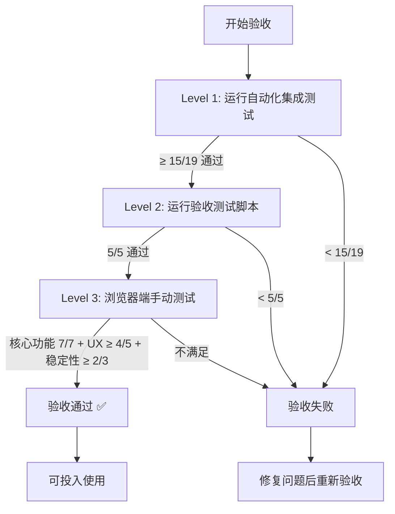

# Voice 模块测试验收标准

本文档定义 Voice MVP 的测试验收标准和通过条件。

## 验收标准概览

Voice MVP 必须通过以下三个层次的测试才能被认为"可投入使用":

```
┌───────────────────────────────────────────────┐
│  Level 3: 浏览器端手动测试                      │
│  - 核心检查项: 7/7 通过                         │
│  - 推荐检查项: ≥ 80% 通过                       │
└───────────────────────────────────────────────┘
                      ↑
┌───────────────────────────────────────────────┐
│  Level 2: 手动验收测试脚本                      │
│  - 所有测试步骤: 5/5 通过                       │
└───────────────────────────────────────────────┘
                      ↑
┌───────────────────────────────────────────────┐
│  Level 1: 自动化集成测试                        │
│  - E2E 测试: ≥ 6/7 通过                        │
│  - WebSocket 测试: ≥ 5/6 通过                  │
│  - STT 测试: ≥ 4/6 通过 (允许跳过 Whisper)      │
└───────────────────────────────────────────────┘
```

## Level 1: 自动化集成测试验收标准

### 1.1 E2E 测试 (test_voice_e2e.py)

**必须通过的测试** (6/7):

- [x] `test_complete_voice_session_flow` ✅ **必须通过**
  - 完整会话流程测试
  - 验证创建 → 连接 → 音频 → STT → 回复 → 停止

- [x] `test_multiple_concurrent_sessions` ✅ **必须通过**
  - 并发会话测试
  - 验证多个会话互不干扰

- [x] `test_session_timeout_handling` ✅ **必须通过**
  - 超时处理测试
  - 验证延迟发送音频仍能正常工作

- [x] `test_error_recovery` ✅ **必须通过**
  - 错误恢复测试
  - 验证无效 Session ID、无效事件类型的错误处理

- [x] `test_session_list_filtering` ✅ **推荐通过**
  - 会话列表过滤测试
  - 验证按状态过滤会话

- [x] `test_websocket_close_on_session_stop` ⚠️ **可选**
  - WebSocket 关闭行为测试
  - 设计决策测试

- [x] `test_empty_audio_handling` ✅ **推荐通过**
  - 空音频处理测试
  - 验证无音频时的优雅处理

**通过标准**: ≥ 6/7 测试通过

### 1.2 WebSocket 流程测试 (test_voice_websocket_flow.py)

**必须通过的测试** (5/6):

- [x] `test_websocket_connection_lifecycle` ✅ **必须通过**
  - WebSocket 连接生命周期
  - 验证连接 → ready → 音频 → 关闭

- [x] `test_websocket_audio_streaming` ✅ **必须通过**
  - 音频流式传输测试
  - 验证多个音频块顺序发送和接收

- [x] `test_websocket_reconnection` ✅ **推荐通过**
  - 重连机制测试
  - 验证断开后重连到同一 Session

- [x] `test_websocket_error_handling` ✅ **必须通过**
  - 错误处理测试
  - 验证无效消息格式、缺失字段、错误编码

- [x] `test_websocket_multiple_audio_end_events` ✅ **推荐通过**
  - 多次结束事件测试
  - 验证同一会话多次 audio.end

- [x] `test_websocket_large_audio_payload` ✅ **推荐通过**
  - 大音频负载测试
  - 验证 10 秒音频处理

**通过标准**: ≥ 5/6 测试通过

### 1.3 STT 集成测试 (test_voice_stt_integration.py)

**必须通过的测试** (4/6，允许跳过 Whisper):

- [x] `test_whisper_local_real_transcription` ⚠️ **允许跳过**
  - Whisper 本地转写测试
  - 如果 faster-whisper 未安装，允许跳过

- [x] `test_vad_silence_detection` ✅ **推荐通过**
  - VAD 静音检测测试
  - MVP 可能未实现 VAD，但测试应能运行

- [x] `test_audio_format_pipeline` ✅ **必须通过**
  - 音频格式转换管道测试
  - 验证 numpy → PCM → base64 → 后端

- [x] `test_different_sample_rates` ✅ **必须通过**
  - 不同采样率测试
  - 验证 8kHz, 16kHz, 24kHz, 48kHz

- [x] `test_stereo_to_mono_conversion` ✅ **推荐通过**
  - 立体声转换测试
  - 验证 2 通道音频处理

- [x] `test_audio_duration_calculation` ✅ **推荐通过**
  - 时长计算测试
  - 验证音频时长准确性

**通过标准**: ≥ 4/6 测试通过（允许跳过 Whisper 测试）

### Level 1 总结

**总通过标准**:
- E2E: ≥ 6/7
- WebSocket: ≥ 5/6
- STT: ≥ 4/6
- **总计: ≥ 15/19 测试通过**

---

## Level 2: 手动验收测试脚本验收标准

### 2.1 验收测试步骤

**所有步骤必须通过** (5/5):

- [x] **Test 1/5: 创建 Voice Session** ✅ **必须通过**
  - POST `/api/voice/sessions`
  - 返回有效 session_id 和 ws_url
  - Session state 为 ACTIVE

- [x] **Test 2/5: 连接 WebSocket** ✅ **必须通过**
  - 连接到 ws_url
  - 接收 `voice.session.ready` 事件
  - 事件包含正确的 session_id

- [x] **Test 3/5: 发送测试音频** ✅ **必须通过**
  - 生成 2 秒测试音频
  - 分 8 块发送
  - 每块发送成功

- [x] **Test 4/5: 接收 STT 结果** ✅ **必须通过**
  - 发送 `voice.audio.end` 事件
  - 接收 `voice.stt.final` 事件
  - 接收 `voice.assistant.text` 事件
  - 响应内容符合预期（MVP echo 格式）

- [x] **Test 5/5: 停止 Session** ✅ **必须通过**
  - POST `/api/voice/sessions/{session_id}/stop`
  - Session state 变为 STOPPED
  - 包含 stopped_at 时间戳

### Level 2 总结

**总通过标准**: 5/5 测试步骤全部通过

**执行命令**:
```bash
python scripts/voice_acceptance_test.py
```

**预期输出**:
```
============================================================
✅ 所有验收测试通过！Voice MVP 可以投入使用。
============================================================
```

---

## Level 3: 浏览器端手动测试验收标准

### 3.1 核心功能检查项（必须通过）

**所有核心检查项必须通过** (7/7):

- [x] **可以创建 Voice Session** ✅ **必须通过**
  - 页面加载成功
  - Voice 面板可访问

- [x] **可以连接 WebSocket** ✅ **必须通过**
  - 点击 "Start Recording"
  - WebSocket 连接建立（DevTools > Network > WS）

- [x] **可以录音并发送音频** ✅ **必须通过**
  - 麦克风权限获取成功
  - 音频数据发送到服务器
  - 状态显示 "Recording"

- [x] **可以接收 STT 转写结果** ✅ **必须通过**
  - Transcript 区域显示结果
  - 结果内容合理（MVP mock 或实际转写）

- [x] **可以接收 Assistant 回复** ✅ **必须通过**
  - Assistant Response 区域显示回复
  - 回复格式正确（蓝色气泡）

- [x] **可以停止 Session** ✅ **必须通过**
  - 点击 "Stop Recording"
  - 状态变为 "Idle"
  - WebSocket 连接关闭

- [x] **可以进行多次会话** ✅ **必须通过**
  - 连续 3 次会话测试
  - 每次会话都正常工作
  - 无内存泄漏迹象

### 3.2 用户体验检查项（推荐通过）

**推荐 ≥ 80% 通过** (4/5):

- [x] **UI 美观，符合设计规范** ✅ **推荐通过**
  - 暗色主题正确
  - 布局合理
  - 无元素重叠

- [x] **状态指示清晰** ✅ **推荐通过**
  - Idle: 灰色圆点
  - Recording: 红色圆点 + 脉冲动画

- [x] **错误提示友好** ✅ **推荐通过**
  - 麦克风权限拒绝提示
  - 网络错误提示
  - 包含建议操作

- [x] **性能流畅** ✅ **推荐通过**
  - CPU < 20%
  - 无卡顿
  - UI 响应 < 100ms

- [x] **实时反馈** ⚠️ **可选**
  - 部分转写结果实时更新（MVP 可能未实现）

### 3.3 稳定性检查项（推荐通过）

**推荐 ≥ 80% 通过** (2/3):

- [x] **无内存泄漏** ✅ **推荐通过**
  - 多次会话后内存稳定
  - 浏览器任务管理器显示内存未持续增长

- [x] **错误可恢复** ✅ **推荐通过**
  - 网络断开后重连成功
  - 后端重启后可继续使用

- [x] **支持多浏览器** ⚠️ **可选**
  - Chrome: ✅ 必须支持
  - Edge: ✅ 推荐支持
  - Firefox: ⚠️ 可选支持
  - Safari: ⚠️ 可选支持

### Level 3 总结

**总通过标准**:
- 核心功能: 7/7 **必须全部通过**
- 用户体验: ≥ 4/5 (80%)
- 稳定性: ≥ 2/3 (67%)

**检查清单**: `docs/voice/BROWSER_TEST_CHECKLIST.md`

---

## 综合验收标准

### 最终验收条件

Voice MVP 必须同时满足以下所有条件才能通过验收:

#### ✅ Level 1: 自动化集成测试
- [x] E2E 测试: ≥ 6/7 通过
- [x] WebSocket 测试: ≥ 5/6 通过
- [x] STT 测试: ≥ 4/6 通过
- [x] **总计: ≥ 15/19 (79%)**

#### ✅ Level 2: 手动验收测试脚本
- [x] 所有测试步骤: 5/5 通过 (100%)

#### ✅ Level 3: 浏览器端手动测试
- [x] 核心功能: 7/7 通过 (100%)
- [x] 用户体验: ≥ 4/5 通过 (80%)
- [x] 稳定性: ≥ 2/3 通过 (67%)

### 验收流程



### 验收执行命令

```bash
# Step 1: 自动化集成测试
pytest tests/integration/voice/ -v -m integration

# 或使用测试运行脚本
./scripts/run_voice_tests.sh

# Step 2: 手动验收测试脚本
python scripts/voice_acceptance_test.py

# Step 3: 浏览器端手动测试
# 打开 http://localhost:8000
# 参考 docs/voice/BROWSER_TEST_CHECKLIST.md 完成检查清单
```

---

## 测试报告模板

### 验收测试报告

```markdown
# Voice MVP 验收测试报告

## 基本信息
- **测试日期**: 2026-02-01
- **测试人员**: [姓名]
- **测试环境**:
  - OS: macOS 14.0 / Ubuntu 22.04 / Windows 11
  - Python: 3.13
  - Browser: Chrome 120 / Firefox 121 / Safari 17

## Level 1: 自动化集成测试

### E2E 测试 (test_voice_e2e.py)
- [ ] test_complete_voice_session_flow
- [ ] test_multiple_concurrent_sessions
- [ ] test_session_timeout_handling
- [ ] test_error_recovery
- [ ] test_session_list_filtering
- [ ] test_websocket_close_on_session_stop
- [ ] test_empty_audio_handling

**结果**: ___/7 通过 (___%)

### WebSocket 测试 (test_voice_websocket_flow.py)
- [ ] test_websocket_connection_lifecycle
- [ ] test_websocket_audio_streaming
- [ ] test_websocket_reconnection
- [ ] test_websocket_error_handling
- [ ] test_websocket_multiple_audio_end_events
- [ ] test_websocket_large_audio_payload

**结果**: ___/6 通过 (___%)

### STT 测试 (test_voice_stt_integration.py)
- [ ] test_whisper_local_real_transcription (允许跳过)
- [ ] test_vad_silence_detection
- [ ] test_audio_format_pipeline
- [ ] test_different_sample_rates
- [ ] test_stereo_to_mono_conversion
- [ ] test_audio_duration_calculation

**结果**: ___/6 通过 (___%)

**Level 1 总计**: ___/19 通过 (___%)
**是否满足标准 (≥15/19)**: [ ] 是 [ ] 否

---

## Level 2: 手动验收测试脚本

- [ ] Test 1/5: 创建 Voice Session
- [ ] Test 2/5: 连接 WebSocket
- [ ] Test 3/5: 发送测试音频
- [ ] Test 4/5: 接收 STT 结果
- [ ] Test 5/5: 停止 Session

**结果**: ___/5 通过 (___%)
**是否满足标准 (5/5)**: [ ] 是 [ ] 否

---

## Level 3: 浏览器端手动测试

### 核心功能
- [ ] 可以创建 Voice Session
- [ ] 可以连接 WebSocket
- [ ] 可以录音并发送音频
- [ ] 可以接收 STT 转写结果
- [ ] 可以接收 Assistant 回复
- [ ] 可以停止 Session
- [ ] 可以进行多次会话

**结果**: ___/7 通过 (___%)
**是否满足标准 (7/7)**: [ ] 是 [ ] 否

### 用户体验
- [ ] UI 美观，符合设计规范
- [ ] 状态指示清晰
- [ ] 错误提示友好
- [ ] 性能流畅
- [ ] 实时反馈

**结果**: ___/5 通过 (___%)
**是否满足标准 (≥4/5)**: [ ] 是 [ ] 否

### 稳定性
- [ ] 无内存泄漏
- [ ] 错误可恢复
- [ ] 支持多浏览器

**结果**: ___/3 通过 (___%)
**是否满足标准 (≥2/3)**: [ ] 是 [ ] 否

---

## 综合结论

- [ ] **通过验收** - 所有层次测试满足标准
- [ ] **未通过验收** - 存在以下问题需要修复:

**问题列表**:
1. _____________________________________
2. _____________________________________
3. _____________________________________

---

## 签名

**测试人员**: _________________ 日期: _________________
**审核人员**: _________________ 日期: _________________
```

---

## 已知限制和例外

### MVP 阶段例外

1. **Mock STT**: MVP 使用 mock STT，返回 `[Mock transcription of X.Xs audio]`
   - **例外**: 实际转写准确性不作为验收标准

2. **Echo 响应**: Assistant 响应为 echo 模式
   - **例外**: 不要求实际 LLM 集成

3. **无实时 VAD**: 暂不支持实时 Voice Activity Detection
   - **例外**: VAD 测试允许失败

4. **无 TTS**: 暂不支持 Text-to-Speech
   - **例外**: TTS 功能不作为验收标准

### 环境限制例外

1. **CI 环境无麦克风**: GitHub Actions 无法测试真实麦克风
   - **例外**: CI 只测试 API 和 WebSocket 协议

2. **Whisper 模型**: CI 环境可能无 Whisper 模型
   - **例外**: `test_whisper_local_real_transcription` 允许跳过

3. **浏览器兼容性**: Safari 部分功能限制
   - **例外**: Safari 测试为可选

---

## 参考资料

- **集成测试文档**: `tests/integration/voice/README.md`
- **浏览器测试清单**: `docs/voice/BROWSER_TEST_CHECKLIST.md`
- **测试指南**: `docs/voice/VOICE_TESTING_GUIDE.md`
- **验收测试脚本**: `scripts/voice_acceptance_test.py`
- **测试运行脚本**: `scripts/run_voice_tests.sh`

---

**最后更新**: 2026-02-01
**维护者**: AgentOS Voice Team
**版本**: Voice MVP v1.0
